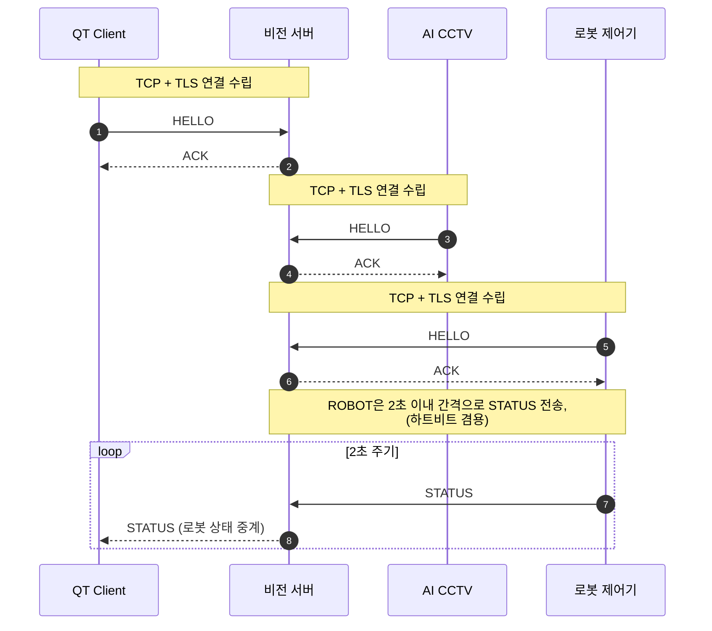
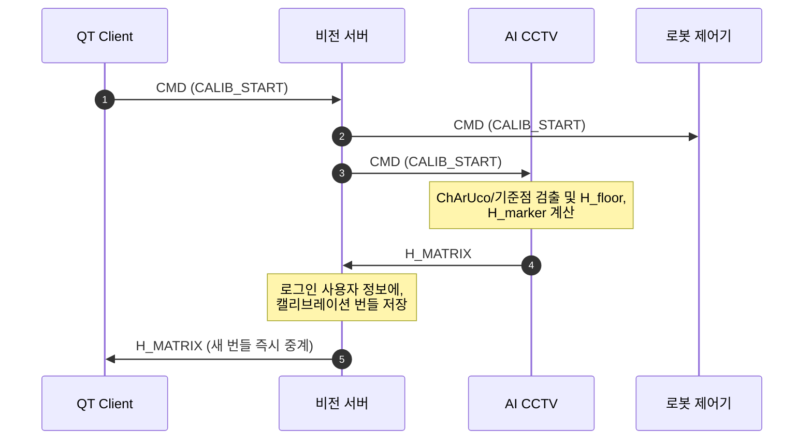
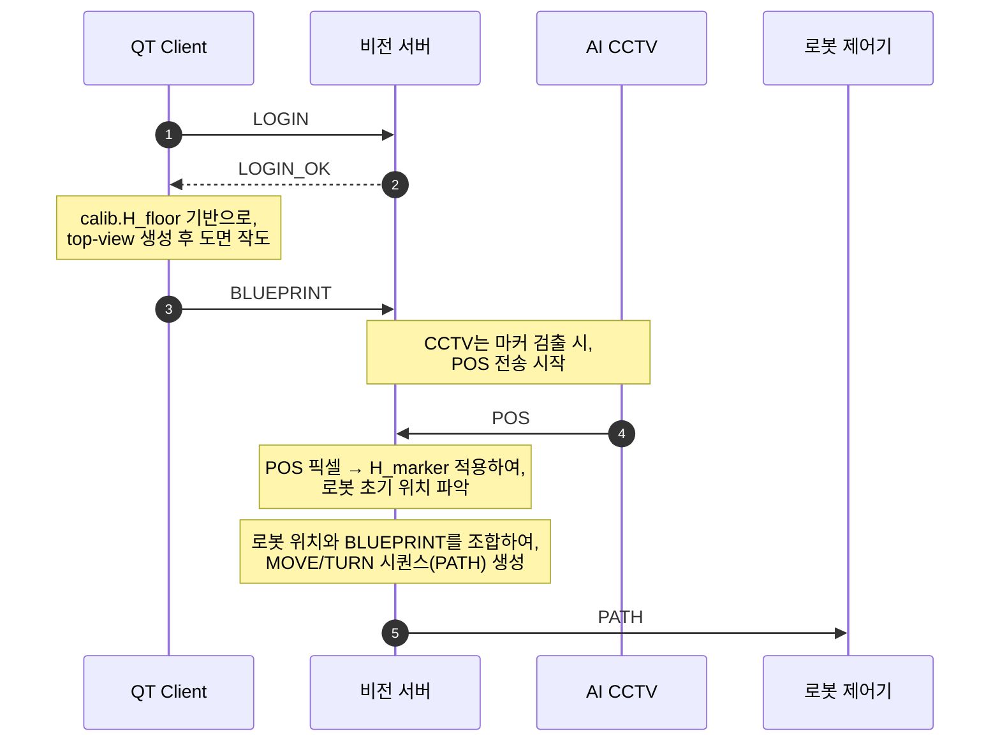
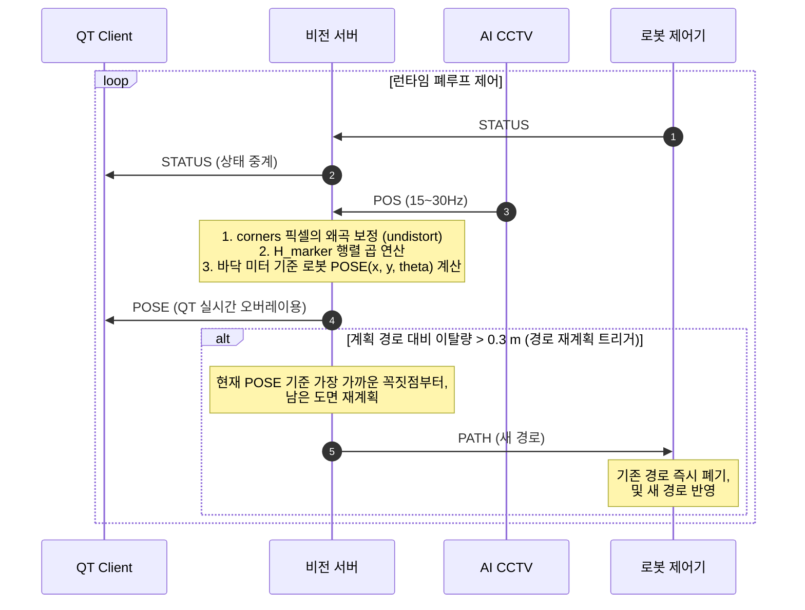
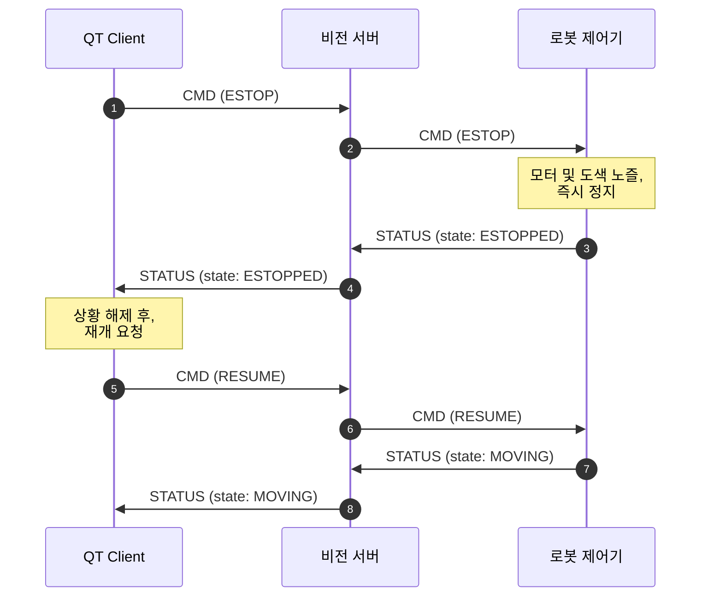

# Road-Painter 서버 통신 프로토콜 (v0.3)

> 최종 수정: 2026-07-21 · 구현 기준: `feature/server` 브랜치 (`Server/src/protocol.hpp`와 동일 내용)
>
> 2026-07-21 추가분: ADMIN role(관리자 창) + TAP, 경로 실행 중 수동조작 차단 규칙.
> 문서 맨 아래 "v0.3 추가 변경(2026-07-21)" 참고.

## 좌표계 규약 (v0.3 핵심 — 반드시 읽을 것)

시스템에는 좌표 "언어"가 두 개 있다:

- **픽셀 좌표**: CCTV 원본 영상 위의 위치 `(u, v)`
- **바닥 좌표**: 실제 바닥 평면 위의 위치, **단위 미터** `(x, y)`

누가 어떤 언어로 보내고, 변환은 누가 하는가:

| 역할 | 서버로 보내는 좌표 | 변환 담당 |
|---|---|---|
| **CCTV** | 마커 4코너 **원본 픽셀** (변환 금지) | **서버** (undistort → H_marker) |
| **QT** | 도면 **바닥 미터 좌표** (변환 완료) | **QT** (top-view 픽셀 ÷ S) |

이렇게 나누는 이유:

- **CCTV → 픽셀 그대로**: 마커 좌표는 렌즈 왜곡 보정(undistort)과 높이 시차 보정(H_marker)이 필요하고, solvePnP 보조 검증도 원본 픽셀이 있어야 가능하다. 캘리브레이션 데이터(K, D, H)를 서버 한 곳에만 두기 위해 CCTV는 "본 그대로"만 보고한다.
- **QT → 변환 완료**: top-view 위에 그린 점은 정의상 바닥 평면 위의 점이다. 왜곡도 높이 문제도 없고, 남은 건 축척 나눗셈(S px/m)뿐이라 Qt가 끝내서 보낸다.

서버 내부 파이프라인 (POS 수신 시):

```
원본 4코너 픽셀
  → undistort  (cv::undistortPoints(..., P=K) 동등 — 결과를 픽셀 단위로 유지)
  → H_marker   (마커 장착 높이 평면용 호모그래피 — 시차 보정 흡수)
  → 바닥 미터 좌표 4점
  → 중심 = 4점 평균, yaw = atan2(전방중점 − 후방중점)   ※ 반드시 변환 후 각도 계산
  → 로봇 pose (x, y, θ)
```

⚠️ **호모그래피를 거친 좌표를 solvePnP에 넣지 말 것.** solvePnP는 K로 투영된 실제 픽셀 좌표를 전제한다. 보조 검증(solvePnPGeneric IPPE_SQUARE)은 원본 코너에서 **병렬**로 수행한다.

## 공통

- **전송**: TCP + TLS, 포트 **9000**
  - 서버만 인증서 제시 (클라이언트는 `certs/server.crt`를 신뢰 CA로 등록해 서버를 검증. 클라이언트 인증서 불필요)
- **프레이밍**: JSON 한 줄 + 개행(`\n`) — JSON Lines
- **공통 형식**: `{"type": "...", "seq": n, "payload": {...}}`
- **접속 절차**: TLS 핸드셰이크 → 첫 메시지로 `HELLO` 전송 (10초 내 미전송 시 서버가 연결 종료) → `ACK` 수신 후 통신 시작

```json
{"type":"HELLO","seq":1,"payload":{"role":"ROBOT"}}
```
- `role`: `"QT"` | `"ROBOT"` | `"CCTV"` | `"ADMIN"` (관리자 창 — 아래 ADMIN 장 참고)
- 서버 응답: `{"type":"ACK","seq":n,"payload":{"msg":"registered as ROBOT"}}`
- 같은 role이 재접속하면 기존 세션은 자동으로 끊고 새 연결로 교체

---

## 로봇 (ROBOT)

### 수신: PATH (서버 → 로봇)

로봇은 좌표를 모르므로 경로는 **동작 명령 시퀀스**로 전달한다.

```json
{"type":"PATH","seq":5,"payload":{
  "phase": "draw",
  "segments": [
    {"op":"MOVE","dist_m":2.0,"paint":true,"heading_deg":35.0},
    {"op":"TURN","angle_deg":-90},
    {"op":"MOVE","dist_m":1.0,"paint":true,"heading_deg":-55.0}
  ]
}}
```

| 필드 | 설명 |
|---|---|
| `phase` | `"approach"`(시작점 접근) \| `"draw"`(도색 경로) — 아래 "2단계 경로 실행 흐름" 참고 |
| `op: "MOVE"` | 직진. `dist_m` = 거리(m), `paint` = 도색 여부 (생략 시 `false` = 단순 이동) |
| `op: "TURN"` | 제자리 회전. `angle_deg` **양수 = 좌회전, 음수 = 우회전** |
| `heading_deg` | 그 동작 후 바라봐야 할 **절대 각도**(월드 기준) — MOVE 전부 + 접근 경로의 마지막 TURN에 실림. 정렬(READY)/주행 피드백(DRIFT) 판정 기준값. 로봇은 무시해도 됨 |

- **PATH가 오면 진행 중이던 기존 경로를 즉시 폐기하고 새 경로로 교체** (서버의 이탈 감지 → 재계획 대응. 한 TCP 연결이라 순서는 보장됨)

### 2단계 경로 실행 흐름 (approach → 대기 → draw)

로봇을 시작점에 보내놓고, 사용자가 Qt에서 **"그림그리기 시작"** 버튼을 눌러야 도색이 시작된다.

```
[1단계 접근] 도면 수신 + 로봇 위치 확보
  → 서버가 PATH(phase="approach") 전송: 시작점까지 회전+직진(전부 paint=false)
    + 마지막에 첫 도색 방향으로 TURN까지 포함 (이 TURN에도 heading_deg 있음)
  → 로봇: 세그먼트마다 READY/ALIGN/GO 수행하며 이동, 마지막 TURN 정렬까지 끝나면
    그 자리에서 대기 (자동으로 도색 시작하지 않음!)

[2단계 도색] Qt "그림그리기 시작" 버튼 → CMD {"cmd":"START_DRAW"}
  → 서버가 PATH(phase="draw") 전송: 도색 전체 경로 (전부 paint=true)
  → 로봇: 이 PATH를 받는 순간 IMU 현재 방향을 0도로 세팅하고 주행 시작
  → 직진 중에는 서버가 DRIFT로 각도 피드백 지속 전송 (아래 참고)
```

### 주행 중 각도 피드백: DRIFT (서버 → 로봇)

직진 중 CCTV 피드백으로 로봇이 얼마나 삐뚤어졌는지 지속적으로 알려준다 (최대 ~5Hz).

```json
{"type":"DRIFT","seq":40,"payload":{"angle_deg": 2.0}}
```

- **가려는 방향이 0도 기준. 시계방향(오른쪽)으로 틀어져 있으면 양수 (예: +2), 반시계(왼쪽)면 음수 (예: -1.5)**
- 값 = 좌회전으로 보정해야 할 양 (ALIGN과 동일 부호 규약)
- 로봇은 IMU와 융합해 직진 중 방향을 보정하는 데 사용. 정지 중(READY 대기 등)에 오는 DRIFT는 무시해도 됨

### 출발 전 정렬 핸드셰이크: READY → ALIGN / GO

각도를 틀고 직진을 시작하기 직전에, CCTV 피드백으로 각도를 미세조정하고 출발하는 절차. **MOVE 세그먼트를 시작하기 전마다** 수행한다.

```
로봇: TURN 완료, 정지 상태
로봇 → 서버: {"type":"READY","seq":21,"payload":{"seg":3}}   ← 곧 실행할 MOVE의 인덱스(0부터)
서버: 최신 CCTV 마커로 잰 실제 각도 vs 그 MOVE의 heading_deg 비교
  ├─ 오차 > 2° → 서버 → 로봇: {"type":"ALIGN","payload":{"angle_deg":-2.5}}
  │              로봇: angle_deg만큼 제자리 회전 후 다시 READY 전송 (반복)
  └─ 오차 ≤ 2° (또는 ALIGN 4회 반복 초과) → 서버 → 로봇: {"type":"GO","payload":{}}
                 로봇: 직진(MOVE) 시작
```

- `ALIGN.angle_deg` 부호는 TURN과 동일 (양수 = 좌회전)
- 서버가 판정 불가한 상황(계획 없음/수동모드/pose 미확보)이면 로봇을 세워두지 않도록 그냥 `GO`를 보낸다
- READY를 기다리는 동안에도 STATUS 주기 전송(하트비트)은 계속해야 함
- 허용 오차 2° / 최대 반복 4회는 러프 디폴트 — 현장 튜닝 예정

### 수신: CMD (서버 → 로봇)

```json
{"type":"CMD","seq":7,"payload":{"cmd":"ESTOP"}}
```
- **이벤트 명령**: `"ESTOP"` | `"RESUME"` | `"CALIB_START"`
- **수동 조작 명령 (조이스틱 방식 — 누르는 동안 이동, 이동량 없음)**:
  `"FORWARD"` | `"BACKWARD"` | `"TURN_LEFT"` | `"TURN_RIGHT"` | `"STOP"`
  - 전/후진, 제자리 좌/우회전. 버튼을 누르면 해당 명령을 보내고, **떼면 `STOP`** 을 보낸다.
  - 이동 속도/각속도는 로봇 펌웨어의 고정값 사용 (거리·각도 값을 싣지 않음).
  - `STOP`은 수동 이동의 일반 정지 — 긴급정지(`ESTOP`, RESUME 필요)와는 별개.
- ACK 응답 불필요 (fire-and-forget)

> ⚠️ **안전**: 조이스틱 방식은 "떼면 STOP"에 의존한다. TCP라 정상 연결 중엔 순서·전달이 보장되지만, **버튼을 누른 채 연결이 끊기면 STOP이 못 가서 로봇이 계속 움직일 수 있다.** 로봇 펌웨어에 데드맨(예: 300ms 내 다음 명령/하트비트 없으면 자동 정지)을 두는 것을 권장.

### 송신: STATUS (로봇 → 서버) — 주기 전송 필수

```json
{"type":"STATUS","seq":12,"payload":{
  "state": "MOVING",
  "painting": true
}}
```

| 필드 | 설명 |
|---|---|
| `state` | `"IDLE"` \| `"MOVING"` \| `"ESTOPPED"` \| `"ERROR"` |
| `painting` | 노즐 동작 여부 (지금 도색 중인지) |

- **2초 이내 간격으로 계속 전송 (IDLE 상태에서도)** — 하트비트 겸용
- 서버는 로봇에게서 **10초간 무수신이면 연결 끊김으로 간주하고 세션 종료** (로봇은 재접속 + HELLO 재등록)
- 서버는 STATUS를 QT로 중계함

---

## QT

### 송신: REGISTER / LOGIN (QT → 서버)

```json
{"type":"REGISTER","seq":1,"payload":{"id":"user1","pw":"..."}}
{"type":"LOGIN","seq":2,"payload":{"id":"user1","pw":"..."}}
```

서버 응답:

| 응답 | payload |
|---|---|
| `REGISTER_OK` | `{"id":"user1"}` |
| `REGISTER_FAIL` | `{"reason":"이미 존재하는 id"}` 등 |
| `LOGIN_OK` | `{"id":"user1","calib":{...}}` — 저장된 캘리브레이션 번들. **`null`이면 캘리브레이션 필요** |
| `LOGIN_FAIL` | `{"reason":"id 또는 비밀번호 불일치"}` |

- Qt는 `calib.H_floor`(+`K`,`D`)로 top-view를 생성한다: 프레임 왜곡 보정 → `warpPerspective(S·H_floor)` (S = 렌더링 축척 px/m)

### 송신: CMD (QT → 서버)

`{"cmd": ...}` — 서버가 ROBOT에 중계, `CALIB_START`는 CCTV에도 중계

- 이벤트: `"ESTOP"` | `"RESUME"` | `"CALIB_START"`
- **그리기 시작: `"START_DRAW"`** — "그림그리기 시작" 버튼. 로봇이 접근(1단계)을 마치고 시작점에 대기 중일 때 누르면, 서버가 도색 경로(PATH phase="draw")를 로봇에 전송한다. 이 명령은 로봇에 중계되지 않음 (로봇은 PATH 수신이 곧 시작 신호). 접근 미완료 상태면 서버가 무시하고 경고 로그만 남김.
- 수동 조작(조이스틱): `"FORWARD"` | `"BACKWARD"` | `"TURN_LEFT"` | `"TURN_RIGHT"` | `"STOP"`
  - 버튼 누름 → 방향 명령, 뗌 → `STOP`. 이동량은 안 실음 (로봇 고정 속도).
- ⚠️ **경로 실행 중에는 수동 조작이 차단된다** (2026-07-21 추가): 서버가 PATH를 보내
  로봇이 경로를 수행 중인 동안 QT의 수동 조작 CMD는 **로봇에 전달되지 않고 무시**된다
  (도색 도중 조이스틱으로 그림을 망치는 것 방지 — 자동이 우선). `ESTOP`/`RESUME`/
  `CALIB_START` 같은 비수동 명령은 항상 통과한다. 현재 거절 응답 메시지는 없으며
  서버 로그로만 확인 가능 (QT는 버튼이 안 먹는 것으로 보임).
- **경로가 없는 상태에서 수동 조작 명령이 오면** 서버는 자동 경로추종/재계획을 중단하고
  수동 모드로 전환한다 (수동 이동을 서버가 '경로 이탈'로 오인해 재계획 PATH를 쏘는
  충돌 방지). **자동 모드 복귀는 새 `BLUEPRINT` 수신 시.** 수동 모드에서도 로봇 위치
  `POSE` 중계(모니터링)는 계속된다.

### 송신: BLUEPRINT (QT → 서버)

```json
{"type":"BLUEPRINT","seq":4,"payload":{"points":[[0.0,0.0],[2.0,0.0],[2.0,1.0]]}}
```
- `points`: **바닥 평면 미터 좌표** 폴리라인 (그릴 선)
- **Qt가 변환을 마친 값이어야 한다**: top-view 위 드로잉 픽셀 → `÷ S` → 미터. 서버는 재변환하지 않는다.
- 서버 동작: 로봇 위치(CCTV POS)를 알고 있으면 즉시 경로를 생성해 로봇에 PATH 전송, 모르면 저장해뒀다가 첫 POS 수신 시 전송

### 수신 (서버 → QT)

- `STATUS`: 로봇 상태 중계 (지속 모니터링용)
- `POS`: CCTV 마커 검출 결과(원본 픽셀) 중계
- `POSE`: 서버가 POS를 변환해 계산한 로봇 pose — **top-view 위 로봇 표시용은 이걸 사용**

  ```json
  {"type":"POSE","seq":15,"payload":{"x":1.234,"y":0.567,"theta_deg":90.0}}
  ```
  (`x`,`y` = 바닥 미터 좌표, `theta_deg` = +x축 기준 반시계)
- `H_MATRIX`: 캘리브레이션 직후 새 번들 즉시 중계 (top-view 갱신용)

---

## CCTV

### 수신: CMD (서버 → CCTV)

`{"cmd":"CALIB_START"}` — 캘리브레이션 시작

### 송신: H_MATRIX (CCTV → 서버) — 캘리브레이션 완료 후 1회

```json
{"type":"H_MATRIX","seq":3,"payload":{
  "calib": {
    "version": 1,
    "K": [[fx,0,cx],[0,fy,cy],[0,0,1]],
    "D": [k1,k2,p1,p2,k3],
    "H_floor":  [[...],[...],[...]],
    "H_marker": [[...],[...],[...]],
    "marker_height_m": 0.25
  }
}}
```

| 필드 | 설명 |
|---|---|
| `K` | 카메라 내부 파라미터 (3×3) — ChArUco 캘리브레이션 결과 |
| `D` | 렌즈 왜곡 계수 `[k1,k2,p1,p2,k3]` |
| `H_floor` | **왜곡 보정된 픽셀** → 바닥 평면 미터 (Qt top-view용) |
| `H_marker` | **왜곡 보정된 픽셀** → 마커 장착 높이 평면 미터 (로봇 측위용 — 마커가 바닥에서 떠 있어 생기는 시차를 캘리브레이션 단계에서 흡수) |
| `marker_height_m` | 마커 장착 높이 (기록용) |
| `version` | 캘리브레이션 버전 — 카메라 위치/줌/포커스/해상도가 바뀌면 재캘리브레이션 후 증가 |

- 두 H는 `solvePnPRansac → solvePnPRefineLM`으로 외부 파라미터(R, t)를 구한 뒤 `H = K·[r₁ r₂ t]`로 해석적으로 유도할 것 (바닥 평면 Z=0, 마커 평면 Z=marker_height). 4점을 두 번 따로 찍는 것보다 일관됨.
- 서버가 로그인된 사용자에 영속 저장하고 QT로 즉시 중계
- 레거시 `{"H":[[...]x3]}`도 당분간 허용 (왜곡·시차 보정 없이 동작 — 데모 전용)

### 송신: POS (CCTV → 서버)

```json
{"type":"POS","seq":10,"payload":{"corners":[[u1,v1],[u2,v2],[u3,v3],[u4,v4]]}}
```
- `corners`: 로봇 마커 4점 = **원본 CCTV 픽셀 좌표**, 순서 = **[전좌, 전우, 후우, 후좌]**
- ⚠️ **CCTV는 어떤 좌표 변환도 하지 말 것** (undistort 포함). 서브픽셀 코너 검출(`CORNER_REFINE_APRILTAG` 권장)까지만 하고 원본을 보낸다. 변환은 전부 서버 담당 — 원본이 있어야 solvePnP 보조 검증도 가능하다.
- 테스트용으로 `{"x","y","theta_deg"}`(바닥 미터 좌표)도 허용
- 서버 동작:
  1. QT(모니터링용)로 원본 그대로 중계 — **로봇에는 중계하지 않음** (로봇은 좌표를 모름. 위치 보정은 서버가 각도로 변환해 `ALIGN`/`DRIFT`로만 전달)
  2. undistort → `H_marker`로 바닥 좌표 변환해 로봇 pose(중심·방향) 계산 → `POSE`로 QT 전송
  3. 계획 경로에서 **0.3 m 초과 이탈** 시 가장 가까운 꼭짓점부터 재계획한 PATH를 로봇에 재전송 (최소 3초 간격) — 임계값은 러프 디폴트, 현장 튜닝 예정

---

## ADMIN (관리자 창)

`Server/admin_console/web_gui.py`(웹 GUI)가 사용하는 role. 일반 클라이언트가 아니라
**감시·점검용**이다. 카메라 설치 기사가 캘리브레이션·로봇 점검을 수행하는 관리자 창이
서버에 이 role로 접속한다.

### 수신: TAP (서버 → ADMIN)

서버가 중계하는 **모든 메시지의 사본**이 ADMIN에게 실시간으로 흘러온다 (로그 모니터용).

```json
{"type":"TAP","seq":30,"payload":{
  "dir": "IN",
  "peer": "ROBOT",
  "msg": {"type":"STATUS","seq":12,"payload":{"state":"MOVING","painting":true}}
}}
```

| 필드 | 설명 |
|---|---|
| `dir` | `"IN"` = peer가 서버로 보낸 것 / `"OUT"` = 서버가 peer에게 보낸 것 |
| `peer` | `"QT"` \| `"ROBOT"` \| `"CCTV"` |
| `msg` | 원본 메시지 전체 |

- ADMIN 자신과 오간 메시지는 tap하지 않는다 (무한 루프 방지)

### 송신: CMD / PATH / H_MATRIX (ADMIN → 서버)

- `CMD {"cmd":...}` → ROBOT 전달 (`CALIB_START`는 CCTV에도). **관리자는 점검·설치용이라
  경로 실행 중이어도 차단 없이 항상 전달된다** (QT의 수동조작 차단과 다름 — 관리자 책임 하 조작).
- `PATH {"segments":[...]}` → ROBOT 전달 (테스트 경로)
- `H_MATRIX` → CCTV가 보낸 것과 동일하게 처리 (저장 + QT 중계). 관리자 창의 캘리브레이션
  도구가 카메라 대신 캘리 결과를 올릴 때 사용

### 카메라 통역 (과도기 구조)

카메라 앱이 아직 이 프로토콜(TLS+HELLO/POS)을 말하지 못하므로, 관리자 창이 카메라의
자체 형식(CAM_POSE, 평문 TCP)을 받아 **CCTV role로 별도 접속해 POS로 통역**해 넣는다.
카메라 앱이 직접 접속하게 되면(→ [docs/CCTV_CAMERA_SPEC.md](docs/CCTV_CAMERA_SPEC.md))
이 통역은 제거 예정.

---

## ⚠️ v0.2 → v0.3 변경 요약 (팀별 반영 필요)

**CCTV팀**
1. `H_MATRIX` payload가 단일 `H` → **캘리브레이션 번들 `calib`** (K, D, H_floor, H_marker, marker_height_m, version)으로 변경. 레거시 `H`도 당분간 동작하지만 왜곡·시차 보정이 빠짐
2. `POS`의 `corners`는 **원본 픽셀** 확정 — undistort 등 어떤 변환도 하지 말 것

**QT팀**
1. `LOGIN_OK`의 `"H"` 필드가 `"calib"` 번들로 변경 — top-view는 `calib.H_floor` 사용
2. `BLUEPRINT.points`는 **바닥 미터 좌표** 확정 — top-view 픽셀을 `÷ S`로 변환해서 보낼 것
3. 신규 수신 메시지 `POSE` — top-view 위 로봇 표시는 원본 `POS` 대신 이걸 사용
4. **수동 조작 UI(조이스틱)**: 전/후진·좌/우 각도 버튼 → 누르면 `CMD {"cmd":"FORWARD"|"BACKWARD"|"TURN_LEFT"|"TURN_RIGHT"}`, **떼면 `CMD {"cmd":"STOP"}`** 전송. 이동량은 안 실음
5. **"그림그리기 시작" 버튼** (신규): 로봇이 시작점 접근을 마친 뒤 사용자가 누르면 `CMD {"cmd":"START_DRAW"}` 전송 → 서버가 도색 경로를 로봇에 보냄

**로봇팀**
1. `CMD` 처리에 **수동 조작 명령 분기 추가**: `FORWARD`/`BACKWARD`/`TURN_LEFT`/`TURN_RIGHT` = 고정 속도로 해당 방향 구동, `STOP` = 정지 (조이스틱: 명령 올 때까지 계속 이동)
2. **데드맨 권장**: 수동 이동 중 일정 시간(예: 300ms) 명령 무수신 시 자동 정지 — 연결 끊김 시 폭주 방지
3. STATUS는 동일
4. **출발 전 정렬 핸드셰이크 구현** (신규): MOVE 시작 전마다 정지 상태로 `READY {"seg":k}` 전송 → `ALIGN {"angle_deg":d}` 받으면 d만큼 제자리 회전 후 다시 READY → `GO {}` 받으면 직진 시작. ("로봇 (ROBOT)" 장의 핸드셰이크 절 참고)
5. **PATH `phase` 처리** (신규): `"approach"` = 시작점까지 이동 후 그 자리에서 **대기** (도색 시작 금지), `"draw"` = **수신 즉시 IMU 현재 방향을 0도로 세팅**하고 도색 주행 시작
6. **DRIFT 수신 처리** (신규): 직진 중 서버가 보내는 각도 피드백 (`angle_deg` 양수 = 시계방향으로 틀어짐 = 그만큼 좌회전 보정). IMU와 융합해 방향 유지에 사용, 정지 중에 오는 건 무시

---

## v0.3 추가 변경 (2026-07-21)

1. **ADMIN role 신설** — 관리자 창(admin_console)이 서버에 접속하는 네 번째 role.
   서버 중계 트래픽 사본(TAP) 수신 + 로봇 제어(CMD/PATH) + 캘리 결과(H_MATRIX) 업로드.
   ("ADMIN (관리자 창)" 장 참고)
2. **경로 실행 중 QT 수동조작 차단** — PATH 실행 중 QT의 조이스틱 CMD는 무시된다
   (ESTOP/RESUME은 통과). QT팀: 경로 실행 중에는 조이스틱 UI를 비활성화하는 것을 권장.
3. **H_MATRIX 송신처 확대** — CCTV 외에 ADMIN(관리자 창 캘리 도구)도 보낼 수 있음.
   서버 처리 방식은 동일.

---

## 프로토콜 기반 전체 사용 시나리오

이 장에서는 앞서 정의한 프로토콜 메시지들이 실제 시스템 운용 시나리오에서 어떻게 오가는지 Phase별로 나누어 설명한다.

### 프로토콜 메시지별 의미와 시나리오 내 역할

사용 시나리오에 등장하는 각 프로토콜 메시지의 물리적/기능적 의미는 다음과 같다.

| 메시지 타입 (`type`) | 송신처 → 수신처 | 시나리오 내 역할 및 상세 의미 |
|---|---|---|
| **`HELLO`** | 클라이언트 → 서버 | **연결 초기화 및 역할 등록**: TLS 연결 수립 후 10초 이내에 전송해야 하며, 송신한 클라이언트가 `QT`, `ROBOT`, `CCTV` 중 어느 장치인지 서버에 명시하고 고유 세션을 할당받는다. |
| **`ACK`** | 서버 → 클라이언트 | **연결 승인**: HELLO 요청을 정상 접수하여 세션 등록이 완료되었음을 클라이언트에 알리는 확인 응답이다. |
| **`REGISTER` / `LOGIN`** | QT → 서버 | **사용자 인증 및 설정 요청**: 작업자가 시스템을 사용하기 위해 로그인을 시도한다. |
| **`LOGIN_OK`** | 서버 → QT | **사용자 인증 승인 및 캘리브레이션 획득**: 로그인이 성공하면 서버는 해당 사용자가 관리하는 현장에 마지막으로 저장된 **캘리브레이션 번들 (`calib`)**을 반환한다. QT는 이를 사용하여 즉시 top-view 영상을 보정하여 렌더링한다. |
| **`CMD`** | QT → 서버 → 로봇/CCTV | **이벤트 기반 제어 명령**: 캘리브레이션 시작(`CALIB_START`), 비상 정지(`ESTOP`), 재개(`RESUME`) 등 동작 제어 이벤트를 단방향(Fire-and-forget)으로 전달 및 중계한다. |
| **`H_MATRIX`** | CCTV → 서버 → QT | **캘리브레이션 프로필 등록 및 갱신**: 캘리브레이션 완료 시점에 CCTV가 계산한 렌즈 파라미터(K, D) 및 두 기하학적 평면 변환 행렬(H_floor, H_marker)을 보고한다. 서버는 이를 데이터베이스에 영속화하고, 실시간 화면 갱신을 위해 QT에 중계한다. |
| **`BLUEPRINT`** | QT → 서버 | **작업 도면 전송**: 작업자가 top-view 화면에 드로잉한 점들을 바닥 평면의 **실제 미터 좌표(x, y)**로 변환하여 서버에 보낸다. 서버는 이 데이터를 바탕으로 실제 로봇의 동작 경로를 기하학적으로 설계한다. |
| **`POS`** | CCTV → 서버 | **실시간 마커 코너 보고**: CCTV가 매 프레임 검출한 로봇의 4개 마커 꼭짓점의 **원본 픽셀 좌표**를 고주기(15~30Hz)로 전송한다. 연산 리소스 경량화를 위해 CCTV는 렌즈 왜곡이나 호모그래피 보정을 거치지 않은 날것 그대로를 보낸다. |
| **`POSE`** | 서버 → QT | **로봇 바닥 기준 위치 중계**: 서버가 수신한 `POS` 원본 픽셀을 undistort → H_marker로 변환하여 실제 바닥 위의 미터 좌표 `(x, y)` 및 방향각 `(theta)`으로 계산해 전송한다(순수 2D SE(2) 계산 — solvePnP/3D 아님). QT는 이를 사용해 지도 위에 로봇 궤적을 렌더링한다. |
| **`PATH`** | 서버 → 로봇 | **로봇 구동 동작 시퀀스**: 도면 정보(`BLUEPRINT`)와 로봇 위치(`POS`)를 결합해 생성한 실시간 직진(`MOVE`), 회전(`TURN`) 명령 리스트이다. `phase="approach"`(시작점 접근 후 대기)와 `phase="draw"`(START_DRAW 후 도색 경로, 로봇은 수신 시 IMU 0도 세팅) 2단계로 나뉘어 전송된다. 로봇은 이 경로를 저장하며 추종하다가, 주행 이탈 감지로 인해 새 PATH가 전송되면 기존 경로는 즉시 폐기하고 이를 덮어쓴다. |
| **`STATUS`** | 로봇 → 서버 → QT | **로봇 상태 보고 및 하트비트**: 로봇이 주행 상태(`state`) 및 노즐 도색 중 여부(`painting`)를 2초 이내 간격으로 서버에 전송한다. 하트비트 겸용으로 사용되며, 서버가 10초간 무수신 시 로봇 연결 단절로 처리한다. |
| **`READY`** | 로봇 → 서버 | **출발 전 정렬 확인 요청**: TURN을 마치고 MOVE를 시작하기 직전, 정지 상태에서 곧 실행할 MOVE의 인덱스(`seg`)를 담아 전송한다. 서버는 CCTV 피드백으로 실제 각도를 확인해 응답할 때까지 로봇은 대기한다. |
| **`ALIGN`** | 서버 → 로봇 | **출발 전 미세 각도 보정**: READY 시점의 실제 각도와 목표 `heading_deg`의 오차가 허용치(2°)를 넘으면 보정할 회전량(`angle_deg`, 양수=좌회전)을 보낸다. 로봇은 그만큼 회전 후 다시 READY를 보낸다. |
| **`GO`** | 서버 → 로봇 | **출발 승인**: 각도 오차가 허용치 이내(또는 보정 반복 초과)일 때 전송. 로봇은 이를 받고 나서야 MOVE(직진)를 시작한다. |
| **`DRIFT`** | 서버 → 로봇 | **주행 중 각도 피드백**: 직진 중 CCTV로 측정한 각도 이탈량을 지속 전송(~5Hz). 가려는 방향 0도 기준, 시계방향(오른쪽) 틀어짐=양수/반시계=음수. 로봇은 IMU와 융합해 직진 방향을 유지한다. |

### Phase 1. 연결 및 초기화 (Connection & Initialization)
각 장치(QT Client, AI CCTV, 로봇 제어기)는 서버와 TLS 연결을 맺고 HELLO 메시지를 전송하여 자신의 역할을 등록한다. 등록 완료 후, 로봇은 주기적으로(2초 이내) 자신의 상태(STATUS)를 송신하여 하트비트를 유지하며, 서버는 이를 QT로 중계한다.



### Phase 2. 설치 위치 캘리브레이션 (Calibration Phase)
작업자가 카메라 설치 완료 후 캘리브레이션을 요청할 때의 흐름이다. QT에서 시작 명령을 보내면 서버가 CCTV와 ROBOT에 중계하고, CCTV는 연산을 마친 뒤 `H_MATRIX`를 통해 캘리브레이션 번들을 전송한다.



### Phase 3. 로그인 및 작업 준비 (Login & Blueprint Setup)
작업자가 로그인을 하면 저장된 캘리브레이션 번들을 획득하여 top-view를 생성한다. 이후 사용자가 그린 도면 데이터를 바닥 미터 좌표계로 변환하여 서버에 `BLUEPRINT`로 송신하며, 서버는 최초 로봇 위치 검출 시점에 경로(`PATH`)를 계획하여 로봇에 전달한다.



### Phase 4. 실시간 제어 및 궤적 모니터링 (Runtime Control & Monitoring)
로봇이 주행을 시작하면, CCTV는 마커 원본 픽셀 좌표(`POS`)를 고주기(15~30Hz)로 서버에 송신한다. 서버는 이를 바닥 미터 좌표(`POSE`)로 변환하여 QT에 전달하며, 동시에 로봇의 이탈 여부를 감시한다. 이탈량이 0.3m를 초과할 경우 경로를 재계획하여 새로운 `PATH`를 전송한다.



### Phase 5. 긴급 정지 및 제어 (Emergency Stop Scenario)
비상 상황 발생 시 QT에서 긴급 정지를 명령하면 서버가 이를 로봇에 중계하며, 로봇은 주행 및 도색을 즉시 중단하고 `ESTOPPED` 상태를 보고한다.


