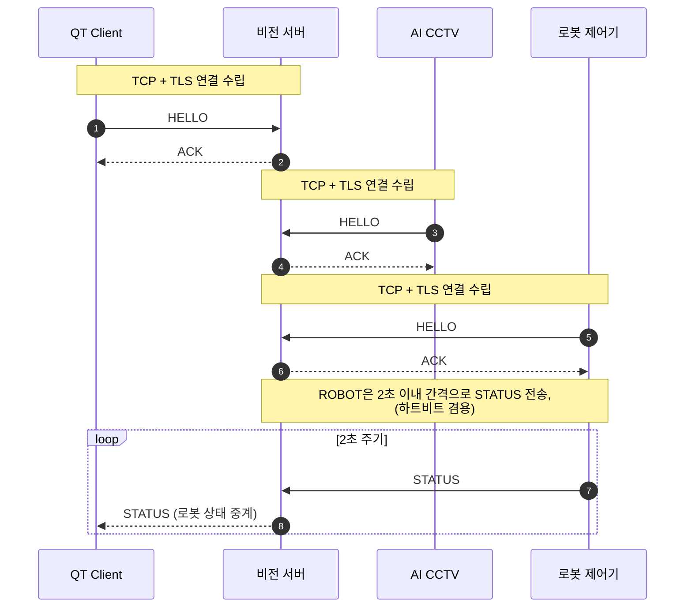
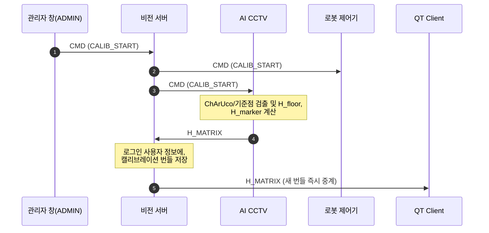
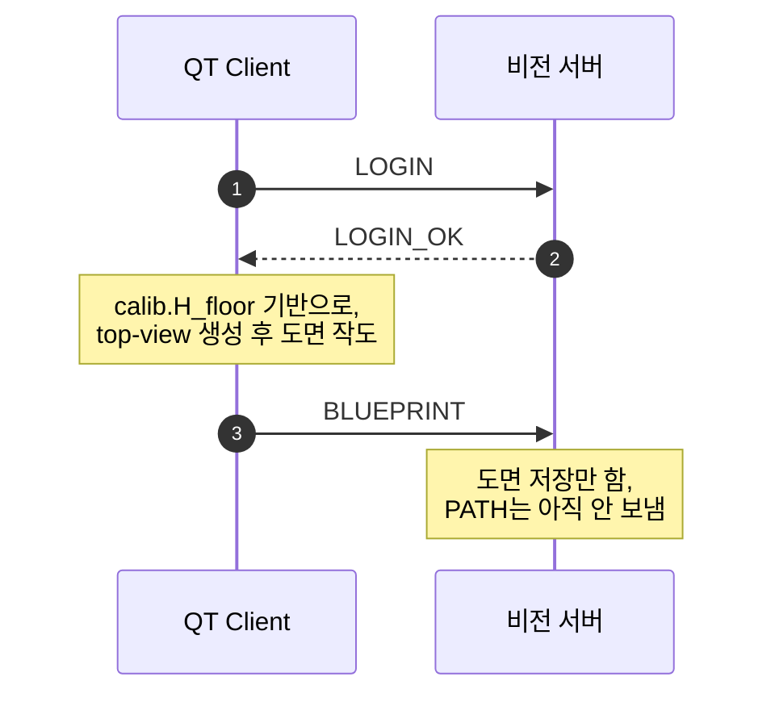
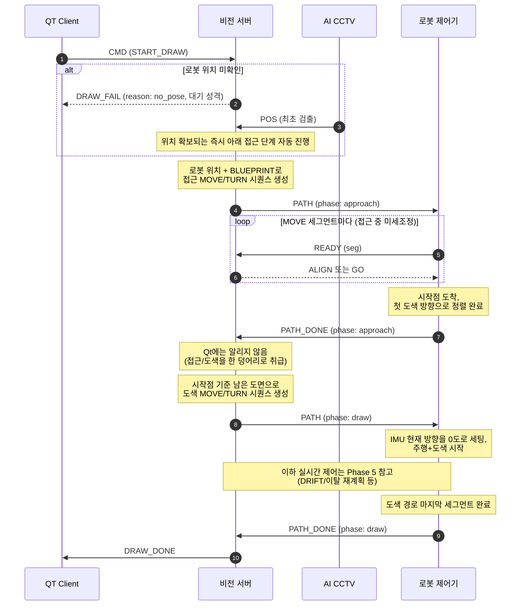
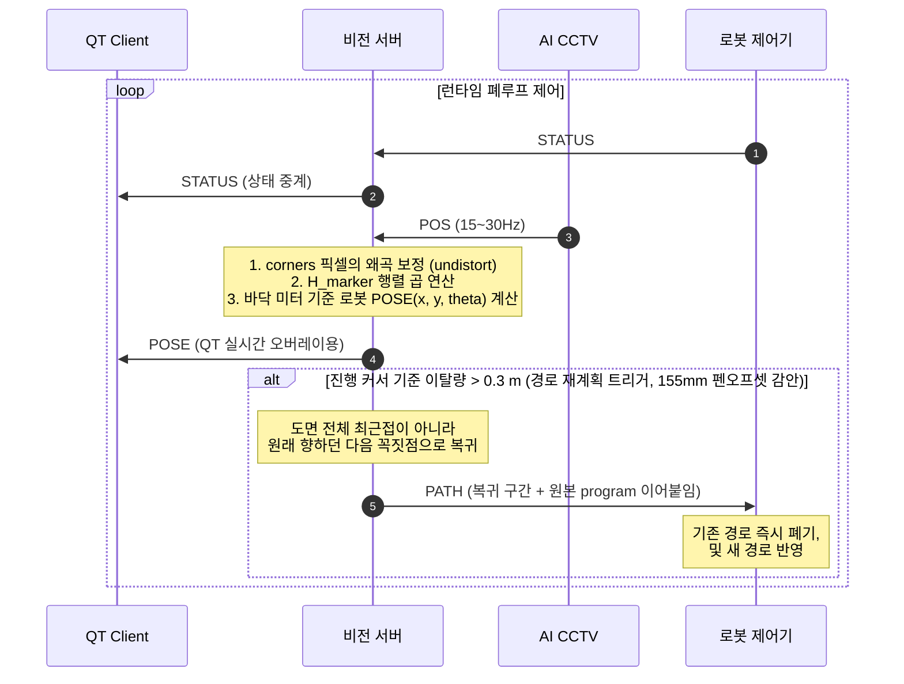
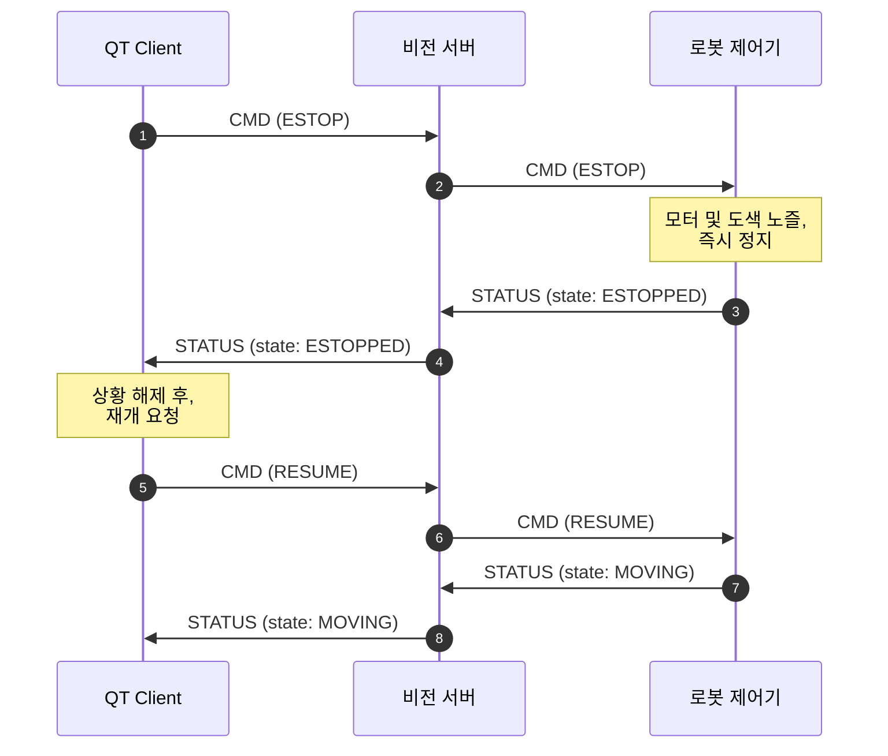

# 메시지 규격

> **메시지를 어떤 형식으로 주고받지?** 에 답하는 문서. 이 저장소의 **프로토콜 정본**이다.
> 관련: [ARCHITECTURE](ARCHITECTURE.md) · [PATH_GEOMETRY](PATH_GEOMETRY.md) · [CALIBRATION](CALIBRATION.md) · [TUNING](TUNING.md)

구현 기준: [`src/protocol.hpp`](../src/protocol.hpp) 상단 주석이 코드 안의 같은 계약이다.
메시지를 추가할 때는 그 파일부터 고치는 것이 관행이다.

**한눈에**

| | |
|---|---|
| 전송 | TCP + TLS 1.2, 포트 **9000** |
| 프레이밍 | JSON 한 줄 + 개행 (JSON Lines) |
| 형식 | `{"type":"...", "seq":n, "payload":{...}}` |
| 등록 | 접속 후 10초 안에 `HELLO{role}` 필수 |
| role | `QT` · `ROBOT` · `CCTV` · `ADMIN` — 각 role 당 연결 하나 |

## 목차

| 장 | 내용 |
|---|---|
| [좌표계 규약](#좌표계-규약--반드시-읽을-것) | 누가 어떤 좌표를 보내고 변환은 누가 하는가 |
| [채널 규약](#채널-규약--다채널-카메라를-쓰면-반드시-읽을-것) | `ch` 필드, 활성 채널, 채널별 캘리브레이션 |
| [공통](#공통) | 전송·프레이밍·`HELLO` |
| [로봇 (ROBOT)](#로봇-robot--server-driven-v2) | v2 주행 규약 — `PATH`/`READY`/`GO`/`ALIGN`/`MORE`/`DRIFT`/`HOLD` |
| [QT](#qt) | 로그인·`BLUEPRINT`·`CMD`·상태 통지 |
| [CCTV](#cctv) | `POS`·`H_MATRIX`·`ZONE_EVENT`·캘리브레이션·채널 정합 |
| [ADMIN](#admin-관리자-창) | `TAP` 로그 미러링, 점검용 명령 |
| [전체 시나리오](#프로토콜-기반-전체-사용-시나리오) | 로그인부터 도색 완료까지 한 번에 |

---

## 좌표계 규약 — 반드시 읽을 것

시스템에는 좌표 "언어"가 두 개 있다:

- **픽셀 좌표**: CCTV 원본 영상 위의 위치 `(u, v)`
- **바닥 좌표**: 실제 바닥 평면 위의 위치, **단위 미터** `(x, y)`

누가 어떤 언어로 보내고, 변환은 누가 하는가:

| 역할 | 서버로 보내는 좌표 | 변환 담당 |
|---|---|---|
| **CCTV** | 마커 4코너 **원본 픽셀** (변환 금지) | **서버** (undistort → H_marker) |
| **QT** | 도면 **바닥 미터 좌표** (변환 완료) | **QT** (top-view 픽셀 ÷ S) |

이렇게 나누는 이유:

- **CCTV → 픽셀 그대로**: 마커 좌표는 렌즈 왜곡 보정(undistort)과 높이 시차 보정(H_marker)이 필요하고, solvePnP 보조 검증도 원본 픽셀이 있어야 가능하다. 캘리브레이션 데이터(K, D, H)를 서버 한 곳에만 두기 위해 CCTV는 "본 그대로"만 보고한다.
- **QT → 변환 완료**: top-view 위에 그린 점은 정의상 바닥 평면 위의 점이다. 왜곡도 높이 문제도 없고, 남은 건 축척 나눗셈(S px/m)뿐이라 Qt가 끝내서 보낸다.

서버 내부 파이프라인 (POS 수신 시):

```
원본 4코너 픽셀
  → undistort  (cv::undistortPoints(..., P=K) 동등 — 결과를 픽셀 단위로 유지)
  → H_marker   (마커 장착 높이 평면용 호모그래피 — 시차 보정 흡수)
  → 바닥 미터 좌표 4점
  → 중심 = 4점 평균, yaw = atan2(전방중점 − 후방중점)   ※ 반드시 변환 후 각도 계산
  → 로봇 pose (x, y, θ)
```

**단위 규약** (2026-08-11 개정): CCTV가 보내는 `H_floor`/`H_marker`는 **mm 기준**(pixel → world mm)이고, **서버는 캘리 번들을 mm 그대로 저장·QT 중계**한다. ÷1000은 서버 내부 좌표 계산용 사본에서만 일어나므로, 서버가 계산해 내보내는 값(`POSE`, `BLUEPRINT.points`, `PATH.dist_m`)은 **종전대로 전부 미터**다. 즉 캘리 **번들**만 mm이고, 좌표를 실어 나르는 메시지는 미터다.

⚠️ **호모그래피를 거친 좌표를 solvePnP에 넣지 말 것.** solvePnP는 K로 투영된 실제 픽셀 좌표를 전제한다. 보조 검증(solvePnPGeneric IPPE_SQUARE)은 원본 코너에서 **병렬**로 수행한다.

## 채널 규약 — 다채널 카메라를 쓰면 반드시 읽을 것

카메라가 1채널(PNO-A9081R) → 4채널(PNM-C16083RVQ)로 늘어나면서, **"어느 채널에서
본 것인가"를 프로토콜이 구분해야 한다.** 채널마다 렌즈 방향·각도가 달라 캘리브레이션
번들(K/D/H)이 **채널마다 완전히 다르기** 때문이다. 채널을 모르면 서버가 어느 H로
픽셀을 바닥 좌표로 바꿔야 할지 알 수 없다.

> ⚠️ **영상(RTSP) 중계는 이 프로토콜의 범위가 아니다.** 4채널 스트림은 MediaMTX가
> 별도 프로세스로 중계하고(`Server/relay/`), 서버는 "지금 어느 채널을 보는가"라는
> 제어 상태만 다룬다. 서버는 영상 라이브러리를 링크하지도 않는다.
> 중계 주소를 QT에 알려주는 통로만 `LOGIN_OK.stream`으로 프로토콜에 있다.

### 표기

**`ch`** = 채널 번호. **1부터 시작하는 정수** (카메라 웹UI의 `CH1`~`CH4`와 같은 번호).

| 붙는 곳 | 방향 | 의미 |
|---|---|---|
| `H_MATRIX.payload.ch` | CCTV/ADMIN → 서버 | 이 캘리브레이션 번들이 **어느 채널의 것인지** |
| `POS.payload.ch` | CCTV → 서버 | 이 마커를 **어느 채널에서 봤는지** |
| `ZONE_EVENT.payload.ch` | CCTV → 서버 → ROBOT | 사람 진입이 **어느 채널에서 검출됐는지** |
| `CMD{"cmd":"SELECT_CHANNEL","ch":n}` | QT/ADMIN → 서버 → CCTV | 작업 채널 전환 |
| `CHANNEL_OK.payload.ch` | 서버 → QT | 전환 결과 + 그 채널의 캘리브레이션 |
| `LOGIN_OK.payload.calibs` | 서버 → QT | **채널별** 번들 맵 |
| `LOGIN_OK.payload.stream` | 서버 → QT | 중계 RTSP 베이스 주소 (선택) |

### 🔴 하위호환 — `ch`는 전부 선택 필드다

**`ch`가 없으면 서버는 `1`로 본다.** 단일 채널 카메라(PNO)와 기존 클라이언트는
한 줄도 안 고쳐도 v0.3과 100% 동일하게 동작한다.

- CCTV가 `ch` 없이 `POS`를 보내면 → 채널 1의 캘리브레이션으로 변환
- CCTV가 `ch` 없이 `H_MATRIX`를 보내면 → 채널 1 슬롯에 저장
- QT가 `SELECT_CHANNEL`을 한 번도 안 보내면 → 활성 채널은 계속 1

### 활성 채널 (`activeChannel`)

서버는 **활성 채널 1개**를 기억한다. 그 채널이 곧 "지금 로봇을 보고 있는 채널"이다.

- `SELECT_CHANNEL`로 바뀐다. 기본값은 1.
- **`POS`의 채널이 활성 채널과 다르면 서버는 그 `POS`를 무시한다.** 다른 채널이
  우연히 로봇 마커를 잡았을 때 pose가 두 채널 사이에서 튀는 것을 막기 위함이다.
  (⚠️ 현재 CCTV 앱은 한 번에 한 채널만 보므로 실제로 이 경우는 드물다 — 그래도
  규약으로 못박아 두면 CCTV가 나중에 4채널 동시 검출로 바뀌어도 서버가 안 흔들린다.)
- 채널을 바꾸면 서버는 **직전 pose를 무효화한다** (`poseValid_ = false`). 예전 채널
  기준 좌표는 새 채널에서 의미가 없기 때문이다 — 새 채널의 첫 `POS`가 올 때까지
  서버는 로봇 위치를 "모르는" 상태가 된다.
- 채널이 바뀌어도 서버는 **진행 중인 경로를 자동으로 폐기하지 않는다.** 작업 중
  채널을 바꾸는 것은 조작 실수에 가까우므로, QT가 작업 중에는 채널 전환 UI를
  잠그는 쪽으로 막는다.

### 캘리브레이션은 채널마다 따로 저장된다

`config/calib_latest.json`(전역 슬롯)과 계정 저장소 모두 **채널별 맵**으로 바뀐다.

```json
{ "1": {…번들…}, "2": {…번들…}, "3": null, "4": {…번들…} }
```

- 조회 순서는 v0.3과 같다: **계정 값 → (없으면) 전역 값**. 채널 단위로 각각 적용된다.
- ⚠️ **채널 하나를 캘리했다고 나머지가 따라오지 않는다.** 4채널을 다 쓰려면
  채널마다 캘리브레이션을 따로 수행해야 한다 (관리자 창에서 채널을 골라 진행).
- 예전 형식(맵이 아닌 번들 하나)이 저장돼 있으면 서버가 **채널 1의 번들로 읽는다**
  (마이그레이션 불필요). 이 하위호환은 `tools/calib_channel_test`가 회귀 테스트로
  못박아 두고 있다 — `make calib_channel_test && ./tools/calib_channel_test`.

## 공통

- **전송**: TCP + TLS, 포트 **9000**
  - 서버만 인증서 제시 (클라이언트는 `certs/server.crt`를 신뢰 CA로 등록해 서버를 검증. 클라이언트 인증서 불필요)
- **프레이밍**: JSON 한 줄 + 개행(`\n`) — JSON Lines
- **공통 형식**: `{"type": "...", "seq": n, "payload": {...}}`
- **접속 절차**: TLS 핸드셰이크 → 첫 메시지로 `HELLO` 전송 (10초 내 미전송 시 서버가 연결 종료) → `ACK` 수신 후 통신 시작

```json
{"type":"HELLO","seq":1,"payload":{"role":"ROBOT"}}
```
- `role`: `"QT"` | `"ROBOT"` | `"CCTV"` | `"ADMIN"` (관리자 창 — 아래 ADMIN 장 참고)
- 서버 응답: `{"type":"ACK","seq":n,"payload":{"msg":"registered as ROBOT"}}`
- 같은 role이 재접속하면 기존 세션은 자동으로 끊고 새 연결로 교체

---


---

## 로봇 (ROBOT) — server-driven v2

> 🔴 로봇 대면 규약은 **여기가 정본**이다. v1(서버가 경로만 던지고 로봇이 알아서 가던 방식)은
> 더 이상 쓰지 않는다.

한 줄 요약: **로봇은 스스로 판단하지 않는다.**
op 하나를 실행하기 전마다 `READY` 를 보내고, 서버가 `GO` / `ALIGN` / `MORE` 중
**정확히 하나**로 답해야만 움직인다.

v1 대비 바뀐 핵심 네 가지.

| | v1 | v2 |
|---|---|---|
| 핸드셰이크 | `MOVE` 앞에서만 | **모든 op 마다** `READY` → `GO`/`ALIGN`/`MORE` |
| 피드백 | `ALIGN` 만 | `ALIGN`(각도) · `MORE`(거리) · `DRIFT`(주행 중 각도) |
| 펜 오프셋 | 로봇이 보정 | **서버가 op 으로 삽입** (로봇은 하면 안 된다) |
| POS 두절 | 없음 | `HOLD` 로 즉시 정지, 복구되면 이어서 |

경로 생성 쪽 계산(펜 오프셋·펜 두께·호 기하·도색 언더슛)은
[PATH_GEOMETRY](PATH_GEOMETRY.md)에 따로 정리했다.

### 1. 좌표계와 부호 규약

#### 1.1 서버 내부 (v1과 동일 — 바뀌지 않음)

- 월드 = 바닥 평면, 단위 미터.
- `pose.theta` = **반시계(CCW) 양수**, +x축 기준. (`poseFromPos`, `atan2`)
- Qt `heading_deg`, Qt `TURN.angle_deg` = **반시계 양수**.

#### 1.2 로봇 대면 (v2에서 반전)

> 🔴 **로봇에게 나가는 모든 각도는 "양수 = 오른쪽으로 그만큼 틀어라"다.**

`turn.angle_deg`, `ALIGN.angle_deg`, `DRIFT.angle_deg` 전부 해당한다.
`arc.angle_deg`는 예외로 **항상 양수(회전량 크기)**이고 방향은 `direction`이 갖는다.

#### 1.3 변환식 (서버가 송신 직전에 1회 적용)

```
angle_robot = -angle_ccw
```

| 계산 | CCW 기준 (서버 내부) | 로봇에 보낼 값 |
|---|---|---|
| Qt TURN 중계 | `qt.angle_deg` | `-qt.angle_deg` |
| ALIGN | `err = normDeg(target_heading - theta_deg)` | `-err` |
| DRIFT | `err = normDeg(target_heading - theta_deg)` | `-err` |

**검산**: 로봇 `theta`=30°, 목표 `heading`=40°.
왼쪽으로 10° 돌아야 함 → `err = +10` → 로봇에 `-10` 전송 → "왼쪽 10°". ✅

> ⚠️ v1 DRIFT 주석("값 = 좌회전으로 보정해야 할 양")은 v2에서 **정확히 부호가 반대**다.
> 로봇 실행부에서 v1 코드를 재사용할 때 이 지점이 가장 조용히 깨진다.

---

### 2. 메시지 카탈로그

공통 형식은 v1과 동일: `{"type":"...", "seq":n, "payload":{...}}` + `\n` (TLS 위 JSON Lines).

#### 2.1 서버 → 로봇

| type | payload | 설명 |
|---|---|---|
| `PATH` | `{"phase":"approach"\|"draw", "ops":[...]}` | 경로 전체. 받는 즉시 기존 경로 폐기. |
| `GO` | `{"op_index":n}` | op n 실행 허가 |
| `ALIGN` | `{"op_index":n, "angle_deg":±d}` | 제자리 미세 회전 후 **같은 op_index로 READY 재전송** |
| `MORE` | `{"op_index":n, "dist_m":±m}` | 현재 방향으로 전/후진 후 **같은 op_index로 READY 재전송** |
| `DRIFT` | `{"op_index":n, "angle_deg":±d}` | 직진 주행 **중** 각도 보정 (READY 불필요) |
| `HOLD` | `{"hold":true\|false, "reason":"pos_lost"}` | 즉시 정지 / 재개 |
| `ZONE_EVENT` | `{"action":"Enter", "ch":n, ...}` | CCTV 구역 진입 경보. CMD와 별도 수신 래치로 음성 재생 |
| `CMD` | `{"cmd":...}` | v1 그대로 (ESTOP/RESUME/수동조작/CALIB_START) |

#### 2.2 로봇 → 서버

| type | payload | 설명 |
|---|---|---|
| `HELLO` | `{"role":"ROBOT"}` | v1 그대로 |
| `STATUS` | `{"state":..., "painting":bool}` | v1 그대로. 500ms 주기, 하트비트 겸용 |
| `READY` | `{"op_index":n}` | **op n을 실행해도 되는지** 묻는다 (아래 §3) |
| `PATH_DONE` | `{"phase":"approach"\|"draw"}` | 마지막 op까지 마쳤을 때 1회 |

`READY` / `PATH_DONE` 외에 로봇이 자발적으로 보내는 것은 `STATUS`뿐이다.

`ZONE_EVENT`는 CCTV가 기존 `role=CCTV` TLS 세션으로 서버에 전송하고, 서버가
`action:"Enter"`만 기존 `role=ROBOT` TLS 세션으로 중계한다. 별도 UDP 포트는 없다.
로봇은 이를 `CMD` 슬롯과 분리해 처리하므로 구역 경보가 `ESTOP`이나 수동 명령을
덮어쓰지 않는다. 여러 Enter가 메인 루프 한 주기 안에 몰리면 한 번으로 합쳐진다.

---

### 3. op_index 와 READY/GO 핸드셰이크

#### 3.1 op_index 의미

> 🔴 `READY.op_index` = **"이제부터 실행하려는" op의 index** (완료한 op이 아니다)

- 서버가 `PATH`를 만들 때 0부터 빈틈없이 부여한다. 오프셋 보정 op도 같은 번호를 먹는다.
- `PATH` 하나 안에서만 유효하다. 새 `PATH`를 받으면 다시 0부터.
- 로봇은 자기가 기다리는 index와 다른 `GO`/`ALIGN`/`MORE`/`DRIFT`는 **조용히 버린다.**
  (지연 도착한 이전 경로의 응답이 새 경로를 움직이는 것을 막는다)

#### 3.2 흐름

```
로봇                          서버
 │  PATH 수신                  │
 ├── READY{0} ────────────────>│   op 0 실행해도 되나?
 │<────────────── GO{0} ───────┤   (또는 ALIGN/MORE 먼저)
 │  op 0 실행                   │
 ├── READY{1} ────────────────>│
 │<────────────── GO{1} ───────┤
 │  op 1 실행                   │
 │        ...                   │
 │  마지막 op(N-1) 실행         │
 ├── PATH_DONE{phase} ────────>│   READY{N}은 보내지 않는다
```

- `ALIGN` / `MORE`를 받으면 로봇은 그 동작을 수행하고 **같은 op_index로 READY를 다시** 보낸다.
- `GO`를 받아야만 다음 op으로 넘어간다. 서버가 응답을 빠뜨리면 로봇은 영원히 멈춘다 —
  **서버는 모든 READY에 반드시 응답 하나를 낸다.**

---

### 4. op 사양 (`PATH.ops` 원소)

모든 op의 공통 필드:

| 필드 | 타입 | 설명 |
|---|---|---|
| `op` | string | `"turn"` / `"nozzle"` / `"move"` / `"arc"` |
| `op_index` | int | 0부터 연속 |
| `role` | string | `"path"` (도면 동작) / `"offset"` (서버가 끼운 보정) |

> 🔴 **`role`은 관측용 메타데이터다. 로봇은 `role`을 읽지 않으며, 값에 따라 동작을 바꾸지 않는다.**
> 로그·디버깅·서버 재현용이다. 로봇 실행부에 `role` 분기가 생기면 그 자체가 버그다.

#### 4.1 `move`

```json
{"op":"move", "role":"path", "dist_m":1.2, "op_index":5}
```
- `dist_m` 음수 = 후진. 바라보는 방향은 바뀌지 않는다.

#### 4.2 `turn`

```json
{"op":"turn", "role":"path", "angle_deg":-90.0, "op_index":5}
```
- 제자리 회전. **양수 = 오른쪽.**

#### 4.3 `nozzle`

```json
{"op":"nozzle", "role":"offset", "down":false, "op_index":2}
```
- 노즐 상태를 바꾸는 유일한 op. `move`에는 `paint` 필드가 **없다** (v1과 다름 — [PATH_GEOMETRY](PATH_GEOMETRY.md) 참고).
- 로봇은 액추에이터가 완전히 착지/상승할 때까지 **약 1.0초 정지 대기** 후 READY를 보낸다
  (로봇팀 기구학 다이어그램 2·4단계). 서버는 이 op에 즉시 `GO`를 주므로 프로토콜상
  추가 대기는 없지만, **꼭짓점 하나당 노즐 op 2개 = 약 2초**가 실행 시간에 붙는다.

#### 4.4 `arc`

```json
{"op":"arc", "role":"path", "radius_m":0.476, "angle_deg":180.0,
 "direction":"right", "op_index":7, "radius_draw_m":0.5}
```

| 필드 | 설명 |
|---|---|
| `radius_m` | **로봇 마커 중심이 그려야 할** 회전 반지름 (실행값) |
| `angle_deg` | 회전량 **크기, 항상 양수** |
| `direction` | `"left"` / `"right"` |
| `radius_draw_m` | (참고용) 도면상 펜 자취 반지름. 로봇은 무시 |

#### 실행 방식 — 직선 근사가 아니다

> 🔴 **`arc` op 하나 = 좌우 바퀴 속도비를 고정한 채 완주하는 한 번의 연속 곡선 주행.**
> 짧은 직선의 조합으로 쪼개지 않는다.

```
R_L = radius_m - W/2                   (안쪽 바퀴, W = 축간거리 ≈ 0.167m)
R_R = radius_m + W/2                   (바깥쪽 바퀴)
SPS_L : SPS_R = R_L : R_R              주행 내내 고정
정지 조건: 바퀴중심 이동거리 = radius_m × θ_rad
```
(`direction="left"`면 좌측이 안쪽, `"right"`면 우측이 안쪽)

#### 펜 보정이 직선과 다르게 들어간다

| | 직진 `move` | 곡선 `arc` |
|---|---|---|
| 보정 방법 | **별도 op을 앞뒤에 삽입** (`+d` / `-d`) | **`radius_m` 값 자체에 녹임** |
| 로봇이 아는 것 | "d만큼 더 가라"는 명령 | 없음 — 시킨 반지름으로 돌 뿐 |

반지름 치환 하나로 끝나는 이유: 노즐의 회전반지름은 바퀴중심 회전반지름의 고정된
기하 함수(`sqrt(radius_m² + d²)`)이고 **쓸어가는 각도가 둘이 완전히 같다**([PATH_GEOMETRY](PATH_GEOMETRY.md)).
주행 내내 성립하는 관계라 중간 보정이 필요 없다.

> 📐 **실측 예시 (도면 200mm 원호 주행 시)**:
> - 도면 목표 반지름 $R_{draw} = 0.200\text{m}$ ($200\text{mm}$)
> - 노즐 오프셋 $d = a$, 차축 $W$ (실제 수치는 `config/params.json`, 아래는 $a=0.155$ 일 때의 예시)
> - 서버 전달 `radius_m`: $R_{robot} = \sqrt{0.200^2 - a^2} = \mathbf{0.1264 \text{ m}}$ ($126.4\text{mm}$)
> - 내측 바퀴 $R_{in} = 0.1264 - 0.083 = 0.0434\text{m} > 0$ (정방향 전진)
> - 외측 바퀴 $R_{out} = 0.1264 + 0.083 = 0.2094\text{m}$
> - 좌우 속도 비율 $SPS_L : SPS_R = R_{in} : R_{out} \approx 1 : 4.82$

#### 개루프 구간이다 — 진입 pose가 전부를 결정한다

- `arc` 주행 중에는 `DRIFT`를 보내지 않는다 ([PATH_GEOMETRY](PATH_GEOMETRY.md)). `GO` 이후 완주까지 서버 피드백이 없다.
- 🔴 **반지름은 위 공식이 보장하지만, 그려지는 원의 "위치"는 진입 pose가 100% 결정한다.**
  ICR이 진입 시점의 중심 좌표와 heading으로 확정되기 때문이다. 진입 각도가 5도 틀어지면
  원 전체가 통째로 어긋난다. 그래서 **arc 진입 전 ALIGN은 직선 앞의 ALIGN보다 중요하다**
  ([PATH_GEOMETRY](PATH_GEOMETRY.md)에서 arc 진입 boundary를 별도 항으로 둔 이유).

#### v1 → v2 마이그레이션 체크리스트 (ARC)

공식 부호만 뒤집는 것으로는 부족하다. **세 곳**이 바뀐다.

| # | 위치 | v1 | v2 | 안 고치면 |
|---|---|---|---|---|
| 1 | **로봇** | 자체 보정 `√(R²+d²)` 수행 | **보정 코드 삭제.** `radius_m`을 받은 그대로 사용 | **이중 보정** |
| 2 | **로봇** | 정지 조건 = Qt `dist_m` (펜 기준 호 길이) | 정지 조건 = `radius_m × θ_rad` (바퀴중심 기준) | **과회전** |
| 3 | **서버** | 없음 | `R_paint < d`면 도면 거부 ([PATH_GEOMETRY](PATH_GEOMETRY.md)) | `√` 안이 음수 → **NaN 전파** |

**① 이중 보정이 왜 위험한가** — 서버가 이미 보정한 값에 로봇이 또 보정하면

```
R_exec = sqrt(R_robot² - d²) = sqrt(R_paint² - 2d²)
```

`R_paint = 0.5` → `0.4489` (정답 `0.4754` 대비 5.6% 작은 원).
`R_paint < d*sqrt(2) ≈ 0.219`에서는 **루트 안이 음수가 되어 그대로 터진다.**

**② 과회전이 왜 생기나** — `R_robot < R_paint`이므로 바퀴중심 호 길이는 펜 호 길이보다
짧다. 펜 기준 길이로 스텝을 세면 그 비율만큼 더 돈다.
`R_paint = 0.5`, 180° 기준 약 **9° 과회전**. v2에는 `dist_m` 필드 자체가 없으므로
자연히 걸러지지만, v1 코드를 복사해 오면 조용히 살아남는 종류의 버그다.

**바뀌지 않는 것**: `angle_deg`(스윕 각도), `direction`, SPS 속도 분배식.
스윕 각도가 보존되는 이유는 노즐 편각이 바퀴중심 편각보다 `atan(d/radius_m)`만큼
**일정하게** 뒤처지기 때문이다 — 상수 차이라 각속도에는 영향이 없다 ([PATH_GEOMETRY](PATH_GEOMETRY.md)).

#### 작은 반지름에서 안쪽 바퀴가 역회전한다

`radius_m < W/2 ≈ 0.0835m`이면 `R_L`이 음수가 된다 — 이는 `R_paint < 0.176m`에 해당한다.
기구학적으로는 정상(제자리 회전에 가까운 선회)이다.

✅ **모터 드라이버는 좌우 반대 방향 동시 구동을 지원한다** (로봇팀 회신 2026-08-07).
따라서 역회전 자체는 하한을 결정하지 않는다. 실사용 하한 `0.200m`은 **바깥 바퀴
SPS 발산** 때문에 정해진 것이고, 그 값이 0.176보다 커서 역회전 구간은 어차피 도면
단계에서 걸러진다 ([PATH_GEOMETRY](PATH_GEOMETRY.md)).

---


---

### 5. 피드백 3종

#### 5.1 판정 시점 — boundary 규칙

> **각 path op의 오차는 그 op이 끝난 직후 boundary에서 교정한다.**
> `turn`의 각도 오차 → `ALIGN`, `move`/`arc`의 거리 오차 → `MORE`.

`READY{k}` 수신 시 (직전 실행 op = `k-1`):

| 조건 | 처리 | 대기 |
|---|---|---|
| `op[k-1]`이 `role=path`인 `turn` | **ALIGN 판정** (최대 6회) | 2초 |
| `k == 0` 이고 `phase == "draw"` | **ALIGN 판정** (첫 주행 op의 heading으로) | 2초 |
| `op[k]`가 `role=path`인 `arc` 이고 위에 안 걸림 | **ALIGN 판정** (진입 **차체** 방위 = 접선 + φ, [PATH_GEOMETRY](PATH_GEOMETRY.md)) | 2초 |
| `op[k-1]`이 도착 꼭짓점을 아는 `move` 또는 `arc` | **MORE 판정** (최대 4회) | 2초 |
| 그 외 (`nozzle`, `turn`, 목표를 모르는 op) | **즉시 `GO`** | 없음 |

> 🔵 **2026-08-11 변경**: MORE 판정 조건에서 `role=path` 요구를 뺐다. 기준은 이제
> "그 op이 끝났을 때 마커 중심이 어디 있어야 하는지 서버가 아는가" 하나이고,
> **오프셋 보정 다리(`role=offset`인 `move ±a`)도 대상**이다.
>
> 예전에는 그 다리들이 조건에서 통째로 빠져, 매 꼭짓점마다 150mm를 슬립계수 하나만
> 믿고 개루프로 찍고 틀려도 아무도 고치지 않았다. 펜 오프셋 설정값이 실측과 5mm만
> 어긋나도 그 오차가 보정 없이 꼭짓점마다 그대로 나타난다(2026-08-11 삼각형 시험
> 관측: 꼭짓점 벌어짐 6~18mm). 목표는 [PATH_GEOMETRY](PATH_GEOMETRY.md) 식 그대로다 —
> `move(+a)`는 「꼭짓점 + a·û」(곧 노즐을 내리므로), `move(-a)`는 「꼭짓점」.
>
> 두 보정 모두 **노즐이 올라가 있는 동안** 실행된다(`move(+a)` 뒤엔 아직
> `nozzle(down)` 전, `move(-a)` 앞엔 이미 `nozzle(up)`). 도료를 문지를 여지가 없다.
> 회귀 테스트: `make offset_feedback_test && ./tools/offset_feedback_test`

- 한 boundary에서 MORE 판정과 ALIGN 판정이 모두 걸릴 수 있다(도색 move 직후 곧바로 arc).
  이때는 **MORE를 먼저 소진하고, 그다음 ALIGN**을 돌린 뒤 `GO`.
- 재시도 횟수는 **boundary마다 0으로 리셋**한다.

#### 5.2 2초 대기 창

- 기준 시각 = **READY 수신 시각** (ALIGN/MORE 송신 시각이 아니다).
  로봇이 회전/전진하는 동안 흘러간 시간을 대기에 포함시키면, 정작 "동작이 끝난 뒤의
  장면"을 못 보고 판정하게 된다.
- 대기 창 동안 들어온 POS를 모은다.
  - 각도: `sin`/`cos` 누적 후 `atan2` (원 위 평균 — ±180° 경계에서 깨지지 않게)
  - 위치: `x`/`y` 산술 평균
- 🔴 **창 안에 채택된 POS가 0장이면 판정하지 않고 곧바로 `GO`.**
  직전 판정과 글자 그대로 같은 pose이므로 **똑같은 보정이 한 번 더 나가는 것이 보장**된다
  (v1에서 -34.6° ALIGN이 값까지 동일하게 3번 나가 로봇이 104° 돈 사례가 있다).
  재시도 카운터는 소모하지 않는다 — 실제로 시도한 게 아니다.

#### 5.3 `DRIFT` — 주행 중 각도 피드백

- **`role=path`인 `move`를 실행 중일 때만** 보낸다.
  `arc` 실행 중에는 보내지 않는다. `role=offset`인 `move`(a)에도 보내지 않는다.
- 서버는 "지금 실행 중인 op" = 마지막으로 `GO{k}`를 보낸 뒤 `READY{k+1}`이 아직 안 온 상태의 `k`.
- 값 = 그 구간의 명목 heading 대비 오차. `angle_deg = -normDeg(target - theta_deg)`.
- 전송 주기 상한 `400ms`. `|angle_deg| < 1.0°`면 보내지 않는다.
- 로봇은 이 신호에 **READY로 응답하지 않는다.**
- 🔴 **거동은 "연속 조향"으로 정한다** — 멈추지 않고 좌우 바퀴 속도차로 흡수한다.
  실주행 테스트 후 "잠깐 멈추고 → 틀고 → 재출발"로 바뀔 수 있다. **서버 동작은 어느
  쪽이든 동일하다** (DRIFT는 fire-and-forget이라 로봇 거동을 서버가 알 필요가 없다).

#### 5.4 `ALIGN` — 출발 각도 정렬

- 목표 heading은 서버가 알고 있다: Qt program의 각 op에 `heading_deg`(CCW 절대 방위)가 실려 있다.
  판정 대상 op에 없으면 **뒤따르는 op에서 첫 번째로 발견되는 값**을 쓴다.
- `err_ccw = normDeg(target_heading - theta_deg)`
- `|err_ccw| <= 4.0°` → `GO`
- 아니면 `ALIGN{op_index:k, angle_deg: -err_ccw}` 송신, 카운터 +1
- 6회를 다 쓰면 포기하고 `GO`

> 임계값 4.0°는 v1에서 현장 튜닝된 값이다(로봇 메인 루프 80ms × 22.58 step/deg에서
> 오는 1틱 오버슛 1.42°, + 마커 코너 픽셀 노이즈 σ≈0.7°). 로봇이 감속 접근/예측 정지를
> 넣어 오버슛을 줄이면 다시 내릴 수 있다.

#### 5.5 `MORE` — 주행 거리 보정

- 서버는 목표 좌표를 **Qt가 준 데이터로만** 구한다 (추측항법 누적 없음).
  - `points` = BLUEPRINT 폴리라인 (= 펜 자취)
  - `v` = 각 Qt op의 "출발 꼭짓점" index
- 방금 끝낸 path op의 **도착 꼭짓점** = 그다음 path op의 `v`.
  다음 path op이 없으면 `points`의 마지막 점.

```
pen_target    = points[v_next]                          (도색 move/arc, 오프셋 move(-a))
              = points[v_self]                          (오프셋 move(+a) = 도색 시작 꼭짓점)
center_target = pen_target + a * û(target_heading)     if 끝난 뒤 노즐이 내려가 있어야 하면
              = pen_target                             if 아니면 (노즐 up 상태)
more_dist     = (center_target - center_actual) · û(target_heading)
```

「끝난 뒤 노즐이 내려가 있어야 하는」 op = 도색 `move`/`arc`, 그리고 **오프셋
`move(+a)`** (바로 다음이 `nozzle(down)`이므로 중심이 이미 a 앞이어야 한다).
오프셋 `move(-a)`는 이미 노즐을 올린 뒤라 목표가 꼭짓점 그대로다.

> 🔴 `+ a * û` 항이 **"오프셋 보정으로 인한 이탈은 정상"** 을 코드로 표현한 것이다.
> 이 항을 빠뜨리면 도색 구간마다 서버가 15.5cm 전진 오차를 잡고 있다고 착각해
> 매번 `MORE{-a}`를 쏜다.

- `|more_dist| <= more_deadband_m` (현재 `0.005 m`) → `GO`
- `|more_dist| > 0.5m` → 물리적으로 말이 안 되는 값이므로 판정 폐기하고 `GO` + WARN 로그
- 아니면 `MORE{op_index:k, dist_m: more_dist}` 송신, 카운터 +1 (양수 = 전진, 음수 = 후진)
- 4회를 다 쓰면 포기하고 `GO`

#### 5.5.1 도색 언더슛 (`paint_undershoot_m`)

> 🔵 **로봇 측 변경 없음.** 받는 메시지의 `dist_m` 값만 달라지고, 규격·핸드셰이크는
> 그대로다. 로봇은 평소처럼 시킨 거리를 가고 `READY`를 보내면 된다.

서버는 **펜을 내리고 긋는 직선(도색 `move`)** 을 계산값 그대로 보내지 않고,
`paint_undershoot_m`(기본 0.02m)만큼 **일부러 덜** 명령한다. 남은 몫은 위 `MORE`
피드백이 채운다.

```
도색 move 명령값 = max(min_move_m, (L + w) - paint_undershoot_m)
MORE 목표        = 그대로 (변경 없음)
```

- 🔴 **목표(`center_target`)는 줄이지 않는다.** 명령만 줄이므로 그 차이가 다음
  boundary에서 그대로 거리 오차로 잡히고, `MORE`가 CCTV 실측 기준으로 메운다.
  목표까지 같이 줄이면 메울 오차가 사라져 그냥 짧게 그은 선이 된다.
- 개루프 한 방으로 끝내는 것보다 **오버슛이 실측으로 교정된다**는 것이 이 방식의 전부다.
- `MORE` 보정 시점에는 **노즐이 아직 내려가 있다**(`nozzle(up)`은 그다음 op).
  그래서 남은 구간도 이어서 정상적으로 칠해진다.
- 적용 대상은 **도색 직선뿐**이다.
  - `arc`는 제외 — `MORE`가 호 끝에 **접선 직선**을 덧붙이는 방식이라([PATH_GEOMETRY](PATH_GEOMETRY.md)),
    덜 그으면 원이 그만큼 찌그러진다.
  - 오프셋 다리(`±a`)는 제외 — 펜이 올라가 있어 덜 갈 이유가 없고, 경로 맨 끝의
    후진 다리는 뒤에 `READY`가 없어 `MORE`로 메울 수도 없다.
  - 도착 꼭짓점을 모르는 구간도 제외 (`MORE` 자체가 안 걸린다).
- `paint_undershoot_m = 0`이면 종전 동작과 완전히 동일하다.

⚠️ `more_deadband_m`(기본 0.005m)보다 커야 의미가 있다. 이하로 두면 `MORE`가
"보정 불필요"로 판정해 **덜 그은 채로 끝난다** — 서버가 기동 시 WARN을 남긴다.

---

### 6. POS 두절 시 정지 (`HOLD`)

- 마지막으로 **채택된** POS로부터 `2000ms` 동안 새 POS가 없으면
  → `HOLD{"hold":true, "reason":"pos_lost"}`
- 로봇은 **실행 중인 op 도중이라도 즉시 정지**한다. op을 포기하지 않고 그 자리에서 멈춘다.
- POS가 다시 **연속 2장 채택**되면 → `HOLD{"hold":false}`
- 로봇은 멈춘 지점에서 **같은 op을 이어서** 수행한다 (남은 거리/각도부터).
- HOLD 중에는 서버가 `GO`/`ALIGN`/`MORE`/`DRIFT`를 **일절 보내지 않는다.**
  해제 시 유예 중이던 boundary의 2초 창을 **다시 처음부터** 센다.
- "채택"의 기준은 v1 POS 이상치 게이트를 그대로 쓴다
  (허용치 = `3.0° + 40°/s × dt`, 연속 5회 거부 시 재동기).

---

### 7. 단계 전이 (`phase`)

v1과 동일하다.

```
Qt: CMD{START_DRAW}
     └─> 서버: PATH{phase:"approach"}      (pose → points[0], 오프셋 보정 없음)
          └─> 로봇: PATH_DONE{"approach"}
               └─> 서버: PATH{phase:"draw"}  (Qt program + 오프셋 보정)
                    └─> 로봇: PATH_DONE{"draw"}
                         └─> 서버: Qt에 DRAW_DONE
```

- 접근 경로는 서버가 생성한다: `turn`(시작점 방향) → `move`(시작점까지) →
  `turn`(첫 도색 heading으로). 전부 `role="path"`, 노즐은 up인 채로 유지.
- 🔴 **접근 단계에도 ALIGN / MORE / DRIFT를 전부 적용한다.** 접근에서 빠지는 것은
  **오프셋 보정 op뿐**이다. 접근 도착 위치의 오차가 그대로 도색 시작점 오차가 되므로
  MORE를 켜 두는 편이 낫다 (단계당 2초를 쓰는 값은 한다).
- 접근 중에는 노즐이 up이므로 `MORE`의 목표는 `points[0]` **그대로**다
  (`+ a * û` 항 없음 — [PATH_GEOMETRY](PATH_GEOMETRY.md)).
- `phase`는 서버가 상태로 판단한다. 로봇이 `phase`를 안 실어도, 어긋나게 실어도
  동작하되 WARN 로그를 남긴다 (v1 그대로).

---

### 8. 전체 예시

도면: `points = [[0,0],[2,0],[2,1.5]]`, 전 구간 도색.

Qt program (변경 없음 — 대문자, CCW 양수):
```json
[{"op":"MOVE","dist_m":2.0,"paint":true,"heading_deg":0.0,"v":0},
 {"op":"TURN","angle_deg":90.0,"heading_deg":90.0,"v":1},
 {"op":"MOVE","dist_m":1.5,"paint":true,"heading_deg":90.0,"v":1}]
```

서버가 만드는 `PATH{phase:"draw"}.ops`:

| idx | op | role | 값 | 실행 후 중심 위치 | 펜 |
|---|---|---|---|---|---|
| 0 | `move` | offset | `+a` | (a, 0) | (0,0) |
| 1 | `nozzle` | offset | `down=true` | — | (0,0) |
| 2 | `move` | **path** | `+2.0` | (2.155, 0) | (2,0) |
| 3 | `nozzle` | offset | `down=false` | — | — |
| 4 | `move` | offset | `-a` | (2, 0) | — |
| 5 | `turn` | **path** | `-90.0` (좌 90°) | (2, 0) | — |
| 6 | `move` | offset | `+a` | (2, a) | (2,0) |
| 7 | `nozzle` | offset | `down=true` | — | (2,0) |
| 8 | `move` | **path** | `+1.5` | (2, 1.655) | (2,1.5) |
| 9 | `nozzle` | offset | `down=false` | — | — |
| 10 | `move` | offset | `-a` | (2, 1.5) | — |

boundary 처리:

| READY | 직전 op | 처리 |
|---|---|---|
| `{0}` | — (경로 시작, draw) | 2초 → **ALIGN** (목표 heading 0°) ×≤6 → `GO{0}` |
| `{1}` | 0: offset move | 즉시 `GO{1}` |
| `{2}` | 1: nozzle | 즉시 `GO{2}` |
| — | *op 2 주행 중* | **DRIFT** (≤2.5Hz, 목표 heading 0°) |
| `{3}` | 2: path move | 2초 → **MORE** (목표 중심 `(2.155, 0)`) ×≤4 → `GO{3}` |
| `{4}` | 3: nozzle | 즉시 `GO{4}` |
| `{5}` | 4: offset move | 즉시 `GO{5}` |
| `{6}` | 5: path turn | 2초 → **ALIGN** (목표 heading 90°) ×≤6 → `GO{6}` |
| `{7}` | 6: offset move | 즉시 `GO{7}` |
| `{8}` | 7: nozzle | 즉시 `GO{8}` |
| — | *op 8 주행 중* | **DRIFT** (목표 heading 90°) |
| `{9}` | 8: path move | 2초 → **MORE** (목표 중심 `(2, 1.655)`) ×≤4 → `GO{9}` |
| `{10}` | 9: nozzle | 즉시 `GO{10}` |
| — | 10 실행 후 | `PATH_DONE{"draw"}` |

**꼭짓점 (2,0) 부근 전체 순서** (요구사항의 `turn → align → go → 노즐 오프셋 보정 → move`):

```
op2 move(path)  →  op3 nozzle up  →  op4 move(-a)  →  op5 turn
                                                            ↓
                                              READY → 2초 → ALIGN → GO
                                                            ↓
                              op6 move(+a)  →  op7 nozzle down  →  op8 move(path)
```

---


---

## QT

### 송신: REGISTER / LOGIN (QT → 서버)

```json
{"type":"REGISTER","seq":1,"payload":{"id":"user1","pw":"...","cam_ip":"192.168.0.31"}}
{"type":"LOGIN","seq":2,"payload":{"id":"user1","pw":"..."}}
```

- `cam_ip`: 선택. 회원가입 시 등록해두는 CCTV 카메라 IP — 서버는 검증 없이 저장만 하고
  로그인 시 그대로 회신한다. Qt는 이 IP로 RTSP URL을 조립해 카메라 영상을 띄운다.

서버 응답:

| 응답 | payload |
|---|---|
| `REGISTER_OK` | `{"id":"user1"}` |
| `REGISTER_FAIL` | `{"reason":"이미 존재하는 id"}` 등 |
| `LOGIN_OK` | `{"id":"user1","calib":{...}\|null,"cam_ip":"192.168.0.31"\|null}` — `calib`은 저장된 캘리브레이션 번들(**`null`이면 캘리브레이션 필요**), `cam_ip`는 카메라 IP(없으면 `null`) |
| `LOGIN_FAIL` | `{"reason":"id 또는 비밀번호 불일치"}` |

- Qt는 `calib.H_floor`(+`K`,`D`)로 top-view를 생성한다: 프레임 왜곡 보정 → `warpPerspective(S·H_floor)` (S = 렌더링 축척 px/m)
- `calib`은 **어느 스키마로 올라왔든 항상 `H_floor`를 포함한다** (평면 스키마의 `H`에는 서버가 별칭을 붙인다 — CCTV `H_MATRIX` 절 참고). Qt는 `H_floor`만 보면 된다.
- 계정에 저장된 번들이 없으면 **전역 슬롯**(`config/calib_latest.json`)의 최신 번들이 내려온다. 둘 다 없을 때만 `null`이다.
- `cam_ip`도 **같은 규약**이다 (2026-08-07 추가): 계정에 값이 없으면 **전역 슬롯**(`config/camera.json`)의 카메라 IP가 내려온다. 둘 다 없을 때만 `null`이다. 카메라는 현장에 한 대뿐이라 주소는 사용자 속성이 아니라 **현장 속성**이므로, 새 계정으로 로그인해도 카메라 IP를 다시 넣을 필요가 없다. 계정에 값이 있으면 **계정 값이 이긴다**(기존 현장 보호).
- `calib`이 `null`이면(캘리브레이션 미완료) Qt는 관리자 창(`admin_console`, 현 서버 `http://<서버IP>:8083` — `admin_console/config.sh`에서 설정) 접속 링크를 안내해 사용자가 캘리브레이션을 진행하게 한다. 이 URL은 Qt 쪽에 고정값으로 둔다 (서버가 내려주지 않음).

### 송신: SET_CAM_IP (QT → 서버) — 카메라 IP 변경 (2026-07-27 추가)

Qt 설정란에서 등록해둔 CCTV 카메라 IP를 바꿀 때 쓴다.

```json
{"type":"SET_CAM_IP","seq":6,"payload":{"cam_ip":"192.168.0.44"}}
```

서버 응답:

| 응답 | payload |
|---|---|
| `SET_CAM_IP_OK` | `{"cam_ip":"192.168.0.44"}` — 저장된 값을 그대로 회신 (지웠으면 `null`) |
| `SET_CAM_IP_FAIL` | `{"reason":"저장 실패"}` |

- `REGISTER`의 `cam_ip`와 동일하게 **서버는 형식 검증을 하지 않고 저장만 한다.** IP 형식 확인은 Qt 몫.
- 빈 문자열(`""`)을 보내면 등록을 지운다 (이후 `LOGIN_OK.cam_ip`가 `null`).
- 저장 즉시 파일에 반영되므로 다음 로그인부터 `LOGIN_OK.cam_ip`로 새 값이 내려온다.
- **2026-08-07 변경**: `H_MATRIX`와 같은 규약으로, **로그인 여부와 무관하게 전역 슬롯**(`config/camera.json`)에 먼저 저장하고, 로그인 중이면 그 계정에도 같이 쓴다. 예전에는 로그인이 없으면 `{"reason":"로그인 필요"}`로 거절했는데(설치 기사가 계정을 만들기 전에는 카메라를 등록할 수 없었다) 이제 성공한다.
- ⚠️ 그래서 **한 사용자가 바꾸면 전역이 바뀌어 다른 사용자에게도 반영된다.** 카메라가 현장에 한 대뿐이라 의도한 동작이다. 계정에 `cam_ip`를 이미 고정해둔 사용자만 자기 값을 계속 본다.

### 송신: CMD (QT → 서버)

`{"cmd": ...}` — 서버가 ROBOT에 중계

- 이벤트: `"ESTOP"` | `"RESUME"`
- ⚠️ **캘리브레이션 시작(`CALIB_START`)은 QT가 보내지 않는다** (2026-07-23 변경). 카메라 설치/캘리브레이션은 **관리자 창(admin_console)에서 시작**한다 — 관리자 창이 ADMIN role로 `CALIB_START`를 보내면 서버가 ROBOT+CCTV에 중계한다. (서버는 하위호환으로 QT가 보낸 `CALIB_START`도 여전히 중계하지만, QT 쪽 캘리 시작 UI는 두지 않는다.) QT는 캘리 **결과**만 받는다: 로그인 시 `LOGIN_OK.calib`, 갱신 시 `H_MATRIX` 중계 → top-view 렌더링용.
- **그리기 시작: `"START_DRAW"`** — "그림그리기 시작" 버튼. **도면(BLUEPRINT)이 올라와 있는 상태에서 이걸 누르면 접근부터 도색 완료까지 전부 자동으로 진행된다** (서버가 1단계 접근 PATH 전송 → 로봇 `PATH_DONE` → 서버가 2단계 도색 PATH 전송 → 로봇 `PATH_DONE` → Qt에 `DRAW_DONE`). 이 명령은 로봇에 중계되지 않음 (로봇은 PATH 수신이 곧 시작 신호).
  - 도면이 없으면 `DRAW_FAIL{stage:"draw", reason:"no_blueprint"}`
  - 이미 실행 중이면 `DRAW_FAIL{stage:"draw", reason:"busy"}` (중복 시작 방지)
  - 로봇 위치를 아직 모르면 `DRAW_FAIL{stage:"draw", reason:"no_pose"}` — **실패가 아니라 대기**이며, CCTV `POS`로 위치가 잡히는 즉시 서버가 자동으로 접근을 시작한다.
- 수동 조작(조이스틱): `"FORWARD"` | `"BACKWARD"` | `"TURN_LEFT"` | `"TURN_RIGHT"` | `"STOP"`
  - 버튼 누름 → 방향 명령, 뗌 → `STOP`. 이동량은 안 실음 (로봇 고정 속도).
- ⚠️ **경로 실행 중에는 수동 조작이 차단된다** (2026-07-21 추가): 서버가 PATH를 보내
  로봇이 경로를 수행 중인 동안 QT의 수동 조작 CMD는 **로봇에 전달되지 않고 무시**된다
  (도색 도중 조이스틱으로 그림을 망치는 것 방지 — 자동이 우선). `ESTOP`/`RESUME`
  같은 비수동 명령은 항상 통과한다. 현재 거절 응답 메시지는 없으며
  서버 로그로만 확인 가능 (QT는 버튼이 안 먹는 것으로 보임).
- **경로가 없는 상태에서 수동 조작 명령이 오면** 서버는 자동 경로추종/재계획을 중단하고
  수동 모드로 전환한다 (수동 이동을 서버가 '경로 이탈'로 오인해 재계획 PATH를 쏘는
  충돌 방지). **자동 모드 복귀는 새 `BLUEPRINT` 수신 시.** 수동 모드에서도 로봇 위치
  `POSE` 중계(모니터링)는 계속된다.

### 송신: BLUEPRINT (QT → 서버)

```json
{"type":"BLUEPRINT","seq":4,"payload":{
  "points": [[0.0,0.0],[0.0,3.0],[0.5,3.0],[0.5,0.0]],
  "paint":  [false, true, false, true],
  "program": [
    {"op":"NOZZLE","v":0,"down":true},
    {"op":"MOVE","v":0,"dist_m":3.0,"paint":true,"heading_deg":90.0},
    {"op":"NOZZLE","v":1,"down":false},
    {"op":"TURN","v":1,"angle_deg":-90.0,"heading_deg":0.0},
    {"op":"MOVE","v":1,"dist_m":0.5,"paint":false,"heading_deg":0.0},
    {"op":"TURN","v":2,"angle_deg":-90.0,"heading_deg":-90.0},
    {"op":"NOZZLE","v":2,"down":true},
    {"op":"MOVE","v":2,"dist_m":3.0,"paint":true,"heading_deg":-90.0},
    {"op":"NOZZLE","v":3,"down":false}
  ]}}
```

위 예제는 **ㄷ자를 눕힌 모양**이다 — 세로 두 줄(3 m씩)만 칠하고, 위쪽 가로 0.5 m는
노즐을 올린 채 이동만 한다. `paint`와 `program`이 서로 어긋나지 않는지 확인할 것:
`paint[2]=false`(= `points[1]→points[2]` 구간)에 대응하는 `MOVE 0.5`도 `paint:false`이고,
그 구간 전후로 `NOZZLE`이 올라갔다 내려온다.

| 필드 | 필수 | 설명 |
|---|---|---|
| `points` | ✅ | **바닥 평면 미터 좌표** 폴리라인 = **펜이 지나갈 자취**. 서버의 이탈 판정·복귀 기준 |
| `paint` | 선택 | `paint[i]` = `points[i-1]→points[i]` 구간 도색 여부. `paint[0]`은 대응 구간이 없어 무시 |
| `program` | 선택 | Qt가 만든 도색 동작 시퀀스. 서버는 **그대로 로봇에 중계**한다 |

- **Qt가 변환을 마친 값이어야 한다**: top-view 위 드로잉 픽셀 → `÷ S` → 미터. 서버는 재변환하지 않는다.
- **서버 동작: 저장만 한다** (2026-07-27 변경). 도면을 올렸다고 로봇이 움직이지 않으며, 실제 출발은 `CMD{"cmd":"START_DRAW"}`부터다.
- 새 도면을 보내면 진행 중이던 경로 상태와 수동 모드가 모두 초기화된다.
- 점 형식이 잘못됐거나 2개 미만이면 `DRAW_FAIL{stage:"plan", reason:"bad_points"}`
- 저장 직후 `BLUEPRINT_OK`로 서버가 받은 개수를 회신한다 (아래 수신 목록).

**선택 필드 2개는 전부 하위호환** — 안 보내면 종전과 100% 동일하게 서버가 경로를 생성한다.

- `paint` 길이가 `points`와 다르면 → 도면은 살리고 이 필드만 무시 (= 전 구간 도색)
- `program`이 없거나 형식이 깨지면 → 서버가 예전처럼 `points`로 직접 생성

> 🔵 **`pen_offset_m` 필드는 폐지됐다 (2026-07-28).** 처음엔 "Qt가 펜 오프셋을 보내면
> 서버가 꼭짓점마다 후진/회전/재전진 시퀀스를 만든다"는 설계였는데, **펜 오프셋
> 보정을 로봇이 전적으로 담당하기로 확정**되면서 필요 없어졌다. 로봇은 `TURN`을
> 실행할 때 자기 하드웨어 상수(155mm 실측)로 스스로 보정한다 — Qt도 서버도 관여하지
> 않는다. 서버는 이 값을 **자기 상수로만** 갖고(`router.hpp` `kPenOffsetM`) 오직
> 이탈 판정 여유값으로만 쓴다 (아래 CCTV `POS` 절 참고). **로봇의 실제 오프셋이
> 바뀌면 이 상수도 같이 고쳐야 한다** — 자동으로 동기화되지 않는다.

### `program` op 규약 (2026-07-28 신설, 같은 날 최종 확정)

Qt 입력값 그대로, 서버는 손대지 않고 중계한다. **로봇이 그대로 실행할, 도면 그대로의
논리적 동작 목록**이다. 꼭짓점에서 로봇이 내부적으로 무엇을 하든(후진→회전→전진 등)
그건 로봇 하드웨어 안에서만 일어나고 `program`에는 안 드러난다 — Qt는 "A에서 B까지
3m 직진, 90° 좌회전, B에서 C까지 0.5m 직진"처럼 도면 그대로만 만들면 된다.

| op | 필드 | 의미 |
|---|---|---|
| `MOVE` | `dist_m` | 직진. **음수 = 후진** (바라보는 방향은 안 바뀜) |
| | `paint` | 이 구간이 도색 구간인지 나타내는 **표시** (노즐을 움직이는 값이 아님) |
| `TURN` | `angle_deg` | 제자리 회전. **양수 = 좌회전** (종전과 동일) |
| `NOZZLE` | `down` | 노즐 내림(`true`) / 올림(`false`) — **노즐 제어는 이 op만** |
| `ARC` | `dist_m` | 곡선 호의 주행 거리 (미터, $S = R \cdot \theta_{\text{rad}}$) |
| | `radius_m` | **도면 상의 곡선 반지름** $R_{\text{paint}}$ (미터, 양수) |
| | `angle_deg` | 회전 각도 (도 단위, 양수) |
| | `direction` | 회전 방향 (`"left"`: 좌회전 / `"right"`: 우회전) |
| | `paint` | 이 구간이 도색 구간인지 나타내는 **표시** (`true`/`false`) |
| 공통 | `heading_deg` | 이 동작을 **마쳤을 때** 로봇이 **바라보는** 절대 방위 |
| 공통 | `v` | **필수.** 이 op가 *출발하는* 도면 꼭짓점 index (`MORE` 목표 좌표 산출용) |

> 🔴 **`heading_deg` 의미**: 진행 방향이 아니라 **로봇이 바라보는 방위**다. 전진 중에는 같지만 **후진 op에서는 180° 다르다.** 서버가 이 값을 pose의 `theta`(마커 앞변 기준 = 바라보는 방향)와 직접 비교하므로 이쪽이 맞다.

> 🔴 **`ARC`만은 "진입할 때"의 접선이다** (2026-08-07 확정). `MOVE`/`TURN`은
> 진입과 출구가 같아 구분할 필요가 없지만, 호는 스윕만큼 벌어진다. Qt가 싣는 값은
> **진입 접선**이고, **서버가 출구 접선을 순산한다**:
> `tangent_exit = normDeg(heading_deg + (left ? +sweep : −sweep))`.
> 접근 단계가 정렬시켜야 할 방위가 곧 진입 접선이라 이쪽이 자연스럽다.
> ⚠️ Qt팀의 해당 수정이 아직 push되지 않아, 저장소 Qt 코드(7/30, 출구)와는
> 어긋나 있다 — 부분호 시험은 push 확인 후에.
> 상세: `docs/PROTOCOL.md` [PATH_GEOMETRY](PATH_GEOMETRY.md).

> 🔴 **노즐은 `NOZZLE` op으로만 움직인다** — 위 "수신: PATH" 절의 단일 결정권 규약 참고.
> Qt가 `program`을 만들 때, 도색 구간 앞에 `NOZZLE down`을 / 뒤에 `NOZZLE up`을 직접
> 넣어야 한다. `MOVE.paint:true`만 두면 노즐이 내려가지 않는다.

> 🔵 **`ARC` op 규약** (2026-07-29 신설, **2026-08-06 v2로 개정**): 알파벳 'D', 'O',
> 도로 곡선 표지 도색을 위한 곡선(원호) 주행 op이다. Qt는 도면 그대로의 곡선 반지름
> `radius_m`($R_{\text{paint}}$)만 주면 된다.
>
> ⚠️ **아래 두 가지가 v1에서 바뀌었다. 예전 서술을 보고 구현하면 조용히 깨진다.**
>
> 1. **보정 주체가 로봇 → 서버**다. 서버가 로봇에 보내는 `arc.radius_m`은 이미
>    보정이 끝난 **마커 중심 기준 실행값**이다. 로봇이 또 보정하면 이중 보정이다.
> 2. **부호가 반대다**: $R_{\text{robot}} = \sqrt{R_{\text{paint}}^2 - a^2}$.
>    직각의 꼭짓점이 노즐이 아니라 **마커 중심**이기 때문이다 (ICR은 좌우 바퀴
>    축선 위에 있고 그 축선은 마커 중심을 지난다). 검산: $R_{\text{robot}}=0$
>    (제자리 회전)이면 $R_{\text{paint}} = a$ — 노즐만 반지름 $a$의 원을
>    그리는 자명한 사실과 맞는다.
>
> 또 서버는 도색 호의 앞뒤에 **진입 위상 보정** `turn(\pm\varphi)`을 끼워 넣는다
> ($\varphi = \arctan(d / R_{\text{robot}})$). 이게 없으면 반지름은 맞는데 **원이
> 통째로 다른 자리에 그려진다** (실측 0.31m 이탈).
> `dist_m`(호 길이)은 서버가 쓰지 않는다 — v2 로봇의 정지 조건은 바퀴중심 기준
> $R_{\text{robot}} \times \theta_{\text{rad}}$라 펜 기준 호 길이와 다르다.
> 상세: `docs/PROTOCOL.md` [PATH_GEOMETRY](PATH_GEOMETRY.md) / [PATH_GEOMETRY](PATH_GEOMETRY.md).

**역할 분담 (v2 최종)**

| | 책임 |
|---|---|
| Qt | 어디에서 어디까지, 칠할지 말지, 몇 m·몇 도(사용자 입력값). **도면 그대로만** |
| 서버 | Qt `program`을 로봇 op으로 **변환**: 부호 반전 · 펜 오프셋 보정 op 삽입 · arc 반지름 치환 · arc 진입 위상 보정 |
| 로봇 | 받은 op을 **그대로 실행**. 자체 보정을 하지 않는다 (하면 이중 보정) |

> 🔵 **`program`에 없는 것: `pivot` 필드, 펜 보정 서브스텝(후진/전진), 속도
> (`speed_mps`/`speed_dps`).** 전부 Qt도 서버도 모르거나 관여 안 하는 값이라
> 아예 없앴다. `pivot` 기반 `ALIGN`/`DRIFT` 억제("꼭짓점 구간에서는 정렬 판정
> 생략")도 사라졌다 — 서버는 이제 로봇이 `TURN`을(내부 보정까지 포함해서) 다
> 끝낸 뒤의 `READY`만 보므로, 중간에 펜이 어긋난 상태를 볼 일 자체가 없다.
> 모든 op에 똑같은 `ALIGN`/`GO`/`DRIFT` 판정이 걸린다.
>
> 부수 효과로 `buildRecovery`도 훨씬 단순해졌다 — "Qt program에 박힌 pivot을
> 다치지 않게 살살 잘라 붙인다"는 로직 자체가 없어지고, **그냥 `v >= k`인 첫
> op을 찾아 거기부터 자른다.**

### 수신 (서버 → QT)

- `STATUS`: 로봇 상태 중계 (지속 모니터링용)
- `POSE`: 서버가 POS를 변환해 계산한 로봇 pose — **top-view 위 로봇 표시용**
  > ⚠️ 2026-07-27부터 **CCTV `POS` 원본(픽셀)은 QT로 중계하지 않는다.** Qt에는 캘리브레이션이 없어 픽셀을 해석할 방법이 없기 때문. 로봇 위치는 `POSE`만 쓰면 된다.

  ```json
  {"type":"POSE","seq":15,"payload":{"x":1.234,"y":0.567,"theta_deg":90.0}}
  ```
  (`x`,`y` = 바닥 미터 좌표, `theta_deg` = +x축 기준 반시계, 범위 `[-180,180]`, 소수 3자리 = 1mm 양자화)
  - **발행 주기 = CCTV `POS` 주기 그대로.** 서버는 `POSE`를 솎지 않는다 (`POS` 1건당 `POSE` 1건, 스로틀 없음 — 같은 핸들러의 `DRIFT`를 2.5Hz로 제한하는 것과 다르다). 현장 관측 15~30Hz이며 카메라 처리 속도에 따라 변한다 — **QT는 상한을 가정하지 말 것.**
  - **마커를 못 찾은 프레임은 `POSE`가 발행되지 않는다.** 주기가 균일하지 않고 끊길 수 있으므로, "멈춘 것"과 "안 보이는 것"을 구분해야 하면 QT가 **마지막 수신 시각 기준 타임아웃**을 두는 게 안전하다.
- `H_MATRIX`: 캘리브레이션 직후 새 번들 즉시 중계 (top-view 갱신용)
- `PEERS`: **로봇/CCTV 접속 상태** (2026-07-22 추가)

  ```json
  {"type":"PEERS","seq":20,"payload":{"robot":true,"cctv":false}}
  ```
  - ROBOT 또는 CCTV가 접속/해제될 때마다 전송. **QT 자신이 막 접속했을 때도**
    현재 상태 스냅샷을 1회 보내준다 (그때그때 물어볼 필요 없음).
  - STATUS/POSE가 한동안 안 온다고 "로봇이 없나?" 유추하지 말고, 이 메시지를
    직접 신뢰할 것 (예: 로봇이 접속만 하고 아직 STATUS 첫 전송 전인 순간도 있음).
- `BLUEPRINT_OK`: **도면 접수 확인** (2026-07-28 추가)

  ```json
  {"type":"BLUEPRINT_OK","seq":21,"payload":{
    "points": 4, "paint": true, "program": 3}}
  ```
  - `BLUEPRINT`를 저장한 직후 1회 회신. Qt가 **보낸 것과 서버가 받은 것이 같은지
    그 자리에서 대조**할 수 있게 하는 값이다.
  - `paint`/`program`이 형식 오류로 무시됐으면 여기에 `false`/`0`으로 나타난다
    (예: `paint` 길이 불일치). 예전에는 응답이 없어 `START_DRAW` 때
    `DRAW_FAIL`로 뒤늦게 알 수밖에 없었다.
- `DRAW_DONE`: **도색 완료 통지** (2026-07-27 추가)

  ```json
  {"type":"DRAW_DONE","seq":40,"payload":{}}
  ```
  - 로봇이 도색 경로를 끝까지 마쳤을 때(`PATH_DONE{phase:"draw"}`) 1회 전송된다.
    Qt는 이걸 받으면 "그리는 중" 표시를 끝내면 된다.
  - **접근 완료는 따로 알리지 않는다** — Qt 입장에선 `START_DRAW`부터 `DRAW_DONE`까지가
    한 덩어리의 "그리는 중"이다. 세부 진행은 `POSE`/`STATUS`로 보면 된다.
- `DRAW_FAIL`: **경로 생성/전송 실패 또는 대기 통지** (2026-07-23 추가)

  ```json
  {"type":"DRAW_FAIL","seq":25,"payload":{
    "stage": "draw",
    "reason": "no_pose",
    "msg": "로봇 위치 미확인 - CCTV POS 수신 후 자동 전송 예정"
  }}
  ```

  | 필드 | 설명 |
  |---|---|
  | `stage` | `"plan"` = BLUEPRINT 처리 중 문제 \| `"draw"` = START_DRAW 이후 처리 중 문제 |
  | `reason` | 코드. `plan`: `bad_points`(도면 형식 오류). `draw`: `no_blueprint`(도면 없음) / `busy`(이미 실행 중) / `no_pose`(로봇 위치 미확인 — 대기 성격, POS 오면 자동 재시도) / `robot_offline`(로봇 미접속) / `not_ready`(서버 내부 오류 — 정상 흐름에선 안 나옴) |
  | `msg` | 사람이 읽을 한글 설명 (UI 표시용) |

  - `reason=no_pose`는 완전한 실패가 아니라 "로봇 위치 확보되면 자동으로
    PATH가 나갈 예정"이라는 대기 안내에 가깝다. Qt는 reason으로 구분해 표시 문구를
    조정할 것 (여기서 "그리는 중" 표시를 끄면 안 된다 — 곧 자동으로 출발한다).

---

## CCTV

### 수신: CMD (서버 → CCTV)

`{"cmd":"CALIB_START"}` — 캘리브레이션 시작

### 송신: ZONE_EVENT (CCTV → 서버)

```json
{"type":"ZONE_EVENT","seq":11,"payload":{
  "ch":1,"object_id":"42","action":"Enter",
  "foot_u":1200.5,"foot_v":810.0,"zone_d":0.0
}}
```

- 카메라 앱이 이미 사용하는 `role=CCTV` 중앙 TLS 연결로 보낸다.
- `action`은 `"Enter"` 또는 `"Exit"`이며, 서버는 음성 경보용으로 `Enter`만
  `role=ROBOT` 세션에 중계한다.
- 관리자 콘솔의 `RP_CCTV_BRIDGE=1` 과도기 모드도 같은 CCTV role 메시지로 올린다.
  직결 운영 모드에서는 카메라 앱이 직접 보내므로 브리지는 꺼 둔다.
- 별도 UDP 전송, `ZONE_FORWARD`, 9999 포트는 사용하지 않는다.

### 송신: H_MATRIX (CCTV → 서버) — 캘리브레이션 완료 후 1회

```json
{"type":"H_MATRIX","seq":3,"payload":{
  "calib": {
    "version": 1,
    "K": [[fx,0,cx],[0,fy,cy],[0,0,1]],
    "D": [k1,k2,p1,p2,k3],
    "H_floor":  [[...],[...],[...]],
    "H_marker": [[...],[...],[...]],
    "marker_height_m": 0.25
  }
}}
```

| 필드 | 설명 |
|---|---|
| `K` | 카메라 내부 파라미터 (3×3) — ChArUco 캘리브레이션 결과 |
| `D` | 렌즈 왜곡 계수 `[k1,k2,p1,p2,k3]` |
| `H_floor` | **왜곡 보정된 픽셀** → 바닥 평면 **mm** (Qt top-view용) |
| `H_marker` | **왜곡 보정된 픽셀** → 마커 장착 높이 평면 **mm** (로봇 측위용 — 마커가 바닥에서 떠 있어 생기는 시차를 캘리브레이션 단계에서 흡수) |
| `marker_height_m` | 마커 장착 높이 (기록용) |
| `version` | 캘리브레이션 버전 — 카메라 위치/줌/포커스/해상도가 바뀌면 재캘리브레이션 후 증가 |

- 두 H는 `solvePnPRansac → solvePnPRefineLM`으로 외부 파라미터(R, t)를 구한 뒤 `H = K·[r₁ r₂ t]`로 해석적으로 유도할 것 (바닥 평면 Z=0, 마커 평면 Z=marker_height). 4점을 두 번 따로 찍는 것보다 일관됨.
- **단위(중요, 2026-08-11 개정)**: `H_floor`/`H_marker`는 **mm 기준**(pixel → world mm)으로 보내고 `unit:"mm"`을 함께 싣는다. **서버는 이 번들을 mm 그대로 저장·QT 중계**한다 — CCTV·서버 저장·QT가 전부 같은 mm 숫자를 본다. ÷1000은 서버 내부 좌표 계산용 사본에서만 하므로 `POSE`와 `PATH.dist_m`는 **여전히 미터**다. (`POS`의 테스트용 `{x,y}`와 `BLUEPRINT.points`도 종전대로 **미터**.)
  > 예전에는 서버가 수신 즉시 번들 자체를 ÷1000 해서 저장·중계했다. 그러면 `unit`이 말하는 단위와 H에 실제로 든 값이 어긋날 여지가 남는다 — 변환을 안 거치는 경로가 하나만 생겨도 좌표가 조용히 1000배 틀어지고 로그는 정상으로 찍힌다. 단위 판단을 `unit` 필드 한 곳으로 모아 그 여지를 없앤 것이다.
- 서버가 로그인된 사용자에 영속 저장하고 QT로 즉시 중계 (mm 번들 그대로)
- 예전 서버가 미터로 저장해 둔 파일은 그대로 읽힌다 — 로그인 때 mm로 되돌려 QT에 내보낸다(저장 파일 자체는 안 고침). 회귀 테스트: `make calib_unit_test && ./tools/calib_unit_test`
- 레거시 `{"H":[[...]x3]}`도 당분간 허용 (왜곡·시차 보정 없이 동작 — 데모 전용. 단위를 적을 자리가 없어 이 형식만 예전처럼 수신 때 미터로 환산해 보관한다)

#### 평면 스키마 (QT-REQ-CCTV-001 rev.2) — 위와 동등하게 처리 (2026-07-30 추가)

관리자 창 캘리브레이션 탭의 **"QT-REQ-CCTV-001 형식으로 채우기"** 버튼이 내보내는 형태다.
`calib` 중첩 없이 **payload 자체가 번들**이고, 바닥 H의 이름이 `H_floor`가 아니라 **`H`** 다.

```json
{"type":"H_MATRIX","seq":3,"payload":{
  "calib_id":"2026-07-30-1400", "created_at":"2026-07-30T14:00:00+09:00",
  "image_size":[1920,1080], "coord_mode":"undistort", "unit":"mm",
  "K":[[fx,0,cx],[0,fy,cy],[0,0,1]], "D":[k1,k2,p1,p2,k3],
  "H":[[...],[...],[...]], "H_marker":[[...],[...],[...]],
  "origin_mm":[0,0], "canvas_mm":[900,600], "axis":"x_right_y_up"
}}
```

- 서버는 `H`를 `H_floor`로 읽고 `K`/`D`/`H_marker`까지 그대로 쓴다 — **보정 동작은 중첩 형식과 완전히 동일**하다.
- 설치 메타데이터(`calib_id`/`created_at`/`image_size`/`coord_mode`/`origin_mm`/`canvas_mm`/`axis`)는 서버가 해석하지 않고 **그대로 저장·QT 중계**한다.
- `unit`도 **`"mm"` 그대로** 나간다(2026-08-11 개정 — 예전에는 ÷1000 후 `"m"`으로 고쳐 보냈다). `unit`이 아예 없으면 서버가 옛 CCTV로 보고 `"mm"`을 박아 넣으며 `[WARN]`을 남긴다 — 규격상 필수 필드다.
- `image_size`가 `[2592,1520]`이 아니거나 `coord_mode`가 `undistort`가 아니면 서버가 `[WARN]`으로 남긴다(거절하지는 않는다 — 실제 영상 크기를 아는 QT가 판단할 몫).
- ⚠️ **판별 규칙**: 최상위 `H`가 있어도 `K`/`D`/`H_floor`/`H_marker` 중 하나라도 같이 오면 평면 번들, `H` 하나뿐이면 레거시다.
  > 2026-07-30 수정 전에는 "`calib`이 없고 `H`가 있으면 무조건 레거시"라 평면 번들이 오면 `H` 행렬만 남고 **`K`/`D`/`H_marker`가 통째로 버려졌다.** 파싱 에러 없이 왜곡 보정과 시차 보정만 조용히 꺼져, 좌표가 렌즈 왜곡만큼 틀린 채 그럴듯하게 나왔다(실측 예: 마커 평면 좌표가 x 57mm·y 20mm 어긋남).
- 서버 로그에 어느 스키마로 읽혔는지 찍힌다 — `캘리브레이션 수신 (평면 번들, mm 보존, H_marker 포함, K/D 포함)`. 평면 번들을 보냈는데 `레거시 H`로 찍히면 K/D가 빠진 것이다.
- 🔵 **저장·중계 시 `H_floor` 별칭이 붙는다** (2026-07-30 추가, `calib.hpp` `aliasFloorKey`). 원본 `H`도 지우지 않으므로 번들에는 **두 키가 같은 값으로** 들어있다.
  > QT는 `calib.H_floor`만 본다(QT-REQ-SRV-001 rev.3 C-1). 별칭이 없던 동안은 평면 번들로 올리면 QT가 좌표계를 못 잡았다 — **에러 없이 조용히**. 관리자 창에서 `QT-REQ-CCTV-001 형식`을 눌렀는지 `구 형식`을 눌렀는지가 QT 동작을 갈랐다. 출력 스키마가 입력 형식에 따라 달라지지 않게 서버에서 통일한 것이다. 명시적 `H_floor`가 이미 있으면 그것이 이긴다(덮지 않음).

#### 전역 캘리브레이션 슬롯 (2026-07-30 추가)

**캘리브레이션은 "현장(카메라+바닥)의 속성"이지 사용자 속성이 아니다.** 그래서 번들은
로그인 상태와 **무관하게** `config/calib_latest.json`에 항상 영속 저장된다.

| 상황 | 저장 대상 |
|---|---|
| 로그인 사용자 있음 | 그 계정 + **전역 슬롯** 둘 다 |
| 로그인 사용자 없음 | **전역 슬롯만** (다음 로그인 때 전달됨) |

- `LOGIN_OK` 조회 순서: **계정 값 → (없으면) 전역 값**. 계정에 고정해둔 번들을 전역이 덮지 않는다.
- 계정 파일(`config/users.json`)과 분리한 이유: 비밀번호 해시 때문에 버전관리 제외 대상이고 백업·교체 주기가 다르다.
  > 이전에는 번들이 `currentUser_`에만 매달려서, 아무도 로그인하지 않은 채 캘리를 올리면 메모리에만 남고 **서버 재시작 시 유실**됐다(`[WARN] 로그인 사용자 없음, 세션에만 유지`). 설치 기사가 "QT 로그인 먼저"를 매번 기억해야 했다 — QT-REQ-SRV-001 R-1로 요청받아 수정.
- ⚠️ 서버는 QT 연결이 끊겨도 `currentUser_`를 유지한다(다른 계정 로그인 시에만 교체). 따라서 "로그인 사용자 없음"은 **서버 기동 후 아무도 한 번도 로그인하지 않은 구간**에서만 발생한다.


### 캘리브레이션 세션 (서버 ↔ CCTV)

절차와 설계 근거는 [CALIBRATION](CALIBRATION.md)에 있다. 여기는 형식만 적는다.

```
Server → CCTV   CALIB_CAPTURE       {ch, request_id, point_index, world_xy_mm:[x,y]}
CCTV   → Server CALIB_CAPTURE_OK    {ch, request_id, point_index, pixel_uv:[u,v], spread_px}
CCTV   → Server CALIB_CAPTURE_FAIL  {ch, request_id, point_index, reason}
Server → CCTV   CALIB_DONE          {ch, request_id, m_mm, n_mm}
CCTV   → Server CALIB_PROGRESS      {ch, request_id, ...}          (선택, 진행 통지)
CCTV   → Server CALIB_STOPPED       {ch, request_id}               (취소 확인)
CCTV   → Server CALIB_FAIL          {ch, request_id, reason}
CCTV   → Server H_MATRIX            {ch, calib:{...}}              (성공 — 위 절 참고)
```

| 필드 | 타입 | 단위 | 비고 |
|---|---|---|---|
| `point_index` | int | — | 0~8. 정지점 번호 |
| `world_xy_mm` | `[double, double]` | mm | **마커 중심**의 월드 좌표 (회전 중심 아님) |
| `pixel_uv` | `[double, double]` | px | **원본(raw) 픽셀.** 왜곡 보정 전 |
| `spread_px` | double | px | 정지 판정에 쓴 코너 흔들림 |
| `m_mm` / `n_mm` | double | mm | 주행한 사각형의 두 변 |

🔴 세션은 **반드시 종결 응답 하나**로 닫힌다 — `H_MATRIX` | `CALIB_FAIL` | `CALIB_CANCELLED`.

### 채널 간 정합 (서버 ↔ CCTV)

```
Server → CCTV   REGISTER_CAPTURE        {ch_a, ch_b, request_id}   ← 주기적으로 반복
CCTV   → Server REGISTER_CAPTURE_OK     {ch_a, ch_b, request_id, ...}
CCTV   → Server REGISTER_CAPTURE_FAIL   {..., reason:"not_both_seen"}
Server → CCTV   REGISTER_DONE           {ch_a, ch_b, request_id}
Server → CCTV   REGISTER_CANCEL         {ch_a, ch_b, request_id}
CCTV   → Server REGISTER_FAIL           {..., reason}
CCTV   → Server REGISTER_STOPPED        {...}                      (취소 확인)
CCTV   → Server H_MATRIX                {... reg_* 필드 포함}       (성공)
```

계산과 저장은 전부 카메라가 한다. 서버는 캡처를 트리거하고 세션 하나를 관리할 뿐이며,
결과 번들의 `reg_*` 필드는 손대지 않고 그대로 흘려보낸다.
`REGISTER_CAPTURE_FAIL` 은 세션을 접지 않는다 — 로봇이 겹침 구역 밖에 있을 뿐일 수 있다.

### 송신: POS (CCTV → 서버)

```json
{"type":"POS","seq":10,"payload":{"corners":[[u1,v1],[u2,v2],[u3,v3],[u4,v4]]}}
```
- `corners`: 로봇 마커 4점 = **원본 CCTV 픽셀 좌표**, 순서 = **[전좌, 전우, 후우, 후좌]**
- ⚠️ **CCTV는 어떤 좌표 변환도 하지 말 것** (undistort 포함). 서브픽셀 코너 검출(`CORNER_REFINE_APRILTAG` 권장)까지만 하고 원본을 보낸다. 변환은 전부 서버 담당 — 원본이 있어야 solvePnP 보조 검증도 가능하다.
- 테스트용으로 `{"x","y","theta_deg"}`(바닥 미터 좌표)도 허용
- 서버 동작:
  1. undistort → `H_marker`로 바닥 좌표 변환해 로봇 pose(중심·방향) 계산 → `POSE`로 QT 전송
  2. **지금 달리고 있는 구간**에서 **0.3 m 초과 이탈** 시 복귀 PATH를 로봇에 재전송 (최소 3초 간격) — 임계값은 러프 디폴트, 현장 튜닝 예정
     > 2026-07-28 변경: 예전에는 "도면 **전체**에서 가장 가까운 꼭짓점"으로 재계획했다. 횡단보도처럼 나란한 줄이 여러 개면 3번 줄을 칠하다 밀린 로봇에게는 4번 줄 꼭짓점이 제일 가까워, **재계획 한 번에 3번 줄을 버리고 4번 줄로 건너뛰었다.** 같은 이유로 옆줄 위에 올라타면 "경로 위"로 판정돼 이탈을 아예 못 잡았다. 지금은 서버가 진행 커서를 들고 "원래 향하던 꼭짓점"으로 복귀시킨다. `program`이 있으면 **복귀 구간만 새로 만들고 원본 시퀀스를 잘라 이어 붙인다.**
     > **이탈 거리 계산도 155mm를 봐준다**: `points`는 펜 자취인데 서버 pose는 마커 중심이라, 로봇이 완벽하게 그리고 있어도 각 구간 끝(꼭짓점)에서 상시 `d`(155mm)만큼 벌어진 것처럼 보인다. 그래서 구간 끝을 `d`만큼 늘려놓고 재서, "꼭짓점에서 `d`보다 더 가면" 그때부터 이탈로 센다. `d`는 서버 상수(`kPenOffsetM`)라 로봇 실측값이 바뀌면 여기도 같이 고쳐야 한다.
  3. `START_DRAW`를 받아뒀는데 그때 로봇 위치를 몰랐다면, 첫 `POS`로 위치가 잡히는 즉시 접근 경로를 자동 전송
- ⚠️ **`POS` 원본은 어디에도 중계되지 않는다** (2026-07-27 변경): 로봇은 좌표를 모르고(위치 보정은 `ALIGN`/`DRIFT` 각도로만 전달), QT도 캘리브레이션이 없어 픽셀을 해석할 수 없어 `POSE`만 받는다. **CCTV가 보내는 방식은 그대로** — 서버 내부 처리만 달라진 것.

---

## ADMIN (관리자 창)

`Server/admin_console/web_gui.py`(웹 GUI)가 사용하는 role. 일반 클라이언트가 아니라
**감시·점검용**이다. 카메라 설치 기사가 캘리브레이션·로봇 점검을 수행하는 관리자 창이
서버에 이 role로 접속한다.

### 수신: TAP (서버 → ADMIN)

서버가 중계하는 **모든 메시지의 사본**이 ADMIN에게 실시간으로 흘러온다 (로그 모니터용).

```json
{"type":"TAP","seq":30,"payload":{
  "dir": "IN",
  "peer": "ROBOT",
  "msg": {"type":"STATUS","seq":12,"payload":{"state":"MOVING","painting":true}}
}}
```

| 필드 | 설명 |
|---|---|
| `dir` | `"IN"` = peer가 서버로 보낸 것 / `"OUT"` = 서버가 peer에게 보낸 것 |
| `peer` | `"QT"` \| `"ROBOT"` \| `"CCTV"` |
| `msg` | 원본 메시지 전체 |

- ADMIN 자신과 오간 메시지는 tap하지 않는다 (무한 루프 방지)

### 송신: CMD / PATH / H_MATRIX / LOGIN (ADMIN → 서버)

- `CMD {"cmd":...}` → ROBOT 전달 (`CALIB_START`는 CCTV에도). **관리자는 점검·설치용이라
  경로 실행 중이어도 차단 없이 항상 전달된다** (QT의 수동조작 차단과 다름 — 관리자 책임 하 조작).
- `PATH {"segments":[...]}` → ROBOT 전달 (테스트 경로)
- `H_MATRIX` → CCTV가 보낸 것과 동일하게 처리 (저장 + QT 중계). 관리자 창의 캘리브레이션
  도구가 카메라 대신 캘리 결과를 올릴 때 사용
- `LOGIN {"id":..,"pw":..}` → **QT의 LOGIN과 동일 처리, 응답만 ADMIN에게** (2026-07-27 추가).
  응답: `LOGIN_OK {"id","calib","cam_ip"}` | `LOGIN_FAIL {"reason"}`

  > ⚠️ **왜 필요한가**: 캘리브레이션은 **"그 시점에 로그인된 사용자"의 계정에 저장**된다
  > (서버는 로그인 사용자를 `currentUser_` 하나로만 기억). 그래서 QT가 아직 붙지 않은
  > 설치 현장에서 관리자 창만으로 캘리를 하면 **세션에만 남고 서버 재시작 시 사라진다**
  > (`[WARN] 캘리브레이션 수신 - 로그인 사용자 없음, 세션에만 유지`). 관리자 창에서
  > 먼저 로그인해두면 캘리 결과가 그 계정에 영속 저장된다.
  >
  > 로그인 사용자는 전역 1명이므로, ADMIN이 로그인한 뒤 QT가 다른 계정으로 로그인하면
  > 이후 캘리 저장 대상은 QT 쪽 계정으로 바뀐다.

  **관리자 창은 이 LOGIN이 통과하기 전까지 어떤 화면·API도 열지 않는다** (로그인 게이트,
  2026-07-27). 캘리를 먼저 하고 로그인해도 소급 저장이 안 되므로, 순서를 사람이 기억하는
  대신 구조로 강제한 것. 관리자 창은 로그인 성공 시 브라우저별 세션 쿠키를 발급하므로
  다른 PC는 각자 로그인해야 하고, 브라우저를 닫으면 재로그인이 필요하다. 서버 링크가
  끊기면 모든 세션이 무효화된다 (서버에 "지금 누가 로그인돼 있나"를 물어보는 프로토콜이
  없어 확인할 방법이 없기 때문).

### 카메라 통역 (과도기 구조 — 2026-07-23 종료됨)

과거엔 카메라 앱이 이 프로토콜(TLS+HELLO/POS)을 못 말해서, 관리자 창이 카메라의 자체
형식(CAM_POSE, 평문 TCP)을 받아 **CCTV role로 별도 접속해 POS로 통역**해 넣었다.

카메라 앱이 이 문서의 CCTV 규격대로 **9000에 role=CCTV로
직접 접속하도록 구현 완료**되어, 이 통역 다리는 껐다 (`admin_console/config.sh`의
`RP_CCTV_BRIDGE=0`). 관리자 창은 이제 ADMIN role(로그 tap + 캘리 도구 + 로봇 제어)로만
9000에 붙고, 카메라의 실시간 POS는 카메라가 직접 보낸다. `RP_CCTV_BRIDGE=1`로 다시
켜면 카메라와 관리자 창이 동시에 role=CCTV를 잡으려 해 서버가 재접속을 반복시키니
주의(같은 role 재접속 시 기존 세션을 끊고 교체하는 동작 — "공통" 절 참고).

관리자 창의 TCP_PORT(카메라 CAM_POSE 수신 포트)는 캘리 명령·스냅샷(CALIB_K 세션, LDC
체크, .ppm 스냅샷) 용도로는 계속 쓴다 — 이건 9000으로 옮기지 않기로 한 채널이라 남아있음.

---


---

## 프로토콜 기반 전체 사용 시나리오

이 장에서는 앞서 정의한 프로토콜 메시지들이 실제 시스템 운용 시나리오에서 어떻게 오가는지 Phase별로 나누어 설명한다.

### 프로토콜 메시지별 의미와 시나리오 내 역할

사용 시나리오에 등장하는 각 프로토콜 메시지의 물리적/기능적 의미는 다음과 같다.

| 메시지 타입 (`type`) | 송신처 → 수신처 | 시나리오 내 역할 및 상세 의미 |
|---|---|---|
| **`HELLO`** | 클라이언트 → 서버 | **연결 초기화 및 역할 등록**: TLS 연결 수립 후 10초 이내에 전송해야 하며, 송신한 클라이언트가 `QT`, `ROBOT`, `CCTV` 중 어느 장치인지 서버에 명시하고 고유 세션을 할당받는다. |
| **`ACK`** | 서버 → 클라이언트 | **연결 승인**: HELLO 요청을 정상 접수하여 세션 등록이 완료되었음을 클라이언트에 알리는 확인 응답이다. |
| **`REGISTER` / `LOGIN`** | QT → 서버 | **사용자 인증 및 설정 요청**: 작업자가 시스템을 사용하기 위해 로그인을 시도한다. |
| **`LOGIN_OK`** | 서버 → QT | **사용자 인증 승인 및 캘리브레이션 획득**: 로그인이 성공하면 서버는 해당 사용자가 관리하는 현장에 마지막으로 저장된 **캘리브레이션 번들 (`calib`)**을 반환한다. QT는 이를 사용하여 즉시 top-view 영상을 보정하여 렌더링한다. |
| **`CMD`** | QT/관리자창 → 서버 → 로봇/CCTV | **이벤트 기반 제어 명령**: 비상 정지(`ESTOP`), 재개(`RESUME`) 등을 QT가, **캘리브레이션 시작(`CALIB_START`)은 관리자 창(ADMIN)이** 보내면 서버가 단방향(Fire-and-forget)으로 중계한다. |
| **`H_MATRIX`** | CCTV → 서버 → QT | **캘리브레이션 프로필 등록 및 갱신**: 캘리브레이션 완료 시점에 CCTV가 계산한 렌즈 파라미터(K, D) 및 두 기하학적 평면 변환 행렬(H_floor, H_marker)을 보고한다. 서버는 이를 데이터베이스에 영속화하고, 실시간 화면 갱신을 위해 QT에 중계한다. |
| **`BLUEPRINT`** | QT → 서버 | **작업 도면 전송**: 작업자가 top-view 화면에 드로잉한 점들을 바닥 평면의 **실제 미터 좌표(x, y)**로 변환하여 서버에 보낸다. 서버는 저장만 하며, 실제 경로 생성은 `START_DRAW`를 받아야 시작된다(2026-07-27 변경). |
| **`SET_CAM_IP`** | QT → 서버 | **카메라 IP 변경**: 로그인 후 사용자가 등록해둔 CCTV IP를 교체한다(2026-07-27 신설). 형식 검증 없이 저장만 하며 `SET_CAM_IP_OK`/`FAIL`로 응답한다. |
| **`POS`** | CCTV → 서버 | **실시간 마커 코너 보고**: CCTV가 매 프레임 검출한 로봇의 4개 마커 꼭짓점의 **원본 픽셀 좌표**를 고주기(15~30Hz)로 전송한다. 연산 리소스 경량화를 위해 CCTV는 렌즈 왜곡이나 호모그래피 보정을 거치지 않은 날것 그대로를 보낸다. 서버 내부 pose 계산에만 쓰이고 어디로도 재중계되지 않는다(2026-07-27 변경). |
| **`POSE`** | 서버 → QT | **로봇 바닥 기준 위치 중계**: 서버가 수신한 `POS` 원본 픽셀을 undistort → H_marker로 변환하여 실제 바닥 위의 미터 좌표 `(x, y)` 및 방향각 `(theta)`으로 계산해 전송한다(순수 2D SE(2) 계산 — solvePnP/3D 아님). QT는 이를 사용해 지도 위에 로봇 궤적을 렌더링한다. |
| **`PATH`** | 서버 → 로봇 | **로봇 구동 동작 시퀀스**: 도면 정보(`BLUEPRINT`)와 로봇 위치(`POS`)를 결합해 생성한 실시간 직진(`MOVE`), 회전(`TURN`) 명령 리스트이다. `phase="approach"`(시작점 접근, `START_DRAW`로 트리거)와 `phase="draw"`(로봇의 접근 완료 `PATH_DONE`으로 트리거, 로봇은 수신 시 IMU 0도 세팅) 2단계로 나뉘어 전송된다. 로봇은 이 경로를 저장하며 추종하다가, 주행 이탈 감지로 인해 새 PATH가 전송되면 기존 경로는 즉시 폐기하고 이를 덮어쓴다. |
| **`PATH_DONE`** | 로봇 → 서버 | **경로 수행 완료 보고**(2026-07-27 신설): 받은 `PATH`의 마지막 세그먼트까지 마쳤을 때 1회 전송. `phase="approach"`면 서버가 곧바로 도색 `PATH`를 이어 보내고, `phase="draw"`면 서버가 QT에 `DRAW_DONE`을 통지한다. |
| **`DRAW_DONE`** | 서버 → QT | **도색 완료 통지**(2026-07-27 신설): 로봇의 도색 `PATH_DONE`을 받으면 QT에 전달한다. 접근 완료는 별도로 통지하지 않는다 — `START_DRAW`~`DRAW_DONE`이 Qt 입장의 한 덩어리 "그리는 중"이다. |
| **`STATUS`** | 로봇 → 서버 → QT | **로봇 상태 보고 및 하트비트**: 로봇이 주행 상태(`state`) 및 노즐 도색 중 여부(`painting`)를 2초 이내 간격으로 서버에 전송한다. 하트비트 겸용으로 사용되며, 서버가 10초간 무수신 시 로봇 연결 단절로 처리한다. |
| **`READY`** | 로봇 → 서버 | **출발 전 정렬 확인 요청**: TURN을 마치고 MOVE를 시작하기 직전, 정지 상태에서 곧 실행할 MOVE의 인덱스(`seg`)를 담아 전송한다. 서버는 CCTV 피드백으로 실제 각도를 확인해 응답할 때까지 로봇은 대기한다. |
| **`ALIGN`** | 서버 → 로봇 | **출발 전 미세 각도 보정**: READY 시점의 실제 각도와 목표 `heading_deg`의 오차가 허용치(2°)를 넘으면 보정할 회전량(`angle_deg`, 양수=좌회전)을 보낸다. 로봇은 그만큼 회전 후 다시 READY를 보낸다. |
| **`GO`** | 서버 → 로봇 | **출발 승인**: 각도 오차가 허용치 이내(또는 보정 반복 초과)일 때 전송. 로봇은 이를 받고 나서야 MOVE(직진)를 시작한다. |
| **`DRIFT`** | 서버 → 로봇 | **주행 중 각도 피드백**: 직진 중 CCTV로 측정한 각도 이탈량을 지속 전송(최대 2.5Hz). 가려는 방향 0도 기준, 시계방향(오른쪽) 틀어짐=양수/반시계=음수. 로봇은 IMU와 융합해 직진 방향을 유지한다. |

### Phase 1. 연결 및 초기화 (Connection & Initialization)
각 장치(QT Client, AI CCTV, 로봇 제어기)는 서버와 TLS 연결을 맺고 HELLO 메시지를 전송하여 자신의 역할을 등록한다. 등록 완료 후, 로봇은 주기적으로(2초 이내) 자신의 상태(STATUS)를 송신하여 하트비트를 유지하며, 서버는 이를 QT로 중계한다.



### Phase 2. 설치 위치 캘리브레이션 (Calibration Phase)
카메라 설치 기사가 캘리브레이션을 시작하는 흐름이다. **캘리브레이션 시작은 관리자 창(admin_console)에서** 한다(2026-07-23 변경 — 이전엔 QT가 시작). 관리자 창이 ADMIN role로 `CALIB_START`를 보내면 서버가 CCTV와 ROBOT에 중계하고, CCTV는 연산을 마친 뒤 `H_MATRIX`를 통해 캘리브레이션 번들을 전송한다. 서버는 이를 저장하고 QT에 중계해 top-view를 갱신한다.

⚠️ **선행 조건(2026-07-27)**: 관리자 창 자체가 **로그인 게이트** 뒤에 있어, 기사가 먼저 계정으로 로그인해야 위 `CMD(CALIB_START)` 버튼을 포함한 어떤 화면도 열린다("ADMIN (관리자 창)" 장 참고). 캘리브레이션이 "그 시점에 로그인된 계정"에 저장되는 구조라, 순서(로그인 → 캘리)를 게이트로 강제한 것이다.



### Phase 3. 로그인 및 도면 준비 (Login & Blueprint Setup)
작업자가 로그인을 하면 저장된 캘리브레이션 번들을 획득하여 top-view를 생성한다. 이후 사용자가 그린 도면 데이터를 바닥 미터 좌표계로 변환하여 서버에 `BLUEPRINT`로 송신한다. **서버는 이 시점에는 저장만 하고 로봇을 움직이지 않는다** (2026-07-27 변경) — 실행은 Phase 4의 `START_DRAW`부터.



### Phase 4. 그리기 시작 — 접근·미세조정·도색 자동 진행 (Start Draw)
사용자가 "그림그리기 시작" 버튼(`CMD START_DRAW`)을 누르면, 서버가 로봇 위치를 확보해 1단계 접근 `PATH`를 전송한다. 로봇은 각 MOVE 출발 전 `READY`→`ALIGN`/`GO` 핸드셰이크로 미세조정하며 접근을 마치고, **접근 완료를 `PATH_DONE`으로 서버에 보고한다 (Qt에는 통지 안 함)**. 서버는 이를 받는 즉시 2단계 도색 `PATH`를 이어 보내고, 도색이 끝나면 로봇이 다시 `PATH_DONE`을 보내 서버가 QT에 `DRAW_DONE`을 통지한다. 이 전체 과정에서 Qt가 추가로 눌러야 하는 버튼은 없다.



### Phase 5. 실시간 제어 및 궤적 모니터링 (Runtime Control & Monitoring)
로봇이 주행하는 동안(접근·도색 공통), CCTV는 마커 원본 픽셀 좌표(`POS`)를 고주기(15~30Hz)로 서버에 송신한다. 서버는 이를 바닥 미터 좌표(`POSE`)로 변환하여 QT에 전달하며, 동시에(도색 단계에서만) 로봇의 이탈 여부를 감시한다. 이탈량이 0.3m를 초과할 경우 경로를 재계획하여 새로운 `PATH`를 전송한다.



### Phase 6. 긴급 정지 및 제어 (Emergency Stop Scenario)
비상 상황 발생 시 QT에서 긴급 정지를 명령하면 서버가 이를 로봇에 중계하며, 로봇은 주행 및 도색을 즉시 중단하고 `ESTOPPED` 상태를 보고한다.


