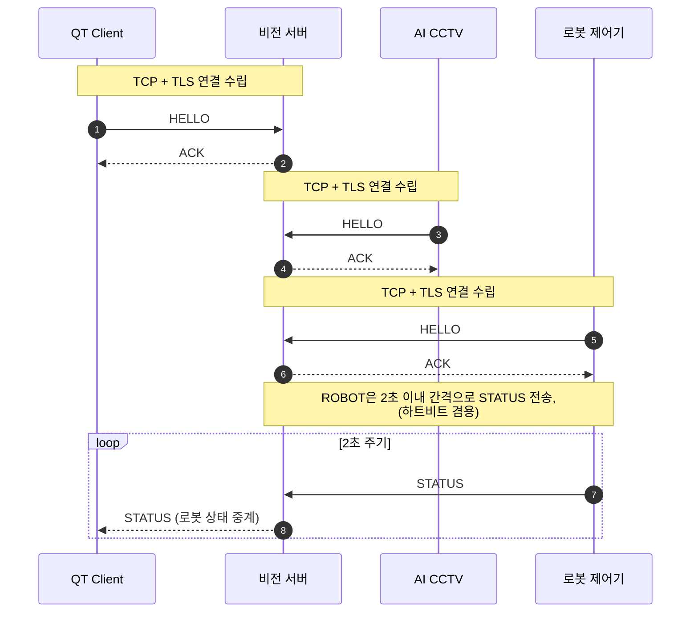
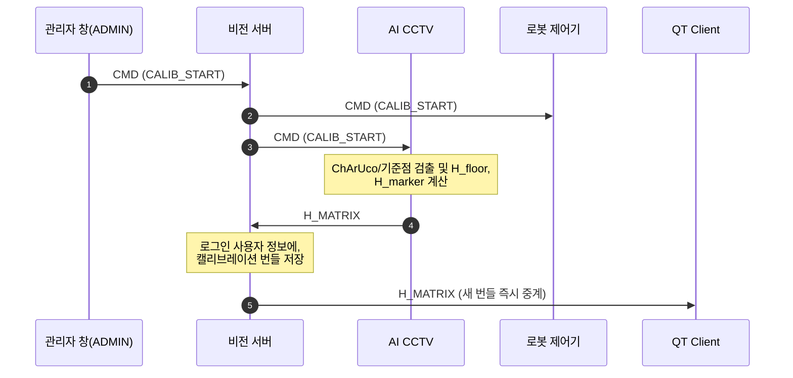
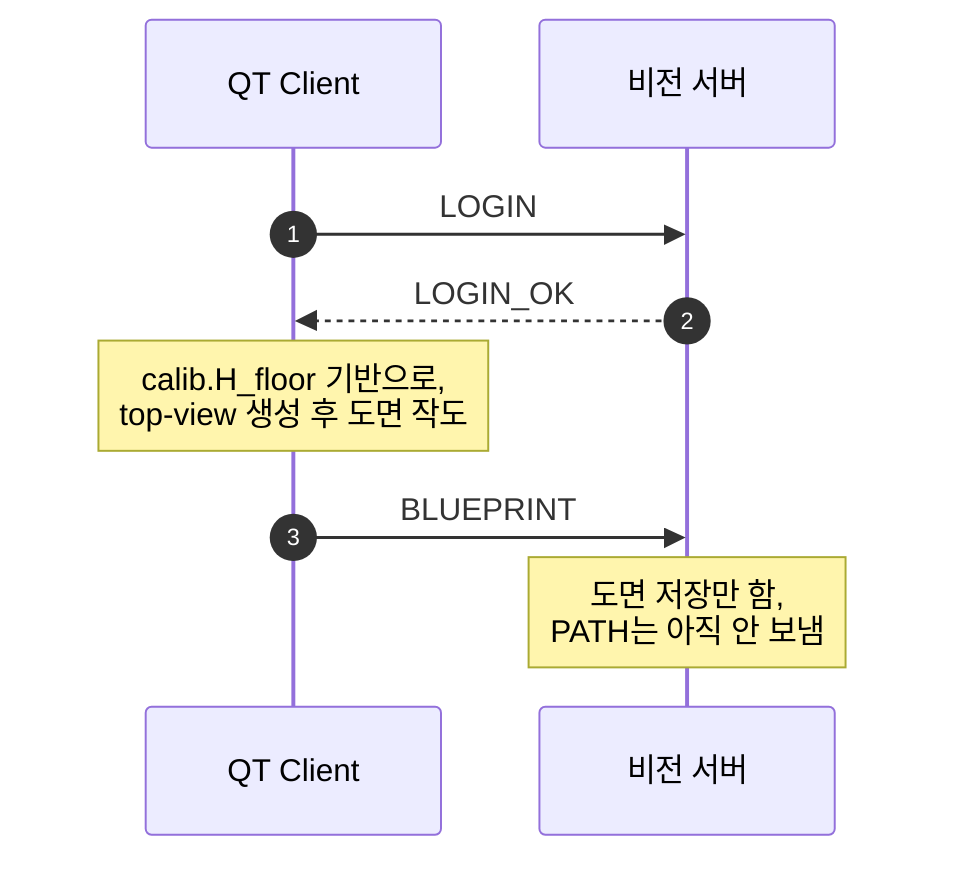
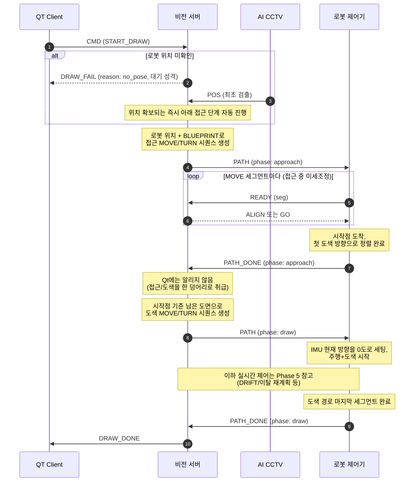
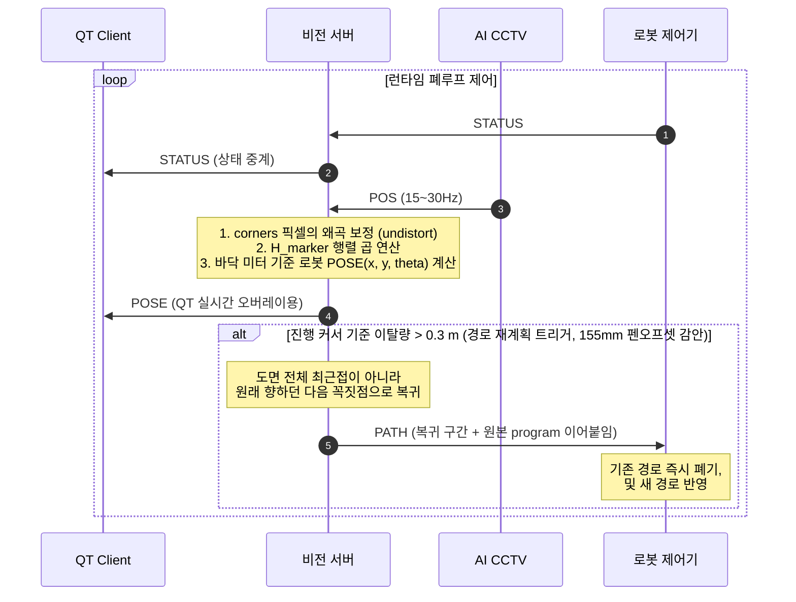
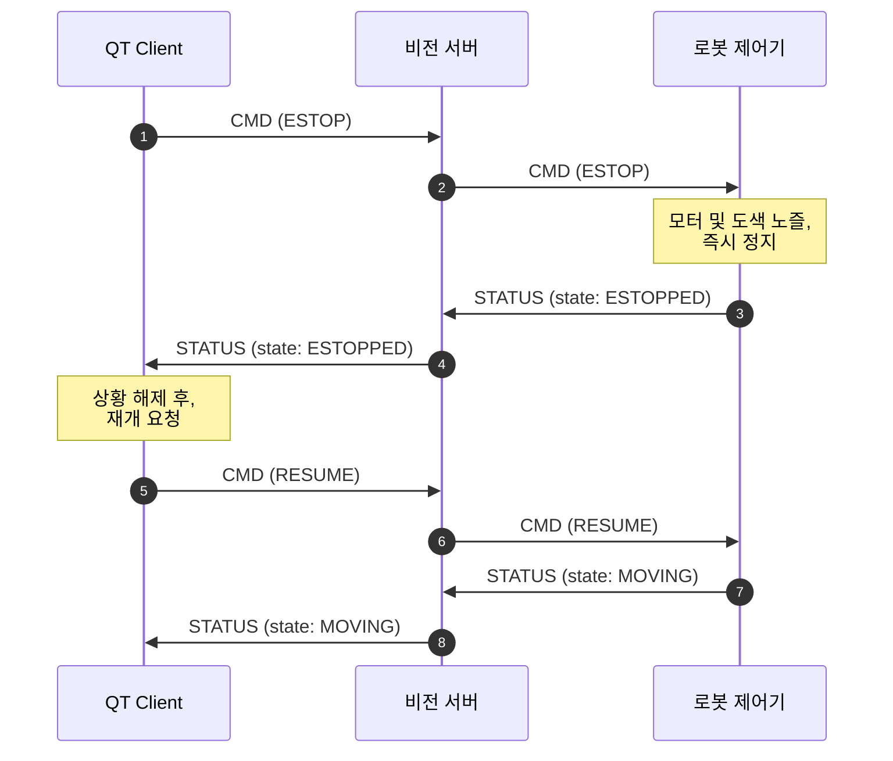

# Road-Painter 서버 통신 프로토콜 (v0.3)

> 최종 수정: 2026-07-27 · 구현 기준: `feature/server` 브랜치 (`Server/src/protocol.hpp`와 동일 내용)
>
> 2026-07-21 추가분: ADMIN role(관리자 창) + TAP, 경로 실행 중 수동조작 차단 규칙.
> 2026-07-23 추가분: REGISTER/LOGIN_OK cam_ip, DRAW_FAIL(경로 실패/대기 통지).
> 2026-07-27 추가분: 그리기 흐름 자동화(PATH_DONE→DRAW_DONE), SET_CAM_IP,
> POS의 QT 중계 중단, 관리자 창 로그인(ADMIN LOGIN) + 로그인 게이트.
> 문서 맨 아래 "v0.3 추가 변경" 절들 참고.

## 좌표계 규약 (v0.3 핵심 — 반드시 읽을 것)

시스템에는 좌표 "언어"가 두 개 있다:

- **픽셀 좌표**: CCTV 원본 영상 위의 위치 `(u, v)`
- **바닥 좌표**: 실제 바닥 평면 위의 위치, **단위 미터** `(x, y)`

누가 어떤 언어로 보내고, 변환은 누가 하는가:

| 역할 | 서버로 보내는 좌표 | 변환 담당 |
|---|---|---|
| **CCTV** | 마커 4코너 **원본 픽셀** (변환 금지) | **서버** (undistort → H_marker) |
| **QT** | 도면 **바닥 미터 좌표** (변환 완료) | **QT** (top-view 픽셀 ÷ S) |

이렇게 나누는 이유:

- **CCTV → 픽셀 그대로**: 마커 좌표는 렌즈 왜곡 보정(undistort)과 높이 시차 보정(H_marker)이 필요하고, solvePnP 보조 검증도 원본 픽셀이 있어야 가능하다. 캘리브레이션 데이터(K, D, H)를 서버 한 곳에만 두기 위해 CCTV는 "본 그대로"만 보고한다.
- **QT → 변환 완료**: top-view 위에 그린 점은 정의상 바닥 평면 위의 점이다. 왜곡도 높이 문제도 없고, 남은 건 축척 나눗셈(S px/m)뿐이라 Qt가 끝내서 보낸다.

서버 내부 파이프라인 (POS 수신 시):

```
원본 4코너 픽셀
  → undistort  (cv::undistortPoints(..., P=K) 동등 — 결과를 픽셀 단위로 유지)
  → H_marker   (마커 장착 높이 평면용 호모그래피 — 시차 보정 흡수)
  → 바닥 미터 좌표 4점
  → 중심 = 4점 평균, yaw = atan2(전방중점 − 후방중점)   ※ 반드시 변환 후 각도 계산
  → 로봇 pose (x, y, θ)
```

**단위 규약**: CCTV가 보내는 `H_floor`/`H_marker`는 **mm 기준**(pixel → world mm)이고, **서버가 수신 즉시 ÷1000로 미터 정규화**한다. 그 결과 서버 내부 좌표와 QT/로봇으로 나가는 값(`POSE`, `BLUEPRINT.points`, `PATH.dist_m`)은 **전부 미터**다. CCTV만 mm로 주면 되고, QT는 종전대로 미터로 주고받는다.

⚠️ **호모그래피를 거친 좌표를 solvePnP에 넣지 말 것.** solvePnP는 K로 투영된 실제 픽셀 좌표를 전제한다. 보조 검증(solvePnPGeneric IPPE_SQUARE)은 원본 코너에서 **병렬**로 수행한다.

## 공통

- **전송**: TCP + TLS, 포트 **9000**
  - 서버만 인증서 제시 (클라이언트는 `certs/server.crt`를 신뢰 CA로 등록해 서버를 검증. 클라이언트 인증서 불필요)
- **프레이밍**: JSON 한 줄 + 개행(`\n`) — JSON Lines
- **공통 형식**: `{"type": "...", "seq": n, "payload": {...}}`
- **접속 절차**: TLS 핸드셰이크 → 첫 메시지로 `HELLO` 전송 (10초 내 미전송 시 서버가 연결 종료) → `ACK` 수신 후 통신 시작

```json
{"type":"HELLO","seq":1,"payload":{"role":"ROBOT"}}
```
- `role`: `"QT"` | `"ROBOT"` | `"CCTV"` | `"ADMIN"` (관리자 창 — 아래 ADMIN 장 참고)
- 서버 응답: `{"type":"ACK","seq":n,"payload":{"msg":"registered as ROBOT"}}`
- 같은 role이 재접속하면 기존 세션은 자동으로 끊고 새 연결로 교체

---

## 로봇 (ROBOT)

### 수신: PATH (서버 → 로봇)

로봇은 좌표를 모르므로 경로는 **동작 명령 시퀀스**로 전달한다.

```json
{"type":"PATH","seq":5,"payload":{
  "phase": "draw",
  "segments": [
    {"op":"NOZZLE","down":true},
    {"op":"MOVE","dist_m":2.0,"paint":true,"heading_deg":35.0},
    {"op":"NOZZLE","down":false},
    {"op":"TURN","angle_deg":-90},
    {"op":"NOZZLE","down":true},
    {"op":"ARC","dist_m":0.628,"radius_m":0.20,"angle_deg":180,"direction":"right","paint":true,"heading_deg":125.0},
    {"op":"NOZZLE","down":false}
  ]
}}
```

| 필드 | 설명 |
|---|---|
| `phase` | `"approach"`(시작점 접근) \| `"draw"`(도색 경로) — 아래 "2단계 경로 실행 흐름" 참고 |
| `op: "MOVE"` | 직진. `dist_m` = 거리(m), `paint` = **이 구간이 도색 구간인지 나타내는 표시** (생략 시 `false`). ⚠️ 이 값으로 노즐을 움직이지 말 것 — 아래 참고 |
| `op: "TURN"` | 제자리 회전. `angle_deg` **양수 = 좌회전, 음수 = 우회전** |
| `op: "NOZZLE"` | 노즐 내림(`down:true`) / 올림(`down:false`) |
| `op: "ARC"` | 곡선(원호) 주행 (2026-07-29 추가). `dist_m` = 호 길이(m), `radius_m` = 도면 곡선 반지름(m), `angle_deg` = 각도(도), `direction` = `"left"` \| `"right"` |
| `heading_deg` | 그 동작 후 바라봐야 할 **절대 각도**(월드 기준) — MOVE 전부 + 접근 경로의 마지막 TURN에 실림. 정렬(READY)/주행 피드백(DRIFT) 판정 기준값. 로봇은 무시해도 됨 |

- **PATH가 오면 진행 중이던 기존 경로를 즉시 폐기하고 새 경로로 교체** (서버의 이탈 감지 → 재계획 대응. 한 TCP 연결이라 순서는 보장됨)

> 🔴 **노즐 제어의 단일 결정권 = `NOZZLE` op** (2026-07-28 확정)
>
> 로봇의 노즐 상태를 바꾸는 것은 **오직 `NOZZLE` op**이다. `MOVE.paint`는 "이 구간이
> 도색 구간인가"를 알려주는 참고용 표시일 뿐이고, **그 값만 보고 노즐을 내리거나
> 올리면 안 된다.**
>
> 규약이 둘이면(`NOZZLE` op / `MOVE.paint`) 로봇 실행부가 "둘 중 뭘 믿나"를 분기해야
> 하고 팀마다 다르게 구현될 여지가 생겨서, 하나로 못박았다.
>
> - 경로는 항상 **노즐이 올라간 상태에서 시작**하고 **`NOZZLE up`으로 끝난다.**
> - 접근 경로(`phase="approach"`)에는 `NOZZLE`이 아예 없다 — 전부 `paint=false`라
>   내릴 일이 없고, 직전 경로가 `NOZZLE up`으로 끝났기 때문.
> - **서버가 `program` 없이 직접 만드는 경로(하위호환)에도 서버가 `NOZZLE`을 끼워
>   넣는다** (`path_planner.hpp` `withNozzleOps`). 예전에는 이 경로에 `NOZZLE`이 하나도
>   없어서, `NOZZLE`만 보는 로봇은 노즐을 영영 못 내렸다 (2026-07-28 수정).
>
> 🔴 **`NOZZLE`은 반드시 `down`/`up`이 번갈아 나온다** (2026-07-29 확정). **같은 상태가
> 연속으로 두 번 오지 않는다** — `down` 다음은 무조건 `up`, `up` 다음은 무조건 `down`.
>
> 예: ㄷ자로 세로 획 두 개를 그릴 때 — 첫 획 끝나고 `NOZZLE up` 한 번 → (도색 없는
> 이동+회전, 노즐은 계속 올라간 채) → 다음 획 시작 직전 `NOZZLE down` 한 번. **이동
> 구간에서 "이미 올라가 있다"고 `NOZZLE up`을 또 보내지 않는다.**
>
> Qt `program`도, 서버가 만드는 폴백(`withNozzleOps`)도 이 규칙을 지킨다 —
> `withNozzleOps`는 애초에 상태가 실제로 바뀔 때만 op을 끼워 넣으므로 자동으로
> 성립한다. 로봇 실행부가 이 전제로 짜여 있다면(예: 상태 토글), 연속 `down`/`up`이
> 오는 입력은 정의되지 않은 것으로 봐도 된다.

### 2단계 경로 실행 흐름 (approach → draw → 완료)

사용자가 Qt에서 **"그림그리기 시작"** 버튼을 한 번 누르면, 접근부터 도색 완료까지 서버가 자동으로 이어서 진행한다. **중간에 사용자가 더 눌러야 하는 버튼은 없다.**

```
[시작] Qt "그림그리기 시작" 버튼 → CMD {"cmd":"START_DRAW"}
  (도면 BLUEPRINT는 이보다 먼저 올라와 있어야 함 — 서버는 도면만 받아서는
   로봇을 움직이지 않는다)

[1단계 접근] 서버가 PATH(phase="approach") 전송
  : 시작점까지 회전+직진(전부 paint=false)
    + 마지막에 첫 도색 방향으로 TURN까지 포함 (이 TURN에도 heading_deg 있음)
  → 로봇: 세그먼트마다 READY/ALIGN/GO 수행하며 이동 (= 출발 전 미세조정)
  → 로봇: 마지막 세그먼트까지 끝나면 서버에 PATH_DONE {"phase":"approach"} 전송
    ※ 이 접근 완료는 Qt에 통지하지 않는다 (Qt 입장에선 계속 "그리는 중")

[2단계 도색] 서버가 곧바로 PATH(phase="draw") 전송 (Qt 개입 없음)
  : 도색 전체 경로 (전부 paint=true)
  → 로봇: 이 PATH를 받는 순간 IMU 현재 방향을 0도로 세팅하고 주행 시작
  → 직진 중에는 서버가 DRIFT로 각도 피드백 지속 전송 (아래 참고)
  → 경로에서 0.3m 넘게 벗어나면 서버가 새 PATH(phase="draw")로 재계획

[완료] 로봇 → 서버: PATH_DONE {"phase":"draw"}
  → 서버가 경로 상태를 정리하고 QT에 DRAW_DONE {} 통지
```

### 주행 중 각도 피드백: DRIFT (서버 → 로봇)

직진 중 CCTV 피드백으로 로봇이 얼마나 삐뚤어졌는지 지속적으로 알려준다 (최대 ~5Hz).

```json
{"type":"DRIFT","seq":40,"payload":{"angle_deg": 2.0}}
```

- **가려는 방향이 0도 기준. 시계방향(오른쪽)으로 틀어져 있으면 양수 (예: +2), 반시계(왼쪽)면 음수 (예: -1.5)**
- 값 = 좌회전으로 보정해야 할 양 (ALIGN과 동일 부호 규약)
- 로봇은 IMU와 융합해 직진 중 방향을 보정하는 데 사용. 정지 중(READY 대기 등)에 오는 DRIFT는 무시해도 됨

🔴 **로봇이 TURN을 실행하는 동안에는 DRIFT를 무시해야 한다 (2026-07-28 확정).**
서버는 "지금 로봇이 도는 중"인지 모른다. `alignSegIdx_`는 직전에 로봇이 `READY`를
보낸 세그먼트로만 갱신되는데, 로봇은 MOVE 앞에서만 `READY`를 보내므로 TURN을
도는 동안 서버는 계속 **직전 MOVE의 목표각을 기준으로** DRIFT를 5Hz로 쏜다.

`robot_sim` 드라이런으로 실측: 접근 마지막 TURN(-45°)을 도는 동안 서버가 계속
"45도 되돌아가라"를 보냈고, 회전 완료 후 도색 첫 MOVE의 각도오차가 **-40.4°**로
나타났다 (ALIGN 2회 소모). 방치하면 로봇이 자기 회전과 서버 보정이 싸운다.

**결정: 로봇이 자기 상태(`IsTurning()` 등)로 스스로 걸러낸다.** 서버가 "지금 TURN
중"임을 알려주는 신호를 새로 만들지 않기로 했다 — 이탈 감시(`POS` 기반 진행
커서)는 `alignSegIdx_`와 무관하게 로봇의 실제 위치만 보고 판단하므로, 서버가
회전 여부를 몰라도 영향이 없다. 즉 **프로토콜 변경이 필요 없다.** 로봇팀 액션
아이템: "TURN op 실행 중엔 들어오는 DRIFT를 적용하지 않는다."

### 출발 전 정렬 핸드셰이크: READY → ALIGN / GO

각도를 틀고 직진을 시작하기 직전에, CCTV 피드백으로 각도를 미세조정하고 출발하는 절차. **MOVE 세그먼트를 시작하기 전마다** 수행한다.

```
로봇: TURN 완료, 정지 상태
로봇 → 서버: {"type":"READY","seq":21,"payload":{"seg":3}}   ← 곧 실행할 MOVE의 인덱스(0부터)
서버: 최신 CCTV 마커로 잰 실제 각도 vs 그 MOVE의 heading_deg 비교
  ├─ 오차 > 2° → 서버 → 로봇: {"type":"ALIGN","payload":{"angle_deg":-2.5}}
  │              로봇: angle_deg만큼 제자리 회전 후 다시 READY 전송 (반복)
  └─ 오차 ≤ 2° (또는 ALIGN 4회 반복 초과) → 서버 → 로봇: {"type":"GO","payload":{}}
                 로봇: 직진(MOVE) 시작
```

- `ALIGN.angle_deg` 부호는 TURN과 동일 (양수 = 좌회전)
- 서버가 판정 불가한 상황(계획 없음/수동모드/pose 미확보)이면 로봇을 세워두지 않도록 그냥 `GO`를 보낸다
- READY를 기다리는 동안에도 STATUS 주기 전송(하트비트)은 계속해야 함
- 허용 오차 2° / 최대 반복 4회는 러프 디폴트 — 현장 튜닝 예정

### 수신: CMD (서버 → 로봇)

```json
{"type":"CMD","seq":7,"payload":{"cmd":"ESTOP"}}
```
- **이벤트 명령**: `"ESTOP"` | `"RESUME"` | `"CALIB_START"`
- **수동 조작 명령 (조이스틱 방식 — 누르는 동안 이동, 이동량 없음)**:
  `"FORWARD"` | `"BACKWARD"` | `"TURN_LEFT"` | `"TURN_RIGHT"` | `"STOP"`
  - 전/후진, 제자리 좌/우회전. 버튼을 누르면 해당 명령을 보내고, **떼면 `STOP`** 을 보낸다.
  - 이동 속도/각속도는 로봇 펌웨어의 고정값 사용 (거리·각도 값을 싣지 않음).
  - `STOP`은 수동 이동의 일반 정지 — 긴급정지(`ESTOP`, RESUME 필요)와는 별개.
- ACK 응답 불필요 (fire-and-forget)

> ⚠️ **안전**: 조이스틱 방식은 "떼면 STOP"에 의존한다. TCP라 정상 연결 중엔 순서·전달이 보장되지만, **버튼을 누른 채 연결이 끊기면 STOP이 못 가서 로봇이 계속 움직일 수 있다.** 로봇 펌웨어에 데드맨(예: 300ms 내 다음 명령/하트비트 없으면 자동 정지)을 두는 것을 권장.

### 송신: STATUS (로봇 → 서버) — 주기 전송 필수

```json
{"type":"STATUS","seq":12,"payload":{
  "state": "MOVING",
  "painting": true
}}
```

| 필드 | 설명 |
|---|---|
| `state` | `"IDLE"` \| `"MOVING"` \| `"ESTOPPED"` \| `"ERROR"` |
| `painting` | 노즐 동작 여부 (지금 도색 중인지) |

- **2초 이내 간격으로 계속 전송 (IDLE 상태에서도)** — 하트비트 겸용
- 서버는 로봇에게서 **10초간 무수신이면 연결 끊김으로 간주하고 세션 종료** (로봇은 재접속 + HELLO 재등록)
- 서버는 STATUS를 QT로 중계함

### 송신: PATH_DONE (로봇 → 서버) — 경로 수행 완료 (2026-07-27 추가)

받은 `PATH`의 **마지막 세그먼트까지 수행을 마쳤을 때 1회** 보낸다. 서버가 다음 단계로 넘어가는 트리거라 **빠뜨리면 그 자리에서 멈춘 채 진행되지 않는다.**

```json
{"type":"PATH_DONE","seq":30,"payload":{"phase":"approach"}}
```

| 필드 | 설명 |
|---|---|
| `phase` | 방금 끝낸 `PATH`의 `phase`를 그대로 되돌려준다 (`"approach"` \| `"draw"`) |

- `phase="approach"` → 서버가 **곧바로 도색 `PATH`를 이어 보낸다** (Qt 개입 없음)
- `phase="draw"` → 서버가 경로 상태를 정리하고 **QT에 `DRAW_DONE`을 통지**한다
- 서버는 자기 상태로 단계를 판단하므로 `phase`가 없거나 어긋나도 동작한다 (어긋나면 서버 로그에 WARN만 남음). 그래도 **되돌려주는 쪽을 권장** — 어긋남이 로그로 드러나야 디버깅이 된다.
- ⚠️ **이탈 재계획으로 `PATH`가 교체된 경우**: 새 `PATH`가 오면 기존 경로는 폐기되므로, **"마지막으로 받은 `PATH`"를 끝냈을 때** 보내면 된다. 폐기된 경로에 대해서는 보내지 않는다.
- 진행 중인 경로가 없는데 `PATH_DONE`이 오면 서버는 WARN 로그만 남기고 무시한다.

---

## QT

### 송신: REGISTER / LOGIN (QT → 서버)

```json
{"type":"REGISTER","seq":1,"payload":{"id":"user1","pw":"...","cam_ip":"192.168.0.31"}}
{"type":"LOGIN","seq":2,"payload":{"id":"user1","pw":"..."}}
```

- `cam_ip`: 선택. 회원가입 시 등록해두는 CCTV 카메라 IP — 서버는 검증 없이 저장만 하고
  로그인 시 그대로 회신한다. Qt는 이 IP로 RTSP URL을 조립해 카메라 영상을 띄운다.

서버 응답:

| 응답 | payload |
|---|---|
| `REGISTER_OK` | `{"id":"user1"}` |
| `REGISTER_FAIL` | `{"reason":"이미 존재하는 id"}` 등 |
| `LOGIN_OK` | `{"id":"user1","calib":{...}\|null,"cam_ip":"192.168.0.31"\|null}` — `calib`은 저장된 캘리브레이션 번들(**`null`이면 캘리브레이션 필요**), `cam_ip`는 등록해둔 카메라 IP(없으면 `null`) |
| `LOGIN_FAIL` | `{"reason":"id 또는 비밀번호 불일치"}` |

- Qt는 `calib.H_floor`(+`K`,`D`)로 top-view를 생성한다: 프레임 왜곡 보정 → `warpPerspective(S·H_floor)` (S = 렌더링 축척 px/m)
- `calib`은 **어느 스키마로 올라왔든 항상 `H_floor`를 포함한다** (평면 스키마의 `H`에는 서버가 별칭을 붙인다 — CCTV `H_MATRIX` 절 참고). Qt는 `H_floor`만 보면 된다.
- 계정에 저장된 번들이 없으면 **전역 슬롯**(`config/calib_latest.json`)의 최신 번들이 내려온다. 둘 다 없을 때만 `null`이다.
- `calib`이 `null`이면(캘리브레이션 미완료) Qt는 관리자 창(`admin_console`, 현 서버 `http://<서버IP>:8083` — `admin_console/config.sh`에서 설정) 접속 링크를 안내해 사용자가 캘리브레이션을 진행하게 한다. 이 URL은 Qt 쪽에 고정값으로 둔다 (서버가 내려주지 않음).

### 송신: SET_CAM_IP (QT → 서버) — 카메라 IP 변경 (2026-07-27 추가)

Qt 설정란에서 등록해둔 CCTV 카메라 IP를 바꿀 때 쓴다. **로그인 상태에서만 동작**한다 (현재 로그인된 사용자의 값을 바꾼다).

```json
{"type":"SET_CAM_IP","seq":6,"payload":{"cam_ip":"192.168.0.44"}}
```

서버 응답:

| 응답 | payload |
|---|---|
| `SET_CAM_IP_OK` | `{"cam_ip":"192.168.0.44"}` — 저장된 값을 그대로 회신 (지웠으면 `null`) |
| `SET_CAM_IP_FAIL` | `{"reason":"로그인 필요"}` \| `{"reason":"저장 실패"}` |

- `REGISTER`의 `cam_ip`와 동일하게 **서버는 형식 검증을 하지 않고 저장만 한다.** IP 형식 확인은 Qt 몫.
- 빈 문자열(`""`)을 보내면 등록을 지운다 (이후 `LOGIN_OK.cam_ip`가 `null`).
- 저장 즉시 파일에 반영되므로 다음 로그인부터 `LOGIN_OK.cam_ip`로 새 값이 내려온다.

### 송신: CMD (QT → 서버)

`{"cmd": ...}` — 서버가 ROBOT에 중계

- 이벤트: `"ESTOP"` | `"RESUME"`
- ⚠️ **캘리브레이션 시작(`CALIB_START`)은 QT가 보내지 않는다** (2026-07-23 변경). 카메라 설치/캘리브레이션은 **관리자 창(admin_console)에서 시작**한다 — 관리자 창이 ADMIN role로 `CALIB_START`를 보내면 서버가 ROBOT+CCTV에 중계한다. (서버는 하위호환으로 QT가 보낸 `CALIB_START`도 여전히 중계하지만, QT 쪽 캘리 시작 UI는 두지 않는다.) QT는 캘리 **결과**만 받는다: 로그인 시 `LOGIN_OK.calib`, 갱신 시 `H_MATRIX` 중계 → top-view 렌더링용.
- **그리기 시작: `"START_DRAW"`** — "그림그리기 시작" 버튼. **도면(BLUEPRINT)이 올라와 있는 상태에서 이걸 누르면 접근부터 도색 완료까지 전부 자동으로 진행된다** (서버가 1단계 접근 PATH 전송 → 로봇 `PATH_DONE` → 서버가 2단계 도색 PATH 전송 → 로봇 `PATH_DONE` → Qt에 `DRAW_DONE`). 이 명령은 로봇에 중계되지 않음 (로봇은 PATH 수신이 곧 시작 신호).
  - 도면이 없으면 `DRAW_FAIL{stage:"draw", reason:"no_blueprint"}`
  - 이미 실행 중이면 `DRAW_FAIL{stage:"draw", reason:"busy"}` (중복 시작 방지)
  - 로봇 위치를 아직 모르면 `DRAW_FAIL{stage:"draw", reason:"no_pose"}` — **실패가 아니라 대기**이며, CCTV `POS`로 위치가 잡히는 즉시 서버가 자동으로 접근을 시작한다.
- 수동 조작(조이스틱): `"FORWARD"` | `"BACKWARD"` | `"TURN_LEFT"` | `"TURN_RIGHT"` | `"STOP"`
  - 버튼 누름 → 방향 명령, 뗌 → `STOP`. 이동량은 안 실음 (로봇 고정 속도).
- ⚠️ **경로 실행 중에는 수동 조작이 차단된다** (2026-07-21 추가): 서버가 PATH를 보내
  로봇이 경로를 수행 중인 동안 QT의 수동 조작 CMD는 **로봇에 전달되지 않고 무시**된다
  (도색 도중 조이스틱으로 그림을 망치는 것 방지 — 자동이 우선). `ESTOP`/`RESUME`
  같은 비수동 명령은 항상 통과한다. 현재 거절 응답 메시지는 없으며
  서버 로그로만 확인 가능 (QT는 버튼이 안 먹는 것으로 보임).
- **경로가 없는 상태에서 수동 조작 명령이 오면** 서버는 자동 경로추종/재계획을 중단하고
  수동 모드로 전환한다 (수동 이동을 서버가 '경로 이탈'로 오인해 재계획 PATH를 쏘는
  충돌 방지). **자동 모드 복귀는 새 `BLUEPRINT` 수신 시.** 수동 모드에서도 로봇 위치
  `POSE` 중계(모니터링)는 계속된다.

### 송신: BLUEPRINT (QT → 서버)

```json
{"type":"BLUEPRINT","seq":4,"payload":{
  "points": [[0.0,0.0],[0.0,3.0],[0.5,3.0],[0.5,0.0]],
  "paint":  [false, true, false, true],
  "program": [
    {"op":"NOZZLE","v":0,"down":true},
    {"op":"MOVE","v":0,"dist_m":3.0,"paint":true,"heading_deg":90.0},
    {"op":"NOZZLE","v":1,"down":false},
    {"op":"TURN","v":1,"angle_deg":-90.0,"heading_deg":0.0},
    {"op":"MOVE","v":1,"dist_m":0.5,"paint":false,"heading_deg":0.0},
    {"op":"TURN","v":2,"angle_deg":-90.0,"heading_deg":-90.0},
    {"op":"NOZZLE","v":2,"down":true},
    {"op":"MOVE","v":2,"dist_m":3.0,"paint":true,"heading_deg":-90.0},
    {"op":"NOZZLE","v":3,"down":false}
  ]}}
```

위 예제는 **ㄷ자를 눕힌 모양**이다 — 세로 두 줄(3 m씩)만 칠하고, 위쪽 가로 0.5 m는
노즐을 올린 채 이동만 한다. `paint`와 `program`이 서로 어긋나지 않는지 확인할 것:
`paint[2]=false`(= `points[1]→points[2]` 구간)에 대응하는 `MOVE 0.5`도 `paint:false`이고,
그 구간 전후로 `NOZZLE`이 올라갔다 내려온다.

| 필드 | 필수 | 설명 |
|---|---|---|
| `points` | ✅ | **바닥 평면 미터 좌표** 폴리라인 = **펜이 지나갈 자취**. 서버의 이탈 판정·복귀 기준 |
| `paint` | 선택 | `paint[i]` = `points[i-1]→points[i]` 구간 도색 여부. `paint[0]`은 대응 구간이 없어 무시 |
| `program` | 선택 | Qt가 만든 도색 동작 시퀀스. 서버는 **그대로 로봇에 중계**한다 |

- **Qt가 변환을 마친 값이어야 한다**: top-view 위 드로잉 픽셀 → `÷ S` → 미터. 서버는 재변환하지 않는다.
- **서버 동작: 저장만 한다** (2026-07-27 변경). 도면을 올렸다고 로봇이 움직이지 않으며, 실제 출발은 `CMD{"cmd":"START_DRAW"}`부터다.
- 새 도면을 보내면 진행 중이던 경로 상태와 수동 모드가 모두 초기화된다.
- 점 형식이 잘못됐거나 2개 미만이면 `DRAW_FAIL{stage:"plan", reason:"bad_points"}`
- 저장 직후 `BLUEPRINT_OK`로 서버가 받은 개수를 회신한다 (아래 수신 목록).

**선택 필드 2개는 전부 하위호환** — 안 보내면 종전과 100% 동일하게 서버가 경로를 생성한다.

- `paint` 길이가 `points`와 다르면 → 도면은 살리고 이 필드만 무시 (= 전 구간 도색)
- `program`이 없거나 형식이 깨지면 → 서버가 예전처럼 `points`로 직접 생성

> 🔵 **`pen_offset_m` 필드는 폐지됐다 (2026-07-28).** 처음엔 "Qt가 펜 오프셋을 보내면
> 서버가 꼭짓점마다 후진/회전/재전진 시퀀스를 만든다"는 설계였는데, **펜 오프셋
> 보정을 로봇이 전적으로 담당하기로 확정**되면서 필요 없어졌다. 로봇은 `TURN`을
> 실행할 때 자기 하드웨어 상수(155mm 실측)로 스스로 보정한다 — Qt도 서버도 관여하지
> 않는다. 서버는 이 값을 **자기 상수로만** 갖고(`router.hpp` `kPenOffsetM`) 오직
> 이탈 판정 여유값으로만 쓴다 (아래 CCTV `POS` 절 참고). **로봇의 실제 오프셋이
> 바뀌면 이 상수도 같이 고쳐야 한다** — 자동으로 동기화되지 않는다.

### `program` op 규약 (2026-07-28 신설, 같은 날 최종 확정)

Qt 입력값 그대로, 서버는 손대지 않고 중계한다. **로봇이 그대로 실행할, 도면 그대로의
논리적 동작 목록**이다. 꼭짓점에서 로봇이 내부적으로 무엇을 하든(후진→회전→전진 등)
그건 로봇 하드웨어 안에서만 일어나고 `program`에는 안 드러난다 — Qt는 "A에서 B까지
3m 직진, 90° 좌회전, B에서 C까지 0.5m 직진"처럼 도면 그대로만 만들면 된다.

| op | 필드 | 의미 |
|---|---|---|
| `MOVE` | `dist_m` | 직진. **음수 = 후진** (바라보는 방향은 안 바뀜) |
| | `paint` | 이 구간이 도색 구간인지 나타내는 **표시** (노즐을 움직이는 값이 아님) |
| `TURN` | `angle_deg` | 제자리 회전. **양수 = 좌회전** (종전과 동일) |
| `NOZZLE` | `down` | 노즐 내림(`true`) / 올림(`false`) — **노즐 제어는 이 op만** |
| `ARC` | `dist_m` | 곡선 호의 주행 거리 (미터, $S = R \cdot \theta_{\text{rad}}$) |
| | `radius_m` | **도면 상의 곡선 반지름** $R_{\text{paint}}$ (미터, 양수) |
| | `angle_deg` | 회전 각도 (도 단위, 양수) |
| | `direction` | 회전 방향 (`"left"`: 좌회전 / `"right"`: 우회전) |
| | `paint` | 이 구간이 도색 구간인지 나타내는 **표시** (`true`/`false`) |
| 공통 | `heading_deg` | 이 동작 후 로봇이 **바라보는** 절대 방위 |
| 공통 | `v` | **필수.** 이 op가 *출발하는* 도면 꼭짓점 index (이탈 복귀 재개 지점 계산용) |

> 🔴 **`heading_deg` 의미**: 진행 방향이 아니라 **로봇이 바라보는 방위**다. 전진 중에는 같지만 **후진 op에서는 180° 다르다.** 서버가 이 값을 pose의 `theta`(마커 앞변 기준 = 바라보는 방향)와 직접 비교하므로 이쪽이 맞다.

> 🔴 **노즐은 `NOZZLE` op으로만 움직인다** — 위 "수신: PATH" 절의 단일 결정권 규약 참고.
> Qt가 `program`을 만들 때, 도색 구간 앞에 `NOZZLE down`을 / 뒤에 `NOZZLE up`을 직접
> 넣어야 한다. `MOVE.paint:true`만 두면 노즐이 내려가지 않는다.

> 🔵 **`ARC` op 규약 (2026-07-29 신설):** 알파벳 'D', 'O', 도로 곡선 표지 도색을 위한 곡선(원호) 주행 op이다.
> Qt와 서버는 도면 그대로의 곡선 반지름 `radius_m`($R_{\text{paint}}$)과 호 거리 `dist_m`만 전달한다.
> 로봇은 $155\text{mm}$ 후방 노즐 오프셋을 내부 피타고라스 공식($R_{\text{robot}} = \sqrt{R_{\text{paint}}^2 + 0.155^2}$)으로 자율 보정하여 매끄럽게 호를 그린다.

**역할 분담 (최종)**

| | 책임 |
|---|---|
| Qt | 어디에서 어디까지, 칠할지 말지, 몇 m·몇 도(사용자 입력값) |
| 서버 | Qt `program`을 그대로 중계. `d`(펜 오프셋)는 이탈 판정·복귀 목표 선정에만 사용 |
| 로봇 | `TURN` 및 `ARC` 실행할 때 자기 하드웨어 상수 `d`로 오프셋/피타고라스 반지름 스스로 보정 |

> 🔵 **`program`에 없는 것: `pivot` 필드, 펜 보정 서브스텝(후진/전진), 속도
> (`speed_mps`/`speed_dps`).** 전부 Qt도 서버도 모르거나 관여 안 하는 값이라
> 아예 없앴다. `pivot` 기반 `ALIGN`/`DRIFT` 억제("꼭짓점 구간에서는 정렬 판정
> 생략")도 사라졌다 — 서버는 이제 로봇이 `TURN`을(내부 보정까지 포함해서) 다
> 끝낸 뒤의 `READY`만 보므로, 중간에 펜이 어긋난 상태를 볼 일 자체가 없다.
> 모든 op에 똑같은 `ALIGN`/`GO`/`DRIFT` 판정이 걸린다.
>
> 부수 효과로 `buildRecovery`도 훨씬 단순해졌다 — "Qt program에 박힌 pivot을
> 다치지 않게 살살 잘라 붙인다"는 로직 자체가 없어지고, **그냥 `v >= k`인 첫
> op을 찾아 거기부터 자른다.**

### 수신 (서버 → QT)

- `STATUS`: 로봇 상태 중계 (지속 모니터링용)
- `POSE`: 서버가 POS를 변환해 계산한 로봇 pose — **top-view 위 로봇 표시용**
  > ⚠️ 2026-07-27부터 **CCTV `POS` 원본(픽셀)은 QT로 중계하지 않는다.** Qt에는 캘리브레이션이 없어 픽셀을 해석할 방법이 없기 때문. 로봇 위치는 `POSE`만 쓰면 된다.

  ```json
  {"type":"POSE","seq":15,"payload":{"x":1.234,"y":0.567,"theta_deg":90.0}}
  ```
  (`x`,`y` = 바닥 미터 좌표, `theta_deg` = +x축 기준 반시계)
- `H_MATRIX`: 캘리브레이션 직후 새 번들 즉시 중계 (top-view 갱신용)
- `PEERS`: **로봇/CCTV 접속 상태** (2026-07-22 추가)

  ```json
  {"type":"PEERS","seq":20,"payload":{"robot":true,"cctv":false}}
  ```
  - ROBOT 또는 CCTV가 접속/해제될 때마다 전송. **QT 자신이 막 접속했을 때도**
    현재 상태 스냅샷을 1회 보내준다 (그때그때 물어볼 필요 없음).
  - STATUS/POSE가 한동안 안 온다고 "로봇이 없나?" 유추하지 말고, 이 메시지를
    직접 신뢰할 것 (예: 로봇이 접속만 하고 아직 STATUS 첫 전송 전인 순간도 있음).
- `BLUEPRINT_OK`: **도면 접수 확인** (2026-07-28 추가)

  ```json
  {"type":"BLUEPRINT_OK","seq":21,"payload":{
    "points": 4, "paint": true, "program": 3}}
  ```
  - `BLUEPRINT`를 저장한 직후 1회 회신. Qt가 **보낸 것과 서버가 받은 것이 같은지
    그 자리에서 대조**할 수 있게 하는 값이다.
  - `paint`/`program`이 형식 오류로 무시됐으면 여기에 `false`/`0`으로 나타난다
    (예: `paint` 길이 불일치). 예전에는 응답이 없어 `START_DRAW` 때
    `DRAW_FAIL`로 뒤늦게 알 수밖에 없었다.
- `DRAW_DONE`: **도색 완료 통지** (2026-07-27 추가)

  ```json
  {"type":"DRAW_DONE","seq":40,"payload":{}}
  ```
  - 로봇이 도색 경로를 끝까지 마쳤을 때(`PATH_DONE{phase:"draw"}`) 1회 전송된다.
    Qt는 이걸 받으면 "그리는 중" 표시를 끝내면 된다.
  - **접근 완료는 따로 알리지 않는다** — Qt 입장에선 `START_DRAW`부터 `DRAW_DONE`까지가
    한 덩어리의 "그리는 중"이다. 세부 진행은 `POSE`/`STATUS`로 보면 된다.
- `DRAW_FAIL`: **경로 생성/전송 실패 또는 대기 통지** (2026-07-23 추가)

  ```json
  {"type":"DRAW_FAIL","seq":25,"payload":{
    "stage": "draw",
    "reason": "no_pose",
    "msg": "로봇 위치 미확인 - CCTV POS 수신 후 자동 전송 예정"
  }}
  ```

  | 필드 | 설명 |
  |---|---|
  | `stage` | `"plan"` = BLUEPRINT 처리 중 문제 \| `"draw"` = START_DRAW 이후 처리 중 문제 |
  | `reason` | 코드. `plan`: `bad_points`(도면 형식 오류). `draw`: `no_blueprint`(도면 없음) / `busy`(이미 실행 중) / `no_pose`(로봇 위치 미확인 — 대기 성격, POS 오면 자동 재시도) / `robot_offline`(로봇 미접속) / `not_ready`(서버 내부 오류 — 정상 흐름에선 안 나옴) |
  | `msg` | 사람이 읽을 한글 설명 (UI 표시용) |

  - `reason=no_pose`는 완전한 실패가 아니라 "로봇 위치 확보되면 자동으로
    PATH가 나갈 예정"이라는 대기 안내에 가깝다. Qt는 reason으로 구분해 표시 문구를
    조정할 것 (여기서 "그리는 중" 표시를 끄면 안 된다 — 곧 자동으로 출발한다).

---

## CCTV

### 수신: CMD (서버 → CCTV)

`{"cmd":"CALIB_START"}` — 캘리브레이션 시작

### 송신: H_MATRIX (CCTV → 서버) — 캘리브레이션 완료 후 1회

```json
{"type":"H_MATRIX","seq":3,"payload":{
  "calib": {
    "version": 1,
    "K": [[fx,0,cx],[0,fy,cy],[0,0,1]],
    "D": [k1,k2,p1,p2,k3],
    "H_floor":  [[...],[...],[...]],
    "H_marker": [[...],[...],[...]],
    "marker_height_m": 0.25
  }
}}
```

| 필드 | 설명 |
|---|---|
| `K` | 카메라 내부 파라미터 (3×3) — ChArUco 캘리브레이션 결과 |
| `D` | 렌즈 왜곡 계수 `[k1,k2,p1,p2,k3]` |
| `H_floor` | **왜곡 보정된 픽셀** → 바닥 평면 **mm** (Qt top-view용) |
| `H_marker` | **왜곡 보정된 픽셀** → 마커 장착 높이 평면 **mm** (로봇 측위용 — 마커가 바닥에서 떠 있어 생기는 시차를 캘리브레이션 단계에서 흡수) |
| `marker_height_m` | 마커 장착 높이 (기록용) |
| `version` | 캘리브레이션 버전 — 카메라 위치/줌/포커스/해상도가 바뀌면 재캘리브레이션 후 증가 |

- 두 H는 `solvePnPRansac → solvePnPRefineLM`으로 외부 파라미터(R, t)를 구한 뒤 `H = K·[r₁ r₂ t]`로 해석적으로 유도할 것 (바닥 평면 Z=0, 마커 평면 Z=marker_height). 4점을 두 번 따로 찍는 것보다 일관됨.
- **단위(중요)**: `H_floor`/`H_marker`는 **mm 기준**(pixel → world mm)으로 보낸다. **서버가 수신 즉시 ÷1000로 미터 정규화**한 뒤 저장·QT 중계하므로, QT가 받는 `calib`와 서버가 계산하는 `POSE`, 로봇에 보내는 `PATH`의 `dist_m`는 **전부 미터**다. (CCTV는 mm만 신경쓰면 됨 — 환산은 서버 담당. `POS`의 테스트용 `{x,y}`와 `BLUEPRINT.points`는 서버 내부 단위인 **미터**로 보낼 것.)
- 서버가 로그인된 사용자에 영속 저장하고 QT로 즉시 중계 (정규화된 미터 번들로 저장·중계)
- 레거시 `{"H":[[...]x3]}`도 당분간 허용 (왜곡·시차 보정 없이 동작 — 데모 전용. 이 H도 mm 기준으로 보고 ÷1000 정규화됨)

#### 평면 스키마 (QT-REQ-CCTV-001 rev.2) — 위와 동등하게 처리 (2026-07-30 추가)

관리자 창 캘리브레이션 탭의 **"QT-REQ-CCTV-001 형식으로 채우기"** 버튼이 내보내는 형태다.
`calib` 중첩 없이 **payload 자체가 번들**이고, 바닥 H의 이름이 `H_floor`가 아니라 **`H`** 다.

```json
{"type":"H_MATRIX","seq":3,"payload":{
  "calib_id":"2026-07-30-1400", "created_at":"2026-07-30T14:00:00+09:00",
  "image_size":[1920,1080], "coord_mode":"undistort", "unit":"mm",
  "K":[[fx,0,cx],[0,fy,cy],[0,0,1]], "D":[k1,k2,p1,p2,k3],
  "H":[[...],[...],[...]], "H_marker":[[...],[...],[...]],
  "origin_mm":[0,0], "canvas_mm":[900,600], "axis":"x_right_y_up"
}}
```

- 서버는 `H`를 `H_floor`로 읽고 `K`/`D`/`H_marker`까지 그대로 쓴다 — **보정 동작은 중첩 형식과 완전히 동일**하다.
- 설치 메타데이터(`calib_id`/`created_at`/`image_size`/`coord_mode`/`origin_mm`/`canvas_mm`/`axis`)는 서버가 해석하지 않고 **그대로 저장·QT 중계**한다.
- `unit`만 예외로, 정규화(÷1000) 후 서버가 **`"m"` 으로 고쳐서** 중계한다. `"mm"`인 채로 넘기면 QT가 미터 값을 mm로 읽기 때문.
- ⚠️ **판별 규칙**: 최상위 `H`가 있어도 `K`/`D`/`H_floor`/`H_marker` 중 하나라도 같이 오면 평면 번들, `H` 하나뿐이면 레거시다.
  > 2026-07-30 수정 전에는 "`calib`이 없고 `H`가 있으면 무조건 레거시"라 평면 번들이 오면 `H` 행렬만 남고 **`K`/`D`/`H_marker`가 통째로 버려졌다.** 파싱 에러 없이 왜곡 보정과 시차 보정만 조용히 꺼져, 좌표가 렌즈 왜곡만큼 틀린 채 그럴듯하게 나왔다(실측 예: 마커 평면 좌표가 x 57mm·y 20mm 어긋남).
- 서버 로그에 어느 스키마로 읽혔는지 찍힌다 — `캘리브레이션 수신 (평면 번들, mm->m 정규화, H_marker 포함, K/D 포함)`. 평면 번들을 보냈는데 `레거시 H`로 찍히면 K/D가 빠진 것이다.
- 🔵 **저장·중계 시 `H_floor` 별칭이 붙는다** (2026-07-30 추가, `calib.hpp` `aliasFloorKey`). 원본 `H`도 지우지 않으므로 번들에는 **두 키가 같은 값으로** 들어있다.
  > QT는 `calib.H_floor`만 본다(QT-REQ-SRV-001 rev.3 C-1). 별칭이 없던 동안은 평면 번들로 올리면 QT가 좌표계를 못 잡았다 — **에러 없이 조용히**. 관리자 창에서 `QT-REQ-CCTV-001 형식`을 눌렀는지 `구 형식`을 눌렀는지가 QT 동작을 갈랐다. 출력 스키마가 입력 형식에 따라 달라지지 않게 서버에서 통일한 것이다. 명시적 `H_floor`가 이미 있으면 그것이 이긴다(덮지 않음).

#### 전역 캘리브레이션 슬롯 (2026-07-30 추가)

**캘리브레이션은 "현장(카메라+바닥)의 속성"이지 사용자 속성이 아니다.** 그래서 번들은
로그인 상태와 **무관하게** `config/calib_latest.json`에 항상 영속 저장된다.

| 상황 | 저장 대상 |
|---|---|
| 로그인 사용자 있음 | 그 계정 + **전역 슬롯** 둘 다 |
| 로그인 사용자 없음 | **전역 슬롯만** (다음 로그인 때 전달됨) |

- `LOGIN_OK` 조회 순서: **계정 값 → (없으면) 전역 값**. 계정에 고정해둔 번들을 전역이 덮지 않는다.
- 계정 파일(`config/users.json`)과 분리한 이유: 비밀번호 해시 때문에 버전관리 제외 대상이고 백업·교체 주기가 다르다.
  > 이전에는 번들이 `currentUser_`에만 매달려서, 아무도 로그인하지 않은 채 캘리를 올리면 메모리에만 남고 **서버 재시작 시 유실**됐다(`[WARN] 로그인 사용자 없음, 세션에만 유지`). 설치 기사가 "QT 로그인 먼저"를 매번 기억해야 했다 — QT-REQ-SRV-001 R-1로 요청받아 수정.
- ⚠️ 서버는 QT 연결이 끊겨도 `currentUser_`를 유지한다(다른 계정 로그인 시에만 교체). 따라서 "로그인 사용자 없음"은 **서버 기동 후 아무도 한 번도 로그인하지 않은 구간**에서만 발생한다.

### 송신: POS (CCTV → 서버)

```json
{"type":"POS","seq":10,"payload":{"corners":[[u1,v1],[u2,v2],[u3,v3],[u4,v4]]}}
```
- `corners`: 로봇 마커 4점 = **원본 CCTV 픽셀 좌표**, 순서 = **[전좌, 전우, 후우, 후좌]**
- ⚠️ **CCTV는 어떤 좌표 변환도 하지 말 것** (undistort 포함). 서브픽셀 코너 검출(`CORNER_REFINE_APRILTAG` 권장)까지만 하고 원본을 보낸다. 변환은 전부 서버 담당 — 원본이 있어야 solvePnP 보조 검증도 가능하다.
- 테스트용으로 `{"x","y","theta_deg"}`(바닥 미터 좌표)도 허용
- 서버 동작:
  1. undistort → `H_marker`로 바닥 좌표 변환해 로봇 pose(중심·방향) 계산 → `POSE`로 QT 전송
  2. **지금 달리고 있는 구간**에서 **0.3 m 초과 이탈** 시 복귀 PATH를 로봇에 재전송 (최소 3초 간격) — 임계값은 러프 디폴트, 현장 튜닝 예정
     > 2026-07-28 변경: 예전에는 "도면 **전체**에서 가장 가까운 꼭짓점"으로 재계획했다. 횡단보도처럼 나란한 줄이 여러 개면 3번 줄을 칠하다 밀린 로봇에게는 4번 줄 꼭짓점이 제일 가까워, **재계획 한 번에 3번 줄을 버리고 4번 줄로 건너뛰었다.** 같은 이유로 옆줄 위에 올라타면 "경로 위"로 판정돼 이탈을 아예 못 잡았다. 지금은 서버가 진행 커서를 들고 "원래 향하던 꼭짓점"으로 복귀시킨다. `program`이 있으면 **복귀 구간만 새로 만들고 원본 시퀀스를 잘라 이어 붙인다.**
     > **이탈 거리 계산도 155mm를 봐준다**: `points`는 펜 자취인데 서버 pose는 마커 중심이라, 로봇이 완벽하게 그리고 있어도 각 구간 끝(꼭짓점)에서 상시 `d`(155mm)만큼 벌어진 것처럼 보인다. 그래서 구간 끝을 `d`만큼 늘려놓고 재서, "꼭짓점에서 `d`보다 더 가면" 그때부터 이탈로 센다. `d`는 서버 상수(`kPenOffsetM`)라 로봇 실측값이 바뀌면 여기도 같이 고쳐야 한다.
  3. `START_DRAW`를 받아뒀는데 그때 로봇 위치를 몰랐다면, 첫 `POS`로 위치가 잡히는 즉시 접근 경로를 자동 전송
- ⚠️ **`POS` 원본은 어디에도 중계되지 않는다** (2026-07-27 변경): 로봇은 좌표를 모르고(위치 보정은 `ALIGN`/`DRIFT` 각도로만 전달), QT도 캘리브레이션이 없어 픽셀을 해석할 수 없어 `POSE`만 받는다. **CCTV가 보내는 방식은 그대로** — 서버 내부 처리만 달라진 것.

---

## ADMIN (관리자 창)

`Server/admin_console/web_gui.py`(웹 GUI)가 사용하는 role. 일반 클라이언트가 아니라
**감시·점검용**이다. 카메라 설치 기사가 캘리브레이션·로봇 점검을 수행하는 관리자 창이
서버에 이 role로 접속한다.

### 수신: TAP (서버 → ADMIN)

서버가 중계하는 **모든 메시지의 사본**이 ADMIN에게 실시간으로 흘러온다 (로그 모니터용).

```json
{"type":"TAP","seq":30,"payload":{
  "dir": "IN",
  "peer": "ROBOT",
  "msg": {"type":"STATUS","seq":12,"payload":{"state":"MOVING","painting":true}}
}}
```

| 필드 | 설명 |
|---|---|
| `dir` | `"IN"` = peer가 서버로 보낸 것 / `"OUT"` = 서버가 peer에게 보낸 것 |
| `peer` | `"QT"` \| `"ROBOT"` \| `"CCTV"` |
| `msg` | 원본 메시지 전체 |

- ADMIN 자신과 오간 메시지는 tap하지 않는다 (무한 루프 방지)

### 송신: CMD / PATH / H_MATRIX / LOGIN (ADMIN → 서버)

- `CMD {"cmd":...}` → ROBOT 전달 (`CALIB_START`는 CCTV에도). **관리자는 점검·설치용이라
  경로 실행 중이어도 차단 없이 항상 전달된다** (QT의 수동조작 차단과 다름 — 관리자 책임 하 조작).
- `PATH {"segments":[...]}` → ROBOT 전달 (테스트 경로)
- `H_MATRIX` → CCTV가 보낸 것과 동일하게 처리 (저장 + QT 중계). 관리자 창의 캘리브레이션
  도구가 카메라 대신 캘리 결과를 올릴 때 사용
- `LOGIN {"id":..,"pw":..}` → **QT의 LOGIN과 동일 처리, 응답만 ADMIN에게** (2026-07-27 추가).
  응답: `LOGIN_OK {"id","calib","cam_ip"}` | `LOGIN_FAIL {"reason"}`

  > ⚠️ **왜 필요한가**: 캘리브레이션은 **"그 시점에 로그인된 사용자"의 계정에 저장**된다
  > (서버는 로그인 사용자를 `currentUser_` 하나로만 기억). 그래서 QT가 아직 붙지 않은
  > 설치 현장에서 관리자 창만으로 캘리를 하면 **세션에만 남고 서버 재시작 시 사라진다**
  > (`[WARN] 캘리브레이션 수신 - 로그인 사용자 없음, 세션에만 유지`). 관리자 창에서
  > 먼저 로그인해두면 캘리 결과가 그 계정에 영속 저장된다.
  >
  > 로그인 사용자는 전역 1명이므로, ADMIN이 로그인한 뒤 QT가 다른 계정으로 로그인하면
  > 이후 캘리 저장 대상은 QT 쪽 계정으로 바뀐다.

  **관리자 창은 이 LOGIN이 통과하기 전까지 어떤 화면·API도 열지 않는다** (로그인 게이트,
  2026-07-27). 캘리를 먼저 하고 로그인해도 소급 저장이 안 되므로, 순서를 사람이 기억하는
  대신 구조로 강제한 것. 관리자 창은 로그인 성공 시 브라우저별 세션 쿠키를 발급하므로
  다른 PC는 각자 로그인해야 하고, 브라우저를 닫으면 재로그인이 필요하다. 서버 링크가
  끊기면 모든 세션이 무효화된다 (서버에 "지금 누가 로그인돼 있나"를 물어보는 프로토콜이
  없어 확인할 방법이 없기 때문).

### 카메라 통역 (과도기 구조 — 2026-07-23 종료됨)

과거엔 카메라 앱이 이 프로토콜(TLS+HELLO/POS)을 못 말해서, 관리자 창이 카메라의 자체
형식(CAM_POSE, 평문 TCP)을 받아 **CCTV role로 별도 접속해 POS로 통역**해 넣었다.

카메라 앱이 이 문서의 CCTV 규격대로 **9000에 role=CCTV로
직접 접속하도록 구현 완료**되어, 이 통역 다리는 껐다 (`admin_console/config.sh`의
`RP_CCTV_BRIDGE=0`). 관리자 창은 이제 ADMIN role(로그 tap + 캘리 도구 + 로봇 제어)로만
9000에 붙고, 카메라의 실시간 POS는 카메라가 직접 보낸다. `RP_CCTV_BRIDGE=1`로 다시
켜면 카메라와 관리자 창이 동시에 role=CCTV를 잡으려 해 서버가 재접속을 반복시키니
주의(같은 role 재접속 시 기존 세션을 끊고 교체하는 동작 — "공통" 절 참고).

관리자 창의 TCP_PORT(카메라 CAM_POSE 수신 포트)는 캘리 명령·스냅샷(CALIB_K 세션, LDC
체크, .ppm 스냅샷) 용도로는 계속 쓴다 — 이건 9000으로 옮기지 않기로 한 채널이라 남아있음.

---

## ⚠️ v0.2 → v0.3 변경 요약 (팀별 반영 필요)

**CCTV팀**
1. `H_MATRIX` payload가 단일 `H` → **캘리브레이션 번들 `calib`** (K, D, H_floor, H_marker, marker_height_m, version)으로 변경. 레거시 `H`도 당분간 동작하지만 왜곡·시차 보정이 빠짐
2. `POS`의 `corners`는 **원본 픽셀** 확정 — undistort 등 어떤 변환도 하지 말 것

**QT팀**
1. `LOGIN_OK`의 `"H"` 필드가 `"calib"` 번들로 변경 — top-view는 `calib.H_floor` 사용
2. `BLUEPRINT.points`는 **바닥 미터 좌표** 확정 — top-view 픽셀을 `÷ S`로 변환해서 보낼 것
3. 신규 수신 메시지 `POSE` — top-view 위 로봇 표시는 원본 `POS` 대신 이걸 사용 (2026-07-27부터 `POS`는 QT로 아예 오지 않음)
4. **수동 조작 UI(조이스틱)**: 전/후진·좌/우 각도 버튼 → 누르면 `CMD {"cmd":"FORWARD"|"BACKWARD"|"TURN_LEFT"|"TURN_RIGHT"}`, **떼면 `CMD {"cmd":"STOP"}`** 전송. 이동량은 안 실음
5. **"그림그리기 시작" 버튼** (신규): 도면을 올린 뒤 사용자가 누르면 `CMD {"cmd":"START_DRAW"}` 전송 → 서버가 접근부터 도색 완료까지 자동 진행 (2026-07-27 변경)

**로봇팀**
1. `CMD` 처리에 **수동 조작 명령 분기 추가**: `FORWARD`/`BACKWARD`/`TURN_LEFT`/`TURN_RIGHT` = 고정 속도로 해당 방향 구동, `STOP` = 정지 (조이스틱: 명령 올 때까지 계속 이동)
2. **데드맨 권장**: 수동 이동 중 일정 시간(예: 300ms) 명령 무수신 시 자동 정지 — 연결 끊김 시 폭주 방지
3. STATUS는 동일
4. **출발 전 정렬 핸드셰이크 구현** (신규): MOVE 시작 전마다 정지 상태로 `READY {"seg":k}` 전송 → `ALIGN {"angle_deg":d}` 받으면 d만큼 제자리 회전 후 다시 READY → `GO {}` 받으면 직진 시작. ("로봇 (ROBOT)" 장의 핸드셰이크 절 참고)
5. **PATH `phase` 처리** (신규): `"approach"` = 시작점까지 이동 후 그 자리에서 **대기** (도색 시작 금지 — 서버가 도색 PATH를 이어서 보내준다), `"draw"` = **수신 즉시 IMU 현재 방향을 0도로 세팅**하고 도색 주행 시작
6. **DRIFT 수신 처리** (신규): 직진 중 서버가 보내는 각도 피드백 (`angle_deg` 양수 = 시계방향으로 틀어짐 = 그만큼 좌회전 보정). IMU와 융합해 방향 유지에 사용, 정지 중에 오는 건 무시

---

## v0.3 추가 변경 (2026-07-21)

1. **ADMIN role 신설** — 관리자 창(admin_console)이 서버에 접속하는 네 번째 role.
   서버 중계 트래픽 사본(TAP) 수신 + 로봇 제어(CMD/PATH) + 캘리 결과(H_MATRIX) 업로드.
   ("ADMIN (관리자 창)" 장 참고)
2. **경로 실행 중 QT 수동조작 차단** — PATH 실행 중 QT의 조이스틱 CMD는 무시된다
   (ESTOP/RESUME은 통과). QT팀: 경로 실행 중에는 조이스틱 UI를 비활성화하는 것을 권장.
3. **H_MATRIX 송신처 확대** — CCTV 외에 ADMIN(관리자 창 캘리 도구)도 보낼 수 있음.
   서버 처리 방식은 동일.

---

## v0.3 추가 변경 (2026-07-23)

1. **REGISTER/LOGIN에 카메라 IP(`cam_ip`)** — Qt가 회원가입 시 카메라 IP를 같이 등록하면
   서버가 저장해뒀다가 로그인 시 `LOGIN_OK.cam_ip`로 회신한다. 서버는 형식 검증 없이
   문자열을 그대로 저장·회신만 하며, RTSP URL 조립(포트·경로 포함)은 Qt 담당이다.
   ("QT" 장 REGISTER/LOGIN 절 참고)
2. **캘리브레이션 없을 때 관리자 창 안내** — `LOGIN_OK.calib`가 `null`이면 Qt는 관리자 창
   웹 GUI(`admin_console`, 현 서버 `http://<서버IP>:8083`)로 이동하는 링크를 보여준다.
   서버 코드/프로토콜 변경 없음 — Qt 쪽 UI 정책이며 URL은 Qt에 고정값으로 둔다.
3. **`DRAW_FAIL` 신설** — BLUEPRINT/START_DRAW 처리 중 경로를 만들지 못하거나(도면 형식
   오류, 로봇 미접속, 접근 완료 대기 상태 아님 등) 아직 불가능한 상태(로봇 위치 미확인)일
   때 서버가 Qt에 통지한다. 이전에는 서버 로그에만 남고 Qt는 알 방법이 없었다.
   ("QT" 장 수신 목록 DRAW_FAIL 절 참고)
4. **캘리브레이션 시작 주체를 QT → 관리자 창으로 이동** — 카메라 설치/캘리브레이션은
   관리자 창(admin_console)에서 시작한다. QT는 더 이상 `CALIB_START`를 보내지 않으며
   캘리 시작 UI도 두지 않는다(캘리 **결과**만 `LOGIN_OK.calib`/`H_MATRIX`로 수신).
   서버는 하위호환으로 QT의 `CALIB_START`도 여전히 중계한다(코드 변경 없음, 정책 변경).
   ("QT" 장 CMD 절 + Phase 2 시나리오 참고)

---

## v0.3 추가 변경 (2026-07-27)

1. **`POS` 원본의 QT 중계 중단** — 서버는 이제 CCTV `POS`를 QT로 넘기지 않고 `POSE`(바닥
   미터 좌표)만 보낸다. Qt에는 캘리브레이션이 없어 원본 픽셀을 해석할 방법이 없었기
   때문. **CCTV 송신 방식은 그대로**이고, QT는 `POS` 수신 분기를 지우면 된다.
   ("QT" 장 수신 목록 + "CCTV" 장 POS 절 참고)

2. **카메라 IP 변경 `SET_CAM_IP` 신설** — 회원가입 때만 정할 수 있던 `cam_ip`를 로그인 후
   언제든 바꿀 수 있다. Qt 설정란용. 응답은 `SET_CAM_IP_OK`/`SET_CAM_IP_FAIL`.
   ("QT" 장 SET_CAM_IP 절 참고)

3. **🔴 그리기 흐름 변경: 접근~도색이 버튼 한 번으로 자동 진행** — 팀별 반영 필요.

   | | 이전 | 변경 후 |
   |---|---|---|
   | `BLUEPRINT` 수신 | 서버가 **즉시 접근 PATH 전송** | **저장만** 함 (로봇 안 움직임) |
   | 접근 시작 트리거 | 도면 수신 (자동) | **`START_DRAW`** (Qt 버튼) |
   | 도색 시작 트리거 | **`START_DRAW`** (Qt 버튼) | 로봇 **`PATH_DONE`**(접근) → 서버가 자동 전송 |
   | 완료 통지 | 없음 | 로봇 `PATH_DONE`(도색) → QT에 **`DRAW_DONE`** |

   - **QT팀**: "그림그리기 시작" 버튼을 누르는 시점이 바뀐다 — 도면을 올린 **직후**에 누르면
     되고(로봇 접근 완료를 기다릴 필요 없음), 이후 `DRAW_DONE`이 올 때까지 "그리는 중"으로
     두면 된다. **접근 완료는 통지되지 않는다** (의도된 설계 — 한 덩어리로 취급).
     `DRAW_FAIL`의 `stage`는 대부분 `"draw"`로 오고, `busy`/`no_blueprint` 코드가 추가됐다.
   - **로봇팀**: **`PATH_DONE` 전송을 구현해야 한다** (신규). 받은 `PATH`의 마지막
     세그먼트를 끝내면 `{"type":"PATH_DONE","payload":{"phase":"<받은 phase>"}}`를 1회 보낸다.
     **이걸 안 보내면 접근 후 도색으로 넘어가지 않는다.** ("로봇 (ROBOT)" 장 PATH_DONE 절 참고)
   - **CCTV팀**: 변경 없음.

4. **관리자 창 로그인 `LOGIN` (ADMIN → 서버) + 로그인 게이트** — 캘리브레이션이 "로그인된
   사용자"에게 저장되는 구조라, QT가 없는 설치 현장에서 캘리 결과가 파일에 안 남는 문제가
   있었다. ADMIN도 `LOGIN`을 보낼 수 있게 하고(서버 처리는 QT와 동일, 응답만 ADMIN으로),
   **관리자 창 전체를 로그인 뒤로 옮겼다** — 로그인 전에는 `/login` 화면만 뜨고 카메라
   캘리브레이션·로봇 제어·로그 모니터와 모든 POST API가 차단된다.
   ("ADMIN (관리자 창)" 장 참고)

---

## v0.3 추가 변경 (2026-07-28)

🔵 **동작 시퀀스 생성 주체가 서버 → Qt로 바뀌었다.** 서버는 저장·중계 + CCTV 보정을 계속 담당한다.

| | 이전 | 변경 후 |
|---|---|---|
| 도색 동작 시퀀스 생성 | **서버** (`buildSegments`) | **Qt** (`BLUEPRINT.program`), 서버는 그대로 중계 |
| 접근 경로 생성 | 서버 | **서버** (변경 없음) |
| 출발 전 정렬 / DRIFT / 이탈 재계획 | 서버 | **서버** (변경 없음) |
| `POSE` 중계 | 서버 → QT | **변경 없음** |
| 노즐 제어 | `paint` 플래그만 | `NOZZLE` op 신설 |
| 후진 | 없음 | `MOVE.dist_m` 음수 |

**왜**: 경로는 한 번 정해지면 불변이라 서버가 실시간으로 만들 이유가 없다. 무엇보다 **Qt 화면의 "로봇 동작 시퀀스" 미리보기가 곧 실행본**이 되어, 미리보기와 실제 주행이 어긋나 조작자가 검증할 수 없던 문제가 사라진다. (펜 오프셋 보정 자체를 누가 하느냐는 별개 결정이고, 최종적으로는 로봇 담당으로 확정됐다 — 아래.)

전체 흐름은 그대로다:

```
BLUEPRINT (points + paint + program) → 서버 저장 → BLUEPRINT_OK 회신
CMD START_DRAW
  → 서버가 로봇 위치에서 points[0]까지 접근 PATH 생성·전송 (서버 담당)
  → 접근 중 MOVE마다 READY/ALIGN/GO 정렬 (서버 담당)
  → 로봇 PATH_DONE(approach)
  → 서버가 저장해둔 program을 그대로 도색 PATH로 전송
  → 주행 중 DRIFT / 이탈 시 복귀 PATH (서버 담당)
  → 로봇 PATH_DONE(draw) → QT에 DRAW_DONE
```

1. **`BLUEPRINT`에 선택 필드 2개 추가** — `paint[]`(구간별 도색 여부, 한붓그리기 → 여러 획),
   `program[]`(동작 시퀀스). **전부 선택이라 안 보내면 종전과 100% 동일하게 동작한다.**
2. **`BLUEPRINT_OK` 신설** — 도면을 받은 즉시 개수를 회신해 Qt가 대조할 수 있게 한다.
3. **`program` op 신설** — `NOZZLE`, `MOVE` 음수(후진). `heading_deg`가
   "진행 방향" → **"바라보는 방위"** 로 의미가 바뀌었다 (후진 op에서 180° 차이).
4. **이탈 판정/복귀를 진행 커서 기준으로 교체** — 옆줄로 튀던 문제 수정 (CCTV `POS` 절 참고).

🔵 **펜 오프셋 보정 = 로봇 전담으로 확정** (같은 날 안에 두 번 바뀜, 최종은 이거다):

| | 처음 시도 (오전) | **최종 (확정)** |
|---|---|---|
| 오프셋 보정 주체 | 서버가 `program`에 후진/회전/재전진 op을 만들어 넣음 (`pivot:true`) | **로봇**이 `TURN` 실행 시 자기 하드웨어 상수(155mm)로 스스로 |
| `BLUEPRINT.pen_offset_m` | Qt가 동적으로 보냄 | **폐지** — 서버는 이탈 판정용 상수만 자체 보유 |
| `program`의 `pivot` op | `ALIGN`/`DRIFT` 서버가 차단 | **없음** — `program`은 도면 그대로의 논리 동작만 (MOVE/TURN/NOZZLE) |
| 회전 중 `DRIFT` | pivot 세그먼트만 서버가 억제 | **모든 TURN**에서 로봇이 자체 필터링 (아래) |

**왜 바뀌었나**: 서버가 만드는 후진/재전진 거리는 "정확히 d"가 정확해야 성립하는데,
그 정확도를 요구하는 쪽(로봇의 스텝/모터 정밀도)과 값을 만드는 쪽(서버)이 분리돼
있으면 둘 다 손해다. 로봇이 이미 `NOZZLE_OFFSET_M` 상수와 오프셋 이동 상태머신
(`StartOffsetMove`/`UpdateOffsetMove`)을 갖고 있었으므로, 그냥 로봇이 전담하는 쪽으로
정리했다 — 서버/Qt는 도면 좌표만 다루고 기구적 보정은 로봇 안에 완전히 캡슐화된다.

🔴 **회전 중 `DRIFT` 억제도 로봇 몫으로 확정** — 위 로봇 `DRIFT` 절 참고.
`robot_sim` 드라이런에서 접근 마지막 TURN 도중 서버가 계속 옛 목표각 기준으로
DRIFT를 쏴 도색 첫 MOVE의 각도오차가 -40.4°까지 벌어지는 걸 실측했다. 서버가
"지금 TURN 중"인지 알려주는 신호를 새로 만드는 대신, 로봇이 자기 상태로 스스로
걸러내는 쪽으로 정했다 — 이탈 감시가 `alignSegIdx_`가 아니라 로봇 실제 위치만
보고 판단해서, 서버가 회전 여부를 몰라도 다른 기능에 영향이 없기 때문이다.

**팀별 반영**

- **QT팀**: `paint`/`program` 2개 필드만 실어 보내면 된다. `pen_offset_m`은 보내도
  서버가 무시하니 안 보내도 된다. `program`의 각 op에 도면 꼭짓점 index(`v`)는
  필수 — 없으면 서버가 전체 거부하고 직접 생성으로 폴백한다. `BLUEPRINT_OK`로
  접수 확인 가능.
  🔴 **도색 구간 앞뒤에 `NOZZLE` op을 직접 넣을 것** — `MOVE.paint:true`만 두면
  노즐이 내려가지 않는다 (노즐 제어의 단일 결정권은 `NOZZLE` op, 위 "수신: PATH" 절).
- **로봇팀**: 신규 처리 3개 — `NOZZLE {down}` op, `MOVE.dist_m` **음수 = 후진**,
  **`TURN` 실행 중엔 들어오는 `DRIFT`를 무시**(항상, pivot 여부와 무관 — 애초에
  pivot이 없다).
  📌 **속도는 프로토콜에 없다** — 주행/도색/회전 속도는 전부 **로봇 펌웨어 고정값**을
  쓴다. op별 `speed_mps`/`speed_dps`도, 이를 바꾸는 `CMD`도 만들지 않기로 확정했다
  (2026-07-28). 도색/이동 속도를 구분해야 하면 `MOVE.paint` 표시를 보고 로봇이
  자기 상수 중에서 고르면 된다.
  🔴 **노즐은 `NOZZLE` op으로만 움직일 것** — `MOVE.paint`로 노즐을 제어하면 안 된다
  (`paint`는 표시용). 서버가 직접 만드는 하위호환 경로에도 이제 `NOZZLE`이 들어가므로
  `NOZZLE` 한 갈래만 구현하면 두 경로가 다 커버된다.
  ⚠️ 그 전에 [docs/DRIVE_TEST_PLAN.md](docs/DRIVE_TEST_PLAN.md) 단계 A의
  **`PATH_DONE` 송신 + `current_waypoint_idx` 진행**이 먼저다 (지금은 첫 세그먼트를 무한 실행).
- **CCTV팀**: 변경 없음.

---

## 프로토콜 기반 전체 사용 시나리오

이 장에서는 앞서 정의한 프로토콜 메시지들이 실제 시스템 운용 시나리오에서 어떻게 오가는지 Phase별로 나누어 설명한다.

### 프로토콜 메시지별 의미와 시나리오 내 역할

사용 시나리오에 등장하는 각 프로토콜 메시지의 물리적/기능적 의미는 다음과 같다.

| 메시지 타입 (`type`) | 송신처 → 수신처 | 시나리오 내 역할 및 상세 의미 |
|---|---|---|
| **`HELLO`** | 클라이언트 → 서버 | **연결 초기화 및 역할 등록**: TLS 연결 수립 후 10초 이내에 전송해야 하며, 송신한 클라이언트가 `QT`, `ROBOT`, `CCTV` 중 어느 장치인지 서버에 명시하고 고유 세션을 할당받는다. |
| **`ACK`** | 서버 → 클라이언트 | **연결 승인**: HELLO 요청을 정상 접수하여 세션 등록이 완료되었음을 클라이언트에 알리는 확인 응답이다. |
| **`REGISTER` / `LOGIN`** | QT → 서버 | **사용자 인증 및 설정 요청**: 작업자가 시스템을 사용하기 위해 로그인을 시도한다. |
| **`LOGIN_OK`** | 서버 → QT | **사용자 인증 승인 및 캘리브레이션 획득**: 로그인이 성공하면 서버는 해당 사용자가 관리하는 현장에 마지막으로 저장된 **캘리브레이션 번들 (`calib`)**을 반환한다. QT는 이를 사용하여 즉시 top-view 영상을 보정하여 렌더링한다. |
| **`CMD`** | QT/관리자창 → 서버 → 로봇/CCTV | **이벤트 기반 제어 명령**: 비상 정지(`ESTOP`), 재개(`RESUME`) 등을 QT가, **캘리브레이션 시작(`CALIB_START`)은 관리자 창(ADMIN)이** 보내면 서버가 단방향(Fire-and-forget)으로 중계한다. |
| **`H_MATRIX`** | CCTV → 서버 → QT | **캘리브레이션 프로필 등록 및 갱신**: 캘리브레이션 완료 시점에 CCTV가 계산한 렌즈 파라미터(K, D) 및 두 기하학적 평면 변환 행렬(H_floor, H_marker)을 보고한다. 서버는 이를 데이터베이스에 영속화하고, 실시간 화면 갱신을 위해 QT에 중계한다. |
| **`BLUEPRINT`** | QT → 서버 | **작업 도면 전송**: 작업자가 top-view 화면에 드로잉한 점들을 바닥 평면의 **실제 미터 좌표(x, y)**로 변환하여 서버에 보낸다. 서버는 저장만 하며, 실제 경로 생성은 `START_DRAW`를 받아야 시작된다(2026-07-27 변경). |
| **`SET_CAM_IP`** | QT → 서버 | **카메라 IP 변경**: 로그인 후 사용자가 등록해둔 CCTV IP를 교체한다(2026-07-27 신설). 형식 검증 없이 저장만 하며 `SET_CAM_IP_OK`/`FAIL`로 응답한다. |
| **`POS`** | CCTV → 서버 | **실시간 마커 코너 보고**: CCTV가 매 프레임 검출한 로봇의 4개 마커 꼭짓점의 **원본 픽셀 좌표**를 고주기(15~30Hz)로 전송한다. 연산 리소스 경량화를 위해 CCTV는 렌즈 왜곡이나 호모그래피 보정을 거치지 않은 날것 그대로를 보낸다. 서버 내부 pose 계산에만 쓰이고 어디로도 재중계되지 않는다(2026-07-27 변경). |
| **`POSE`** | 서버 → QT | **로봇 바닥 기준 위치 중계**: 서버가 수신한 `POS` 원본 픽셀을 undistort → H_marker로 변환하여 실제 바닥 위의 미터 좌표 `(x, y)` 및 방향각 `(theta)`으로 계산해 전송한다(순수 2D SE(2) 계산 — solvePnP/3D 아님). QT는 이를 사용해 지도 위에 로봇 궤적을 렌더링한다. |
| **`PATH`** | 서버 → 로봇 | **로봇 구동 동작 시퀀스**: 도면 정보(`BLUEPRINT`)와 로봇 위치(`POS`)를 결합해 생성한 실시간 직진(`MOVE`), 회전(`TURN`) 명령 리스트이다. `phase="approach"`(시작점 접근, `START_DRAW`로 트리거)와 `phase="draw"`(로봇의 접근 완료 `PATH_DONE`으로 트리거, 로봇은 수신 시 IMU 0도 세팅) 2단계로 나뉘어 전송된다. 로봇은 이 경로를 저장하며 추종하다가, 주행 이탈 감지로 인해 새 PATH가 전송되면 기존 경로는 즉시 폐기하고 이를 덮어쓴다. |
| **`PATH_DONE`** | 로봇 → 서버 | **경로 수행 완료 보고**(2026-07-27 신설): 받은 `PATH`의 마지막 세그먼트까지 마쳤을 때 1회 전송. `phase="approach"`면 서버가 곧바로 도색 `PATH`를 이어 보내고, `phase="draw"`면 서버가 QT에 `DRAW_DONE`을 통지한다. |
| **`DRAW_DONE`** | 서버 → QT | **도색 완료 통지**(2026-07-27 신설): 로봇의 도색 `PATH_DONE`을 받으면 QT에 전달한다. 접근 완료는 별도로 통지하지 않는다 — `START_DRAW`~`DRAW_DONE`이 Qt 입장의 한 덩어리 "그리는 중"이다. |
| **`STATUS`** | 로봇 → 서버 → QT | **로봇 상태 보고 및 하트비트**: 로봇이 주행 상태(`state`) 및 노즐 도색 중 여부(`painting`)를 2초 이내 간격으로 서버에 전송한다. 하트비트 겸용으로 사용되며, 서버가 10초간 무수신 시 로봇 연결 단절로 처리한다. |
| **`READY`** | 로봇 → 서버 | **출발 전 정렬 확인 요청**: TURN을 마치고 MOVE를 시작하기 직전, 정지 상태에서 곧 실행할 MOVE의 인덱스(`seg`)를 담아 전송한다. 서버는 CCTV 피드백으로 실제 각도를 확인해 응답할 때까지 로봇은 대기한다. |
| **`ALIGN`** | 서버 → 로봇 | **출발 전 미세 각도 보정**: READY 시점의 실제 각도와 목표 `heading_deg`의 오차가 허용치(2°)를 넘으면 보정할 회전량(`angle_deg`, 양수=좌회전)을 보낸다. 로봇은 그만큼 회전 후 다시 READY를 보낸다. |
| **`GO`** | 서버 → 로봇 | **출발 승인**: 각도 오차가 허용치 이내(또는 보정 반복 초과)일 때 전송. 로봇은 이를 받고 나서야 MOVE(직진)를 시작한다. |
| **`DRIFT`** | 서버 → 로봇 | **주행 중 각도 피드백**: 직진 중 CCTV로 측정한 각도 이탈량을 지속 전송(~5Hz). 가려는 방향 0도 기준, 시계방향(오른쪽) 틀어짐=양수/반시계=음수. 로봇은 IMU와 융합해 직진 방향을 유지한다. |

### Phase 1. 연결 및 초기화 (Connection & Initialization)
각 장치(QT Client, AI CCTV, 로봇 제어기)는 서버와 TLS 연결을 맺고 HELLO 메시지를 전송하여 자신의 역할을 등록한다. 등록 완료 후, 로봇은 주기적으로(2초 이내) 자신의 상태(STATUS)를 송신하여 하트비트를 유지하며, 서버는 이를 QT로 중계한다.



### Phase 2. 설치 위치 캘리브레이션 (Calibration Phase)
카메라 설치 기사가 캘리브레이션을 시작하는 흐름이다. **캘리브레이션 시작은 관리자 창(admin_console)에서** 한다(2026-07-23 변경 — 이전엔 QT가 시작). 관리자 창이 ADMIN role로 `CALIB_START`를 보내면 서버가 CCTV와 ROBOT에 중계하고, CCTV는 연산을 마친 뒤 `H_MATRIX`를 통해 캘리브레이션 번들을 전송한다. 서버는 이를 저장하고 QT에 중계해 top-view를 갱신한다.

⚠️ **선행 조건(2026-07-27)**: 관리자 창 자체가 **로그인 게이트** 뒤에 있어, 기사가 먼저 계정으로 로그인해야 위 `CMD(CALIB_START)` 버튼을 포함한 어떤 화면도 열린다("ADMIN (관리자 창)" 장 참고). 캘리브레이션이 "그 시점에 로그인된 계정"에 저장되는 구조라, 순서(로그인 → 캘리)를 게이트로 강제한 것이다.



### Phase 3. 로그인 및 도면 준비 (Login & Blueprint Setup)
작업자가 로그인을 하면 저장된 캘리브레이션 번들을 획득하여 top-view를 생성한다. 이후 사용자가 그린 도면 데이터를 바닥 미터 좌표계로 변환하여 서버에 `BLUEPRINT`로 송신한다. **서버는 이 시점에는 저장만 하고 로봇을 움직이지 않는다** (2026-07-27 변경) — 실행은 Phase 4의 `START_DRAW`부터.



### Phase 4. 그리기 시작 — 접근·미세조정·도색 자동 진행 (Start Draw)
사용자가 "그림그리기 시작" 버튼(`CMD START_DRAW`)을 누르면, 서버가 로봇 위치를 확보해 1단계 접근 `PATH`를 전송한다. 로봇은 각 MOVE 출발 전 `READY`→`ALIGN`/`GO` 핸드셰이크로 미세조정하며 접근을 마치고, **접근 완료를 `PATH_DONE`으로 서버에 보고한다 (Qt에는 통지 안 함)**. 서버는 이를 받는 즉시 2단계 도색 `PATH`를 이어 보내고, 도색이 끝나면 로봇이 다시 `PATH_DONE`을 보내 서버가 QT에 `DRAW_DONE`을 통지한다. 이 전체 과정에서 Qt가 추가로 눌러야 하는 버튼은 없다.



### Phase 5. 실시간 제어 및 궤적 모니터링 (Runtime Control & Monitoring)
로봇이 주행하는 동안(접근·도색 공통), CCTV는 마커 원본 픽셀 좌표(`POS`)를 고주기(15~30Hz)로 서버에 송신한다. 서버는 이를 바닥 미터 좌표(`POSE`)로 변환하여 QT에 전달하며, 동시에(도색 단계에서만) 로봇의 이탈 여부를 감시한다. 이탈량이 0.3m를 초과할 경우 경로를 재계획하여 새로운 `PATH`를 전송한다.



### Phase 6. 긴급 정지 및 제어 (Emergency Stop Scenario)
비상 상황 발생 시 QT에서 긴급 정지를 명령하면 서버가 이를 로봇에 중계하며, 로봇은 주행 및 도색을 즉시 중단하고 `ESTOPPED` 상태를 보고한다.


